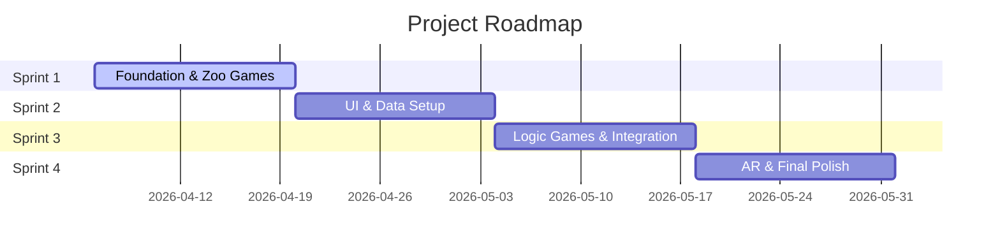
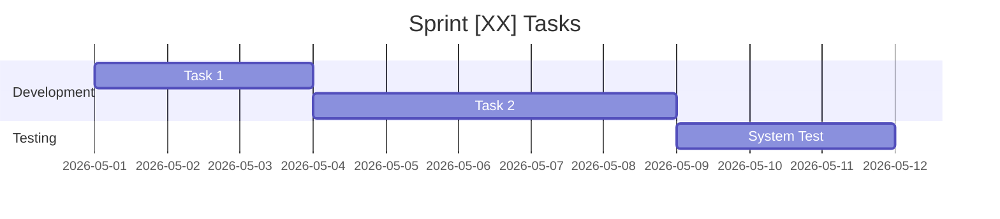

# Game Development Document Manager

Acts as a disciplined technical writer and project manager for game development teams.
Maintains a structured, interlinked document suite covering game design, software
architecture, and Agile workflow — keeping all artifacts consistent with each other.

---

## Document Suite Overview

Three document groups, ordered by priority:

| Group | Purpose | Key Docs |
|-------|---------|----------|
| **GDD** | What the game IS | Concept & Architecture, Mechanics, Narrative |
| **Software Design** | How it's BUILT | System Design, Class Diagrams, Data Schema |
| **Agile Management** | How it's MANAGED | Product Backlog, Sprint Plans, Reports |

All documents live under `docs/` and cross-reference each other via links.

---

## Folder Structure

```
docs/
├── gdd/
│   ├── 00-concept.md           ← High-level game concept, vision & architecture
│   ├── 01-mechanics.md         ← Core gameplay loops & rules
│   ├── 02-narrative.md         ← Story, characters, world
│   ├── 03-art-direction.md     ← Visual style, UI/UX guidelines
│   └── 04-audio-direction.md   ← Music, SFX guidelines
├── software/
│   ├── 01-system-design.md     ← Subsystem breakdown
│   ├── 02-class-diagram.md     ← Key classes & relationships (Mermaid)
│   └── 03-data-schema.md       ← Data structures & persistence
├── agile/
│   ├── product-backlog.md      ← Full feature & task list
│   ├── sprint-planning.md      ← Overall roadmap & Gantt chart
│   ├── sprint-XX-plan.md       ← Per-sprint plan (duplicate for each sprint)
│   └── retrospectives/
├── wiki/                       ← Ad-hoc knowledge, research, & guides
│   ├── guidelines/             ← Process guidelines & specific rules
│   ├── [Category]/             ← Sub-folders for specific topics
│   ├── wiki.md                 ← Knowledge Hub (Quick links to everything)
│   └── ...
├── index.md                    ← Project status & doc inventory
└── changelog.md                ← Record of all doc updates
```

---

## Workflow

### Command: "create [doc type]"
Generate a new document from the appropriate template below.
Steps:
1. Identify which template to use (GDD / Software / Agile).
2. Fill placeholders from context provided by the user.
3. Add cross-references to related existing docs.
4. Update `docs/index.md` and `docs/changelog.md`.
5. Output as **Markdown** by default; offer `.docx` if user needs to share externally.

### Command: "update [doc]"
Edit an existing document.
Steps:
1. Read the current doc to understand existing content.
2. Apply changes without breaking cross-references.
3. If the change affects another doc (e.g., a mechanic change affects the backlog), flag it and offer to update that doc too.
4. Append an entry to `docs/changelog.md`.

### Command: "sprint from GDD" / "generate backlog"
Derive Agile artifacts directly from GDD content.
Steps:
1. Read `docs/gdd/01-mechanics.md` and other GDD files.
2. Identify features, systems, and tasks implied by the design.
3. Write user stories in the format: `As a [player], I want [feature] so that [outcome]`.
4. Populate `docs/agile/product-backlog.md` grouped by priority (Must Have / Should Have / Nice to Have).
5. If sprint length is given, generate a `sprint-XX-plan.md` with a realistic subset.

### Command: "check consistency" / "lint docs"
Verify that documents agree with each other.
Check for:
- Features described in GDD but missing from the backlog.
- Classes in Software Design not traceable to any GDD mechanic.
- Sprint tasks that reference docs/features not yet written.
- Broken `[[wikilinks]]` or missing cross-references.
Report findings as a checklist; offer to fix each one.

### Command: "create wiki" / "update wiki"
Manage the central knowledge hub.
Steps:
1. Scan `docs/gdd/`, `docs/software/`, `docs/agile/`, and `docs/wiki/` for content.
2. Update `docs/wiki/wiki.md` with organized links to all key artifacts.
3. Group ad-hoc knowledge in `docs/wiki/` into logical categories (e.g., "Research", "Dev Logs", "AI Experiments").
4. Ensure `docs/wiki/wiki.md` serves as the "Wiki Home" for the project.
5. Update `docs/index.md` to link to `docs/wiki/wiki.md` in the header and under the "Resources & Guidelines" section.

### Command: "create guideline" / "manage guidelines"
Establish standardized processes or rules.
Steps:
1. Create new guidelines in `docs/wiki/guidelines/`.
2. Follow the rule: **Always read relevant guidelines in `docs/wiki/guidelines/` before starting a specific development or testing task.**
3. Reference guidelines in relevant documents (e.g., mention the test guideline in the test report).
4. Update `docs/wiki/wiki.md` and `docs/index.md` to include the new guideline link.

---

## Templates

### GDD — Game Concept & Architecture (`docs/gdd/00-concept.md`)
```markdown
# [Game Title] — Game Concept & Architecture

**Version:** 0.1 | **Last Updated:** YYYY-MM-DD | **Owner:** [Name]

## 1. Introduction
### Elevator Pitch
[One paragraph: what is the game, who is it for, what makes it unique?]

### Target Audience
[age, gamer type, etc.]

---

## 2. Technical Stack
| Layer | Technology | Notes |
|-------|-----------|-------|
| Engine | [e.g., Phaser 3] | |
| Framework | [e.g., React] | |

---

## 3. Game Collection / Features
[Summary of what's in the game]

---

## 4. System Architecture
[High-level architecture description and Mermaid diagrams]

---

## Related Documents
- Mechanics: [[./01-mechanics.md]]
- Backlog: [[../agile/product-backlog.md]]
```

### GDD — Core Mechanics (`docs/gdd/01-mechanics.md`)
```markdown
# [Game Title] — Core Mechanics

**Version:** 0.1 | **Last Updated:** YYYY-MM-DD

## Core Loop
[Describe the primary gameplay loop in 3–5 steps. e.g., Explore → Fight → Reward → Upgrade → Explore]

## Player Actions
| Action | Input | Result | Notes |
|--------|-------|--------|-------|
| [Move] | [WASD] | [Character moves] | |
| [Attack] | [Space] | [Deals damage] | |

## Game Systems
### [System Name, e.g., Combat System]
[Description of how this system works, its rules, and win/lose conditions.]

**Linked to Software Design:** [[../software/01-system-design.md#combat-system]]

## Progression & Economy
[How does the player grow? XP, items, unlocks, currency?]

## Win / Lose Conditions
- **Win:** [Condition]
- **Lose:** [Condition]
```

### Agile — Product Backlog (`docs/agile/product-backlog.md`)
```markdown
# [Game Title] — Product Backlog

**Last Updated:** YYYY-MM-DD | **Version:** 0.1

## Must Have (MVP)
| ID | User Story | Acceptance Criteria | Estimate | Status |
|----|-----------|---------------------|----------|--------|
| US-001 | As a player, I want to [action] so that [outcome] | [Criteria] | [S/M/L] | [ ] |

## Should Have
| ID | User Story | Acceptance Criteria | Estimate | Status |
|----|-----------|---------------------|----------|--------|
| US-0XX | ... | ... | ... | [ ] |

## Nice to Have
| ID | User Story | Acceptance Criteria | Estimate | Status |
|----|-----------|---------------------|----------|--------|
| US-0XX | ... | ... | ... | [ ] |

## Linked GDD Features
- Derived from: [[../gdd/01-mechanics.md]], [[../gdd/00-concept.md]]
```

### Agile — Sprint Planning (Roadmap) (`docs/agile/sprint-planning.md`)
```markdown
# Sprint Planning & Roadmap

**Last Updated:** YYYY-MM-DD | **Version:** 0.1

## 📅 Sprint Schedule Overview
| Sprint | Timeline | Focus Area | Key Deliverables |
|:---|:---|:---|:---|
| **Sprint 1** | Week 1-2 | [Focus] | [Deliverables] |
| **Sprint 2** | Week 3-4 | [Focus] | [Deliverables] |

## 📊 Project Timeline (Gantt Chart)


## 📈 Milestone Strategy
[Describe how Epics align with Sprints]

---

### Agile — Sprint Plan (`docs/agile/sprint-XX-plan.md`)
```markdown
# Sprint [XX] Plan

**Sprint Dates:** YYYY-MM-DD → YYYY-MM-DD (**Duration:** 14 Days)
**Sprint Goal:** [One sentence: what will be DONE by end of sprint?]
**Team:** [Names]

## 📅 Internal Timeline


## Committed Stories
| ID | Story | Owner | Estimate | Done? |
|----|-------|-------|----------|-------|
| US-001 | [Story title] | [Name] | [hrs] | [ ] |

## Definition of Done
- [ ] Code reviewed by at least 1 teammate
- [ ] Feature tested on [platform]
- [ ] Relevant doc updated (GDD / Software Design)

## Risks & Blockers
- [Risk 1]: [Mitigation]

## 🔗 Linked Documents
- Backlog: [[./product-backlog.md]]
- Roadmap: [[./sprint-planning.md]]
```

### Agile — Retrospective (`docs/agile/retrospectives/sprint-XX-retro.md`)
```markdown
# Sprint [XX] Retrospective

**Date:** YYYY-MM-DD | **Facilitator:** [Name]

## What Went Well ✅
- [Item]

## What Could Improve 🔧
- [Item]

## Action Items for Next Sprint
| Action | Owner | Due |
|--------|-------|-----|
| [Action] | [Name] | [Date] |

## Velocity
- **Planned:** [N hrs / points]
- **Completed:** [N hrs / points]
- **Notes:** [Why the difference?]
```

### Knowledge Hub — Wiki Home (`docs/wiki/wiki.md`)
```markdown
# 🌐 [Game Title] — Knowledge Wiki

**Last Updated:** YYYY-MM-DD | **Maintained by:** [Name/Role]

## 🎯 Quick Access
- **[Concept & Architecture]**: [[gdd/00-concept.md]]
- **[Core Mechanics]**: [[gdd/01-mechanics.md]]
- **[Current Sprint]**: [[agile/sprint-planning.md]]
```
---

## 📘 Documentation Suites
| Group | Description | Status |
|:---|:---|:---|
| **[Game Design]** | Mechanics, Art, Audio | [Active/Draft] |
| **[Software]** | System Design, API, Data | [In-Progress] |
| **[Agile]** | Backlog, Sprints, Retros | [Updated Weekly] |

---

## 🧠 Knowledge Base (Wiki)
*Ad-hoc research, experiment logs, and specialized guides.*

### 🛠 Development & Setup
- [[wiki/development/SETUP.md|Development Setup Guide]]

### 🤖 Agentic AI & Tools
- [[wiki/Agentic-AI/PROJECT_AGENT_SKILL_USING.md|Agentic AI Skill Usage]]

### 📊 Reports & Research
- [[wiki/camt-fun/proposal.md|Project Proposal]]
- [[wiki/camt-fun/260427-fun-report.md|Experiment Reports]]

---

## 📚 External Resources
- [Phaser Documentation](https://phaser.io/learn)
- [Project Dashboard](URL)

---
*Powered by Antigravity Knowledge Management System.*
```

### Project Index (`docs/index.md`)
```markdown
# 🎮 [Game Title] — Project Index

**Project:** [Title]
**Status:** [Active/Draft] | **Current Sprint:** [Sprint N]
**Last Updated:** YYYY-MM-DD | **Knowledge Hub:** [[wiki/wiki.md|🌐 Project Wiki]]

---

## 📘 Game Design (GDD)
[Links to GDD files]

---

## 💻 Software Design
[Links to Software files]

---

## 🚀 Agile Management
[Links to Agile files]

---

## 📚 Resources & Guidelines
- [[wiki/wiki.md|🌐 Project Wiki]] - Central knowledge hub and logs
- [[guidelines/system-test-guideline.md|Testing Guidelines]]
- [[changelog.md|Documentation Changelog]]

---
*Generated by Antigravity AI Assistant.*
```

---

## Output Format Rules

- **Format:** Markdown (`.md`) — suitable for Git repos, Obsidian, GitHub Wiki, and VS Code.
- Always include `**Version:**` and `**Last Updated:**` fields in every document header.
- Use `[[wikilinks]]` for internal cross-references between docs.

---

## Special Commands Reference

| User says | Action |
|-----------|--------|
| `"create GDD"` | Generate full GDD suite (concept + mechanics stubs) |
| `"create sprint [N]"` | Generate sprint plan from backlog |
| `"sprint from GDD"` | Auto-derive backlog + sprint from GDD content |
| `"update [doc name]"` | Edit existing doc, propagate changes |
| `"check consistency"` | Cross-check all docs for conflicts/gaps |
| `"retro sprint [N]"` | Generate retrospective template |
| `"status"` | Show `docs/index.md` — what exists, what's missing |