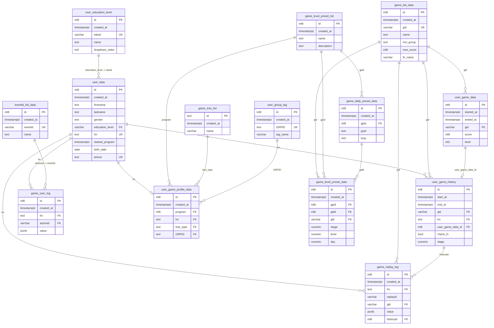
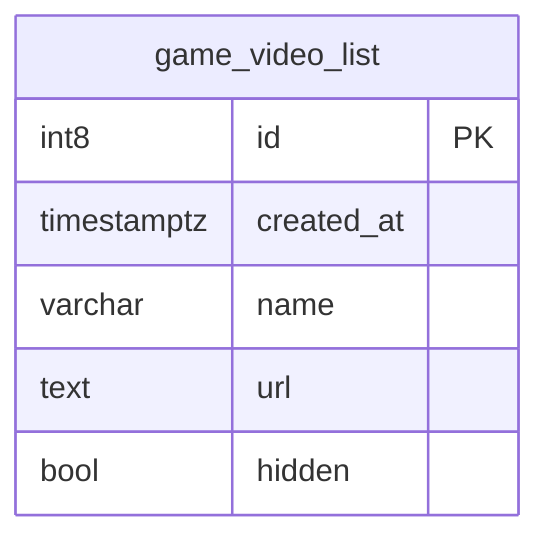

# แผนผังฐานข้อมูล (Database Schema) — MCI Cognitive Games

**เวอร์ชันแอป:** v1.3.0
**วันที่จัดทำ:** 24 กรกฎาคม 2026
**เอกสารคู่กัน:** [system-design.md](./system-design.md) · [system-flowchart.md](./system-flowchart.md)

เอกสารนี้แสดงตารางทั้งหมดในฐานข้อมูลและความสัมพันธ์ระหว่างกัน แบ่งเป็น 3 มุมมอง คือ
1. **ภาพรวมแบบจัดกรอบ** — จัดตารางเป็นกลุ่มใหญ่ ๆ เพื่อดูโครงสร้างโดยรวมได้ง่าย
2. **ERD ตารางที่มีความสัมพันธ์** — รายละเอียดคอลัมน์ของตารางที่เชื่อมโยงกัน
3. **ตารางอิสระ** — ตารางที่ไม่มีความสัมพันธ์กับตารางอื่น

> **หมายเหตุสำคัญ:** สคีมาที่ได้รับมาไม่ได้ประกาศ Foreign Key อย่างเป็นทางการ ความสัมพันธ์ในแผนผังนี้ถูก **อนุมานจากรูปแบบการตั้งชื่อคอลัมน์** (เช่น `hn`, `gid`, `gpid`, `gdid`, `historyid`, `GRPID`, `tree_type`, `program`, `actionid`) จึงควรตรวจสอบยืนยันกับตรรกะของแอปอีกครั้งก่อนนำไปใช้อ้างอิงเชิงบังคับ

**สัญลักษณ์ที่ใช้**

- `PK` = Primary Key (คีย์หลัก) · `UK` = Unique (ค่าไม่ซ้ำ) · `FK` = Foreign Key ที่อนุมานไว้ (คีย์อ้างอิง)
- เส้นความสัมพันธ์ใน ERD: `||--o{` หมายถึง "หนึ่ง ต่อ หลาย" และ `||--o|` หมายถึง "หนึ่ง ต่อ ศูนย์หรือหนึ่ง"

---

## 1. ภาพรวมแบบจัดกรอบ (Grouped Overview)

มุมมองนี้จัดตารางเป็นกลุ่มใหญ่ตามหน้าที่ และแสดงว่ากลุ่มไหนเชื่อมกับกลุ่มไหนผ่านคอลัมน์ใด โดยแยกกรอบ **ตารางอิสระ (ไม่มีความสัมพันธ์)** ออกให้ชัดเจน

```mermaid
flowchart LR
    subgraph USER["กลุ่มผู้ใช้ (User)"]
        direction TB
        U1["user_data"]
        U2["user_game_profile_data"]
        U3["user_education_level"]
        U4["user_group_tag"]
    end

    subgraph PLAY["กลุ่มการเล่นและประวัติ (Play / History)"]
        direction TB
        P1["game_list_data"]
        P2["user_game_data"]
        P3["user_game_history"]
        P4["game_replay_log"]
        P5["game_user_log"]
        P6["eventid_list_data"]
    end

    subgraph PRESET["กลุ่มแผนการเล่นรายวัน (Preset)"]
        direction TB
        R1["game_level_preset_list"]
        R2["game_daily_preset_data"]
        R3["game_level_preset_data"]
    end

    subgraph LOOKUP["ตารางอ้างอิง (Lookup)"]
        direction TB
        L1["game_tree_list"]
    end

    subgraph STANDALONE["ไม่มีความสัมพันธ์ / ตารางอิสระ"]
        direction TB
        S1["game_video_list"]
    end

    PLAY -->|"hn"| USER
    PRESET -->|"gid"| PLAY
    USER -->|"program"| PRESET
    USER -->|"tree_type"| LOOKUP

    style USER fill:#fff3bf,stroke:#e6b800
    style PLAY fill:#d3f9d8,stroke:#37b24d
    style PRESET fill:#d0ebff,stroke:#1c7ed6
    style LOOKUP fill:#f3d9fa,stroke:#ae3ec9
    style STANDALONE fill:#f1f3f5,stroke:#868e96,stroke-dasharray: 6 4
```

**อ่านแผนผังนี้อย่างไร**

- **กลุ่มผู้ใช้** — ทุกอย่างที่เกี่ยวกับตัวผู้เล่น (ข้อมูลส่วนตัว โปรไฟล์เกม ระดับการศึกษา กลุ่มทดสอบ)
- **กลุ่มการเล่นและประวัติ** — รายการเกม ผลการเล่น ประวัติ และบันทึกพฤติกรรม/เหตุการณ์ เชื่อมกลับไปยังผู้เล่นผ่าน `hn`
- **กลุ่มแผนการเล่นรายวัน** — โปรแกรม/แผนของแต่ละวัน/รายละเอียดด่าน เชื่อมไปยังรายการเกมผ่าน `gid`
- **ตารางอ้างอิง** — ตารางค่าคงที่ที่ถูกอ้างถึง (ชนิดต้นคิดดี)
- **ตารางอิสระ (กรอบเส้นประ)** — `game_video_list` ไม่มีคอลัมน์เชื่อมกับตารางอื่น เพราะระบบสุ่มเลือกวิดีโอโดยตรง

---

## 2. ERD ตารางที่มีความสัมพันธ์ (Related Tables)

มุมมองนี้แสดงรายละเอียดคอลัมน์ของตารางทั้งหมด **ยกเว้นตารางอิสระ** พร้อมเส้นความสัมพันธ์ที่อนุมานไว้

---

## 3. ตารางอิสระ (Standalone — ไม่มีความสัมพันธ์)

ตารางนี้ไม่มีคอลัมน์ที่เชื่อมโยงกับตารางอื่น ระบบใช้งานโดยสุ่มเลือกรายการโดยตรง (กรองด้วย `hidden`)

---

## อธิบายกลุ่มตารางและความสัมพันธ์

### 1. กลุ่มผู้ใช้ (User)

- **`user_data`** — ข้อมูลหลักของผู้เล่นแต่ละคน (ชื่อ เพศ วันเกิด เบอร์โทร และรหัส `hn`) โดย `hn` เป็นค่าไม่ซ้ำที่ตารางอื่นใช้อ้างอิงถึงผู้เล่น
- **`user_education_level`** — ตารางอ้างอิงระดับการศึกษา คอลัมน์ `education_level` ใน `user_data` อ้างถึง `eduid`
- **`user_game_profile_data`** — โปรไฟล์เกมของผู้เล่น (หนึ่งคนต่อหนึ่งโปรไฟล์) เก็บโปรแกรมที่ได้รับ (`program`), ชนิดต้นไม้ (`tree_type`) และกลุ่มทดสอบ (`GRPID`) จึงเป็นจุดเชื่อมไปยังตารางอ้างอิงหลายตาราง
- **`user_group_tag`** — ตารางอ้างอิงกลุ่มทดสอบ (`GRPID` + `tag_name`)

### 2. กลุ่มการเล่นและประวัติ (Play / History)

- **`game_list_data`** — รายการมินิเกมทั้งหมด (`gid` ไม่ซ้ำ, ชื่อไทย/อังกฤษ, หมวด `mci_group`, คะแนนสูงสุด) เป็นตารางแม่ที่หลายตารางอ้างถึงด้วย `gid`
- **`user_game_data`** — ผลการเล่นแต่ละครั้ง (คะแนน ระดับ เวลาเริ่ม–จบ)
- **`user_game_history`** — ประวัติการเล่นรายครั้งของผู้เล่น ผูกกับ `user_data` (`hn`), เกม (`gid`) และผลการเล่น (`user_game_data_id`) พร้อมสถานะเช็คชื่อ (`check-in`) และด่าน (`stage`)
- **`game_replay_log`** — บันทึกพฤติกรรมการเล่นเชิงลึก ผูกกับผู้เล่น (`hn`), เกม (`gid`) และประวัติการเล่น (`historyid`)
- **`game_user_log`** — บันทึกเหตุการณ์การใช้งาน ผูกกับผู้เล่น (`hn`) และประเภทเหตุการณ์ (`actionid`)
- **`eventid_list_data`** — ตารางอ้างอิงประเภทเหตุการณ์ (`eventid` + `name`) ที่ `game_user_log.actionid` น่าจะอ้างถึง

### 3. กลุ่มแผนการเล่นรายวัน (Preset)

- **`game_level_preset_list`** — โปรแกรม/ชุดแผนการเล่น (ชื่อ + คำอธิบาย) เป็นตารางแม่ของกลุ่ม preset และเป็นสิ่งที่ `user_game_profile_data.program` อ้างถึง
- **`game_daily_preset_data`** — แผนของแต่ละวันภายในโปรแกรม (`gpid` อ้างถึงโปรแกรม, เป้าหมาย `goal`, จำนวนรอบ `loop`)
- **`game_level_preset_data`** — รายละเอียดด่านในแต่ละวัน (`gpid` = โปรแกรม, `gdid` = วัน, `gid` = เกม, พร้อม `stage`/`level`/`day`)

### 4. ตารางอ้างอิงและสื่อ (Lookup & Media)

- **`game_tree_list`** — ชนิด "ต้นคิดดี" ที่ `user_game_profile_data.tree_type` อ้างถึง
- **`game_video_list`** — คลังวิดีโอสำหรับช่วงพัก/เช็คชื่อ (`url`, `hidden`) เป็น **ตารางอิสระ** ระบบสุ่มเลือกโดยกรองรายการที่ถูกซ่อน จึงไม่มีคอลัมน์อ้างอิงตรงจากตารางอื่น

---

## หมายเหตุเพิ่มเติม

- คอลัมน์ `check-in` ในตาราง `user_game_history` มีเครื่องหมายขีดกลางในชื่อจริง แต่ในแผนผังแสดงเป็น `check_in` เพื่อให้ Mermaid แสดงผลได้ (ชื่อจริงในฐานข้อมูลคือ `check-in`)
- ความสัมพันธ์ที่ควรตรวจสอบเป็นพิเศษเพราะอนุมานจากชื่อล้วน ๆ ได้แก่ `game_user_log.actionid → eventid_list_data.eventid` และ `user_game_profile_data.program → game_level_preset_list.id`
- ทุกตารางมี `created_at` (หรือ `started_at`/`start_at`) เป็น timestamp เวลาที่สร้างเรคคอร์ด

---

[กลับไปที่รายงานสรุประบบ](./system-design.md)
