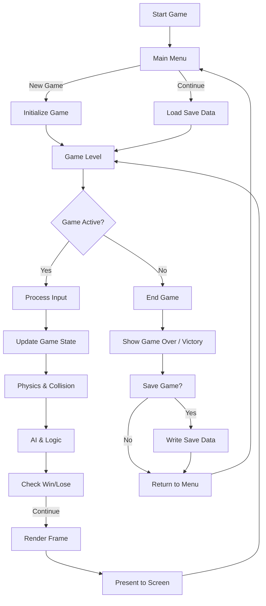
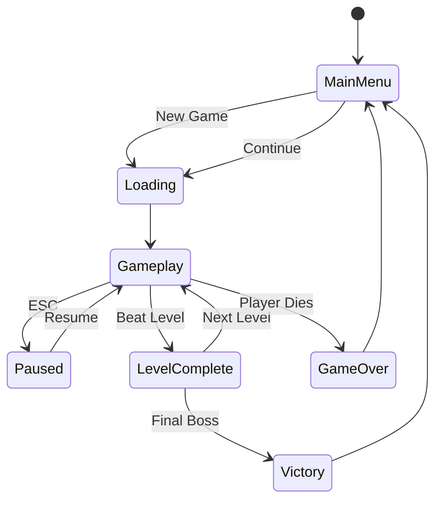
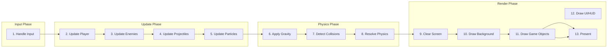
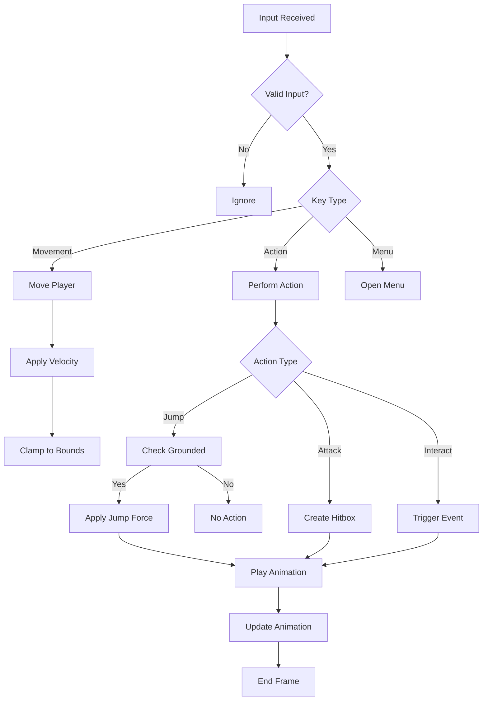
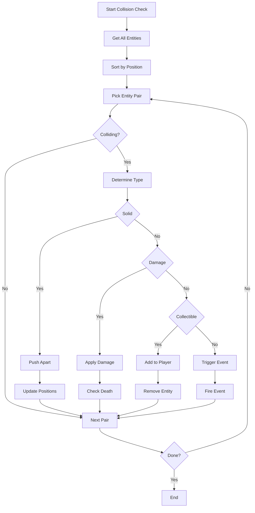
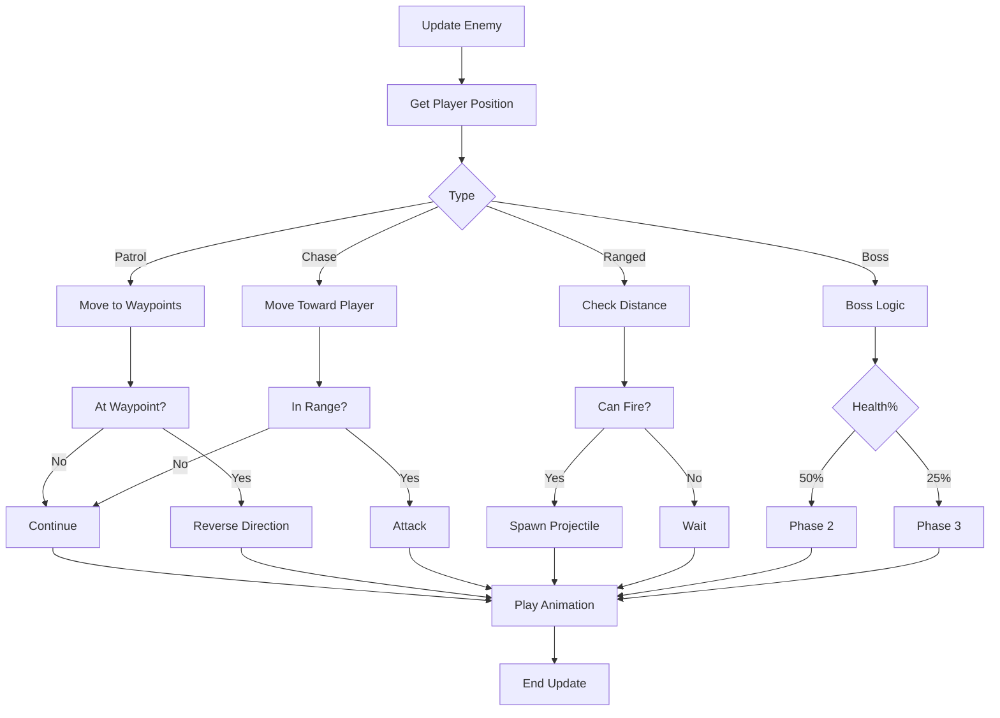
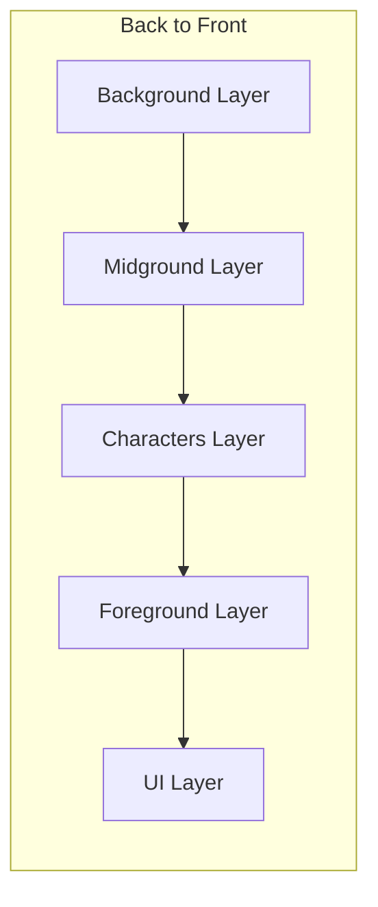

# Game Loop Diagram

---
*Document Version: 1.0*  
*Project: [Game Title]*  
*Last Updated: YYYY-MM-DD*
---

## 1. Main Game Loop

---

## 2. Game State Flow

---

## 3. Update Loop (Per Frame)

---

## 4. Player Input Flow

---

## 5. Collision Detection Loop

---

## 6. Enemy AI Loop

---

## 7. Render Pipeline

---

## Notes

- **Target FPS**: [Target FPS]
- **Delta Time**: [Delta Time strategy]
- **Render**: [Render strategy]
- **Input**: [Input handling strategy]
