# Class Diagram - [Game Title]

---

**Project:** [Project Name]
**Version:** 1.0
**Status:** [Draft/Review/Final]
**Last Updated:** [YYYY-MM-DD]

---

## 1. Game Architecture

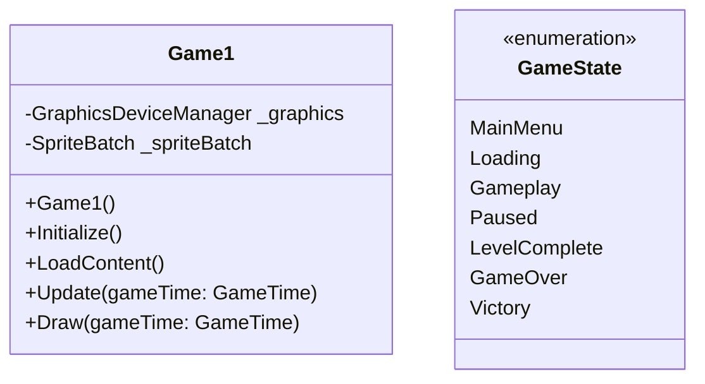

---

## 2. Core Classes

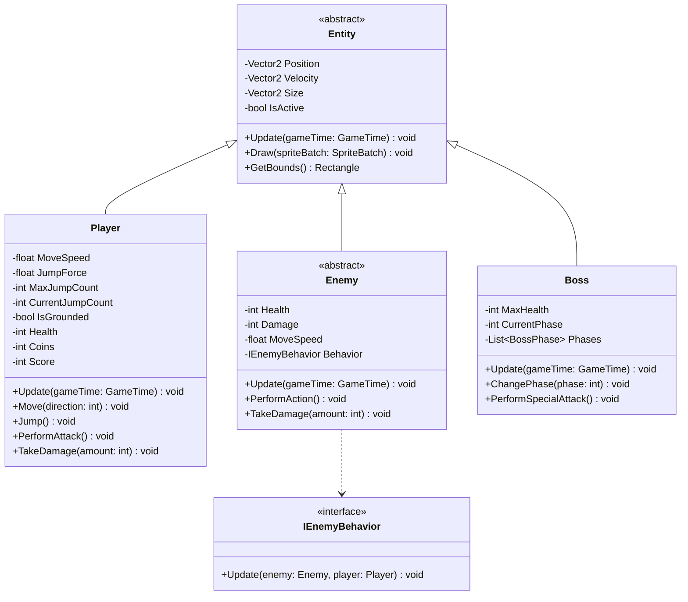

---

## 3. Enemy Types

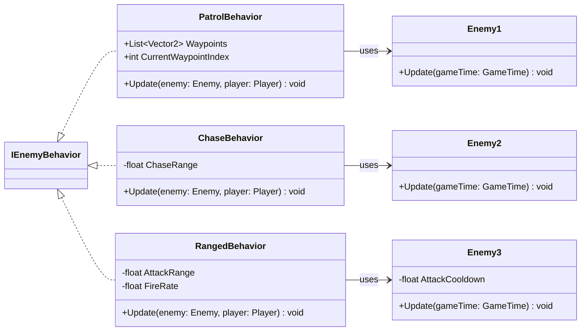

---

## 4. Collectibles & Items

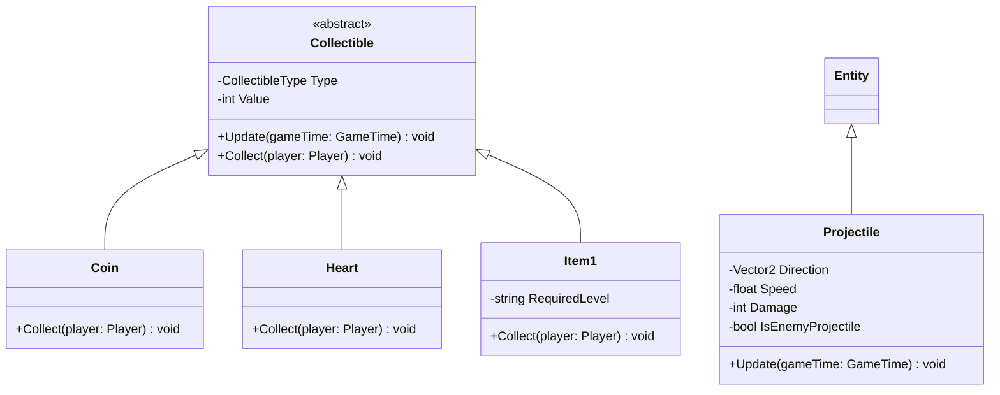

---

## 5. Level & World

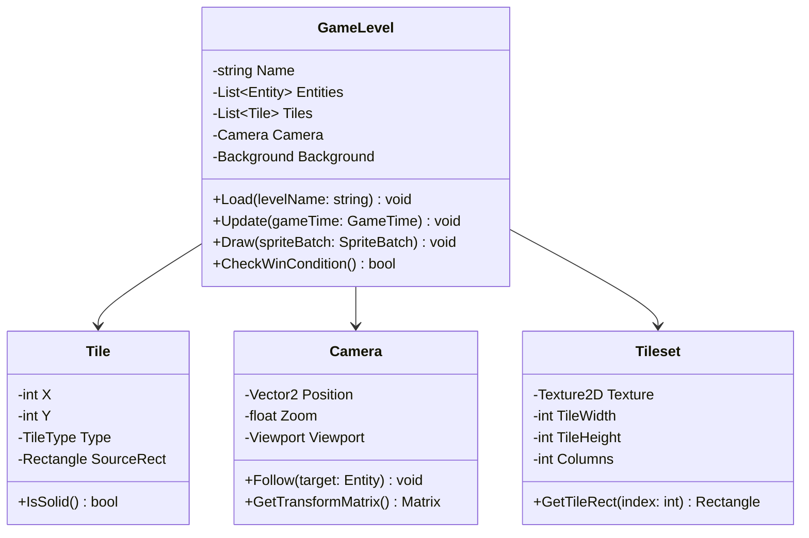

---

## 6. UI & HUD

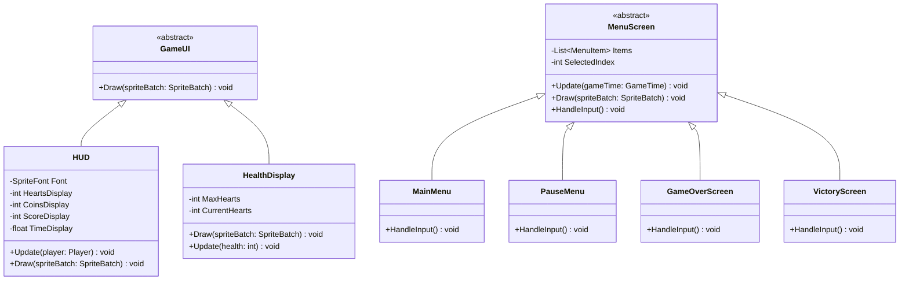

---

## 7. Audio System

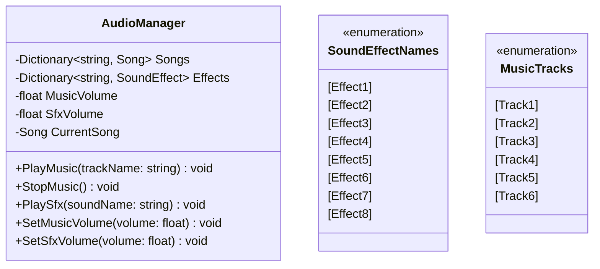

---

## 8. Save System

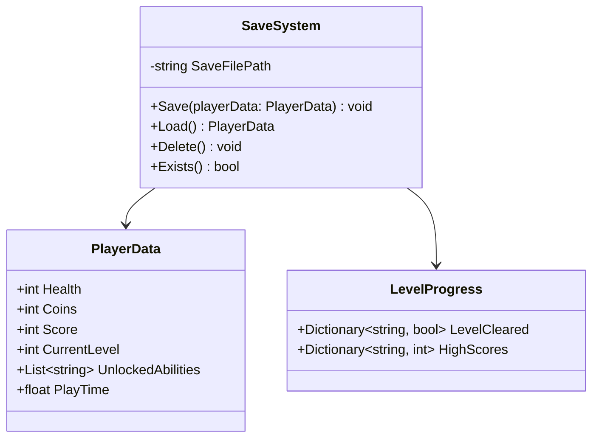

---

## 9. Collision System

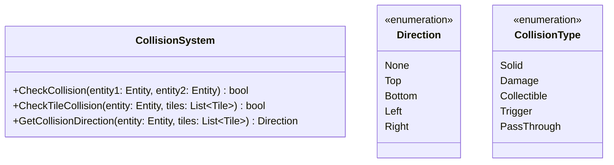

---

## 10. Input System

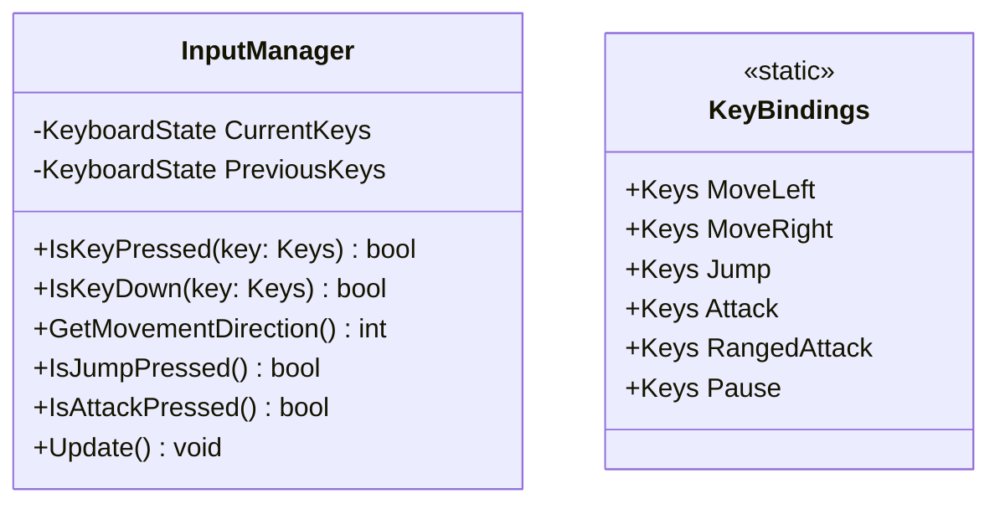

---

## 11. Effects & Particles

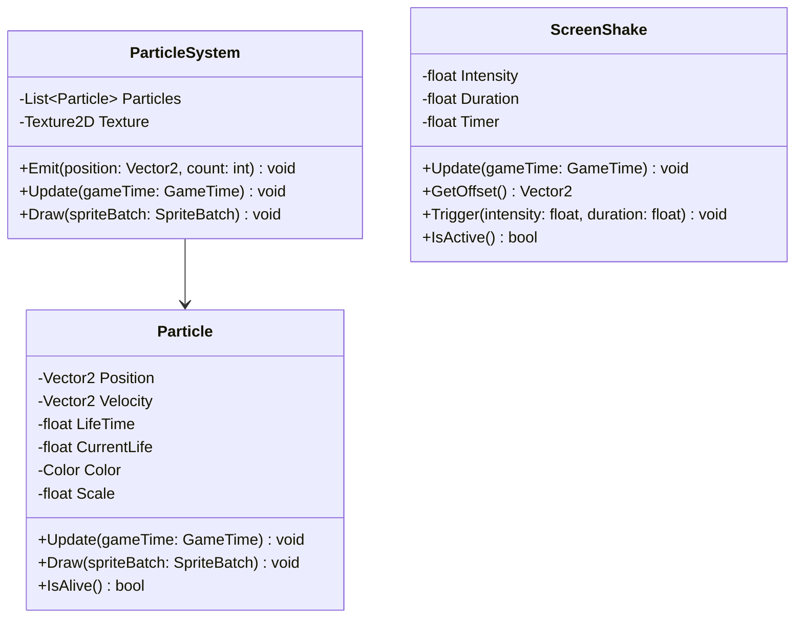

---

## 12. Project Structure

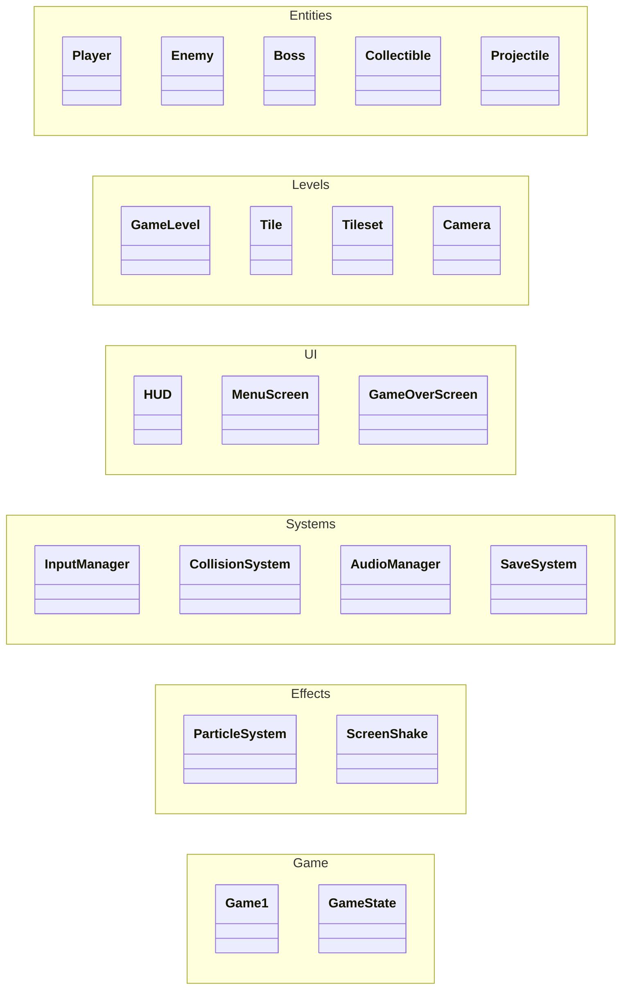

---

## Notes

- ใช้ `<<abstract>>` สำหรับ abstract classes
- ใช้ `<<interface>>` สำหรับ interfaces
- ใช้ `<<enumeration>>` สำหรับ enums
- Classes ที่เป็น `<<static>>` คือ static classes
