# Class Diagram - MCI Cognitive Games

---

## *Document Version: 1.0*  
*Project: MCI Cognitive Games*  
*Last Updated: 2026-04-21*

## 1. Game Architecture

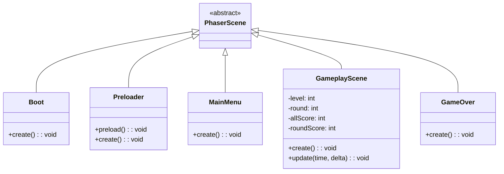

##  Core Base Classes

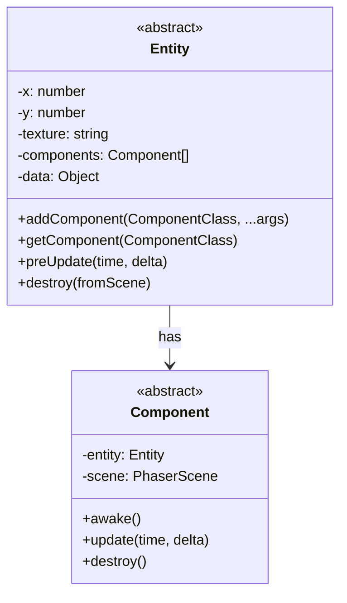

---

## 3. Component System

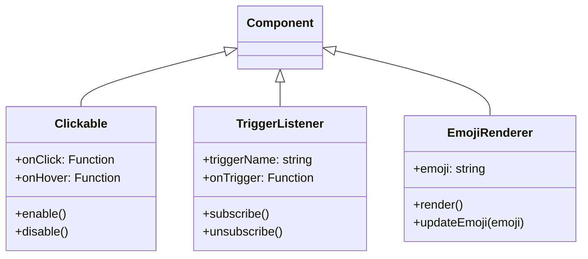

---

## 4. Zoo Detective Classes

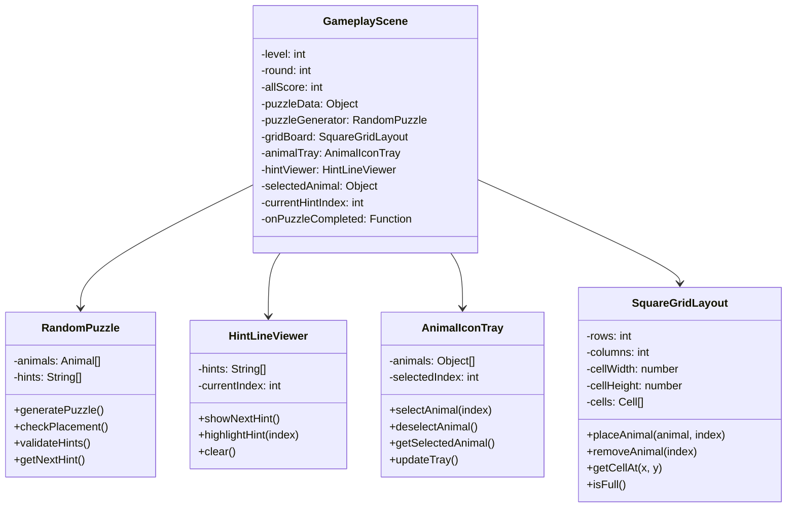

---

## 5. Zoo Feeder Classes

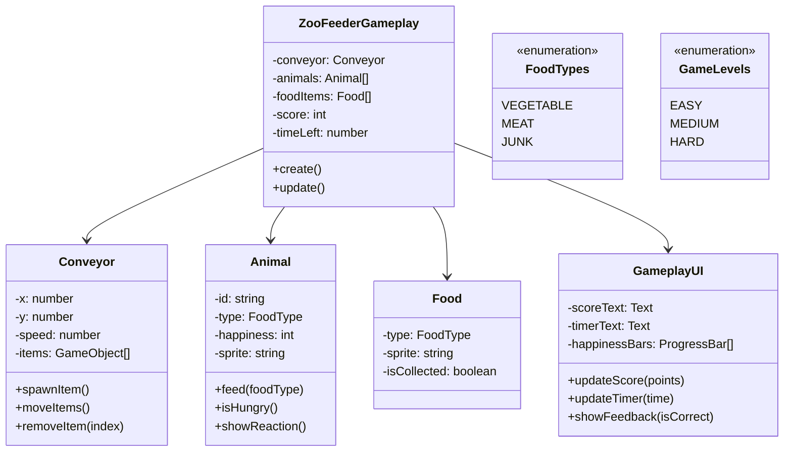

---

## 6. Context Clues Classes

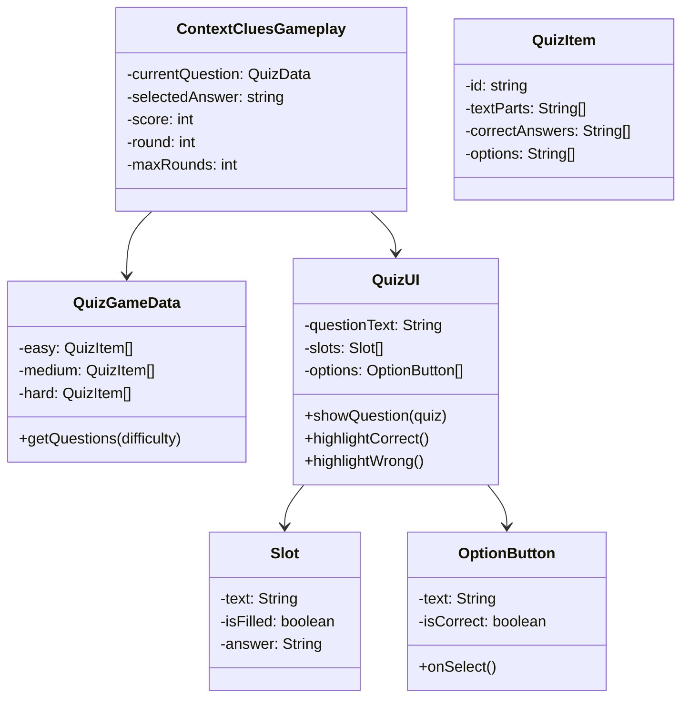

---

## 7. Symmetry Decor Classes

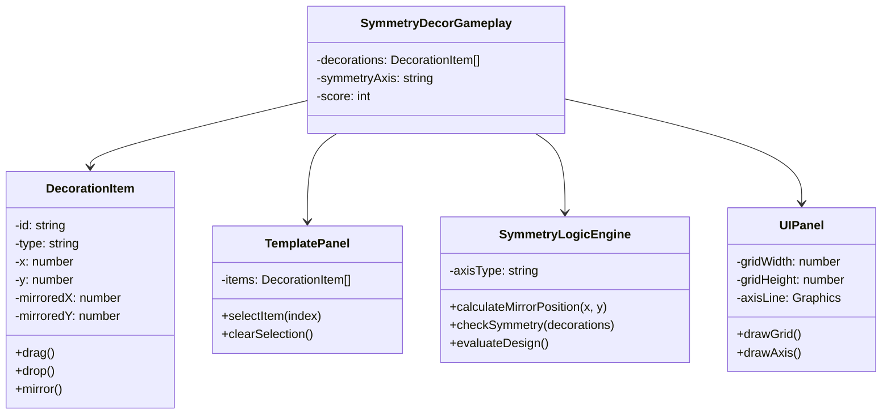

---

## 8. Postcard Reader Classes

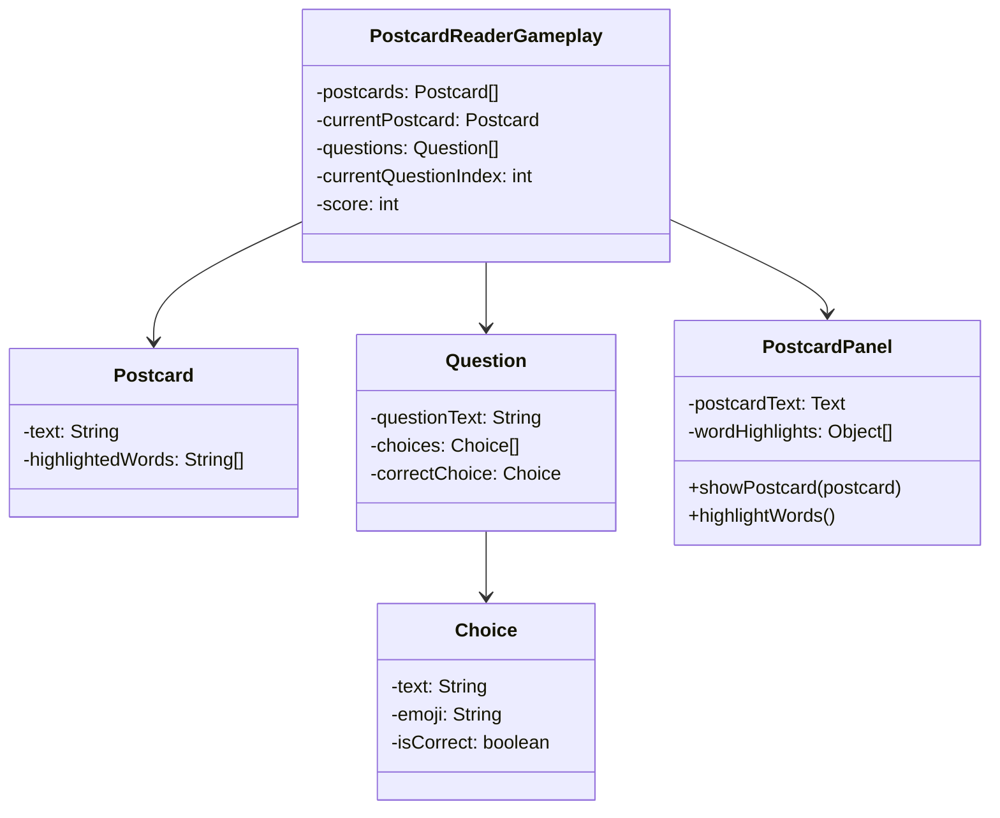

---

## 9. UI System

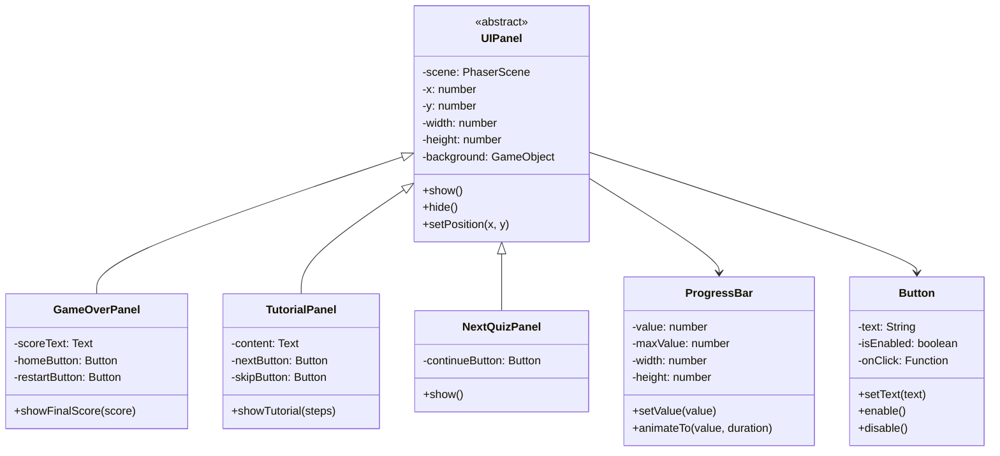

---

## 10. Database System

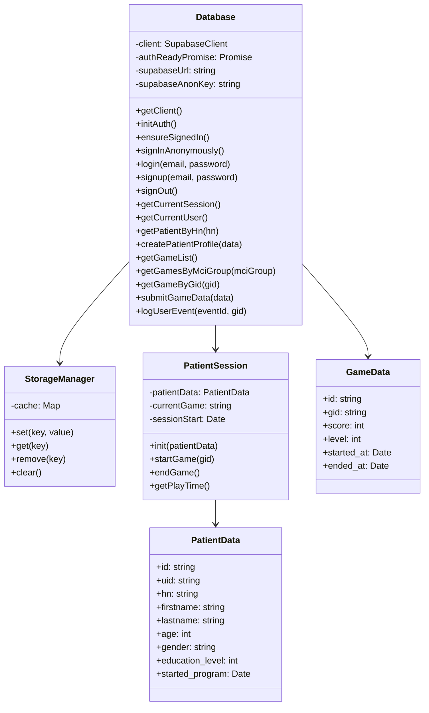

---

## 11. Layout Utilities

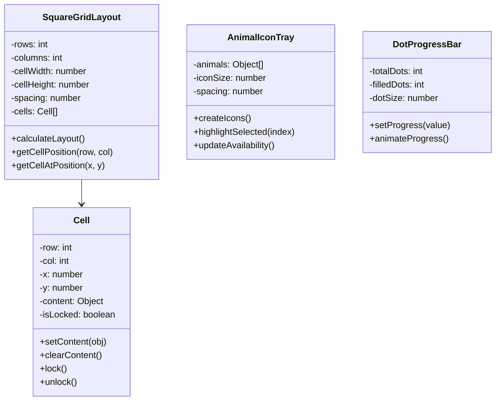

---

## 12. Object Pool System

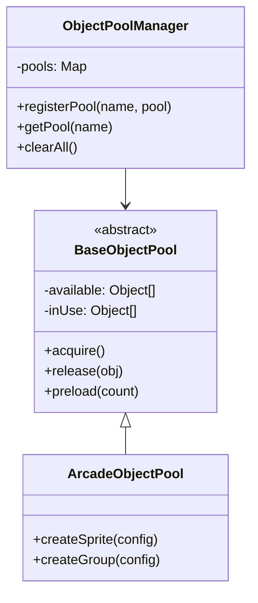

---

## 13. Project Structure

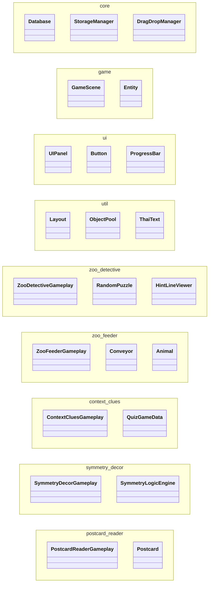

---

## Notes

- ใช้ `<<abstract>>` สำหรับ abstract classes
- ใช้ `<<interface>>` สำหรับ interfaces
- ใช้ `<<enumeration>>` สำหรับ enums
- Entity-Component pattern ใช้ในเกมทั้งหมด
- ทุก Scene สืบทอดจาก `Phaser.Scene`