# Game Loop Diagram

---
*Document Version: 1.0*  
*Project: MCI Cognitive Games*  
*Last Updated: 2026-04-21*
---

## 1. Main Game Loop (Application Level)

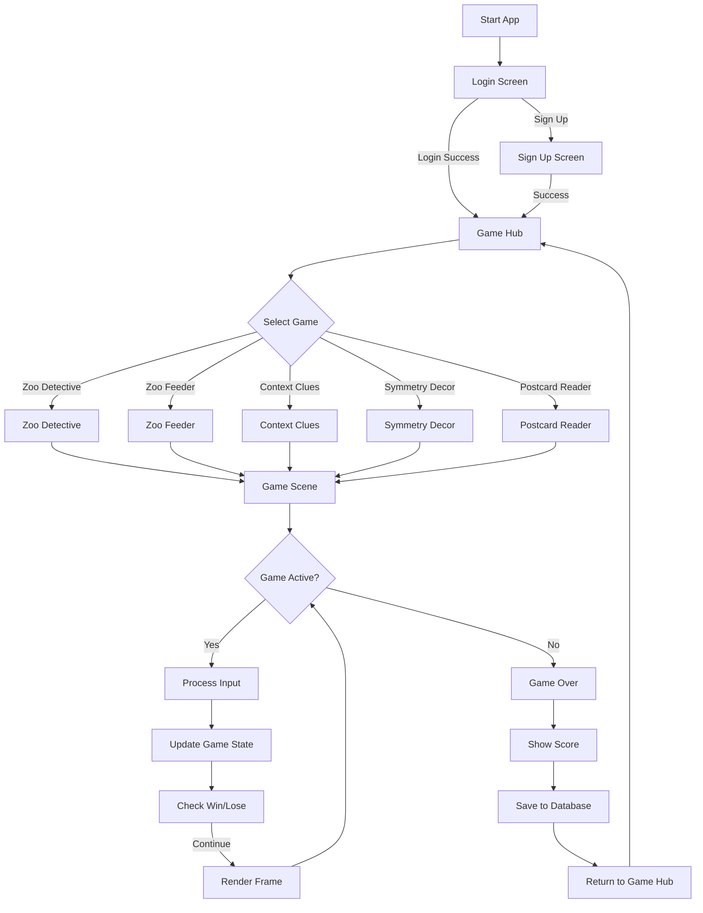

---

## 2. Game Scene Flow (Per Game)

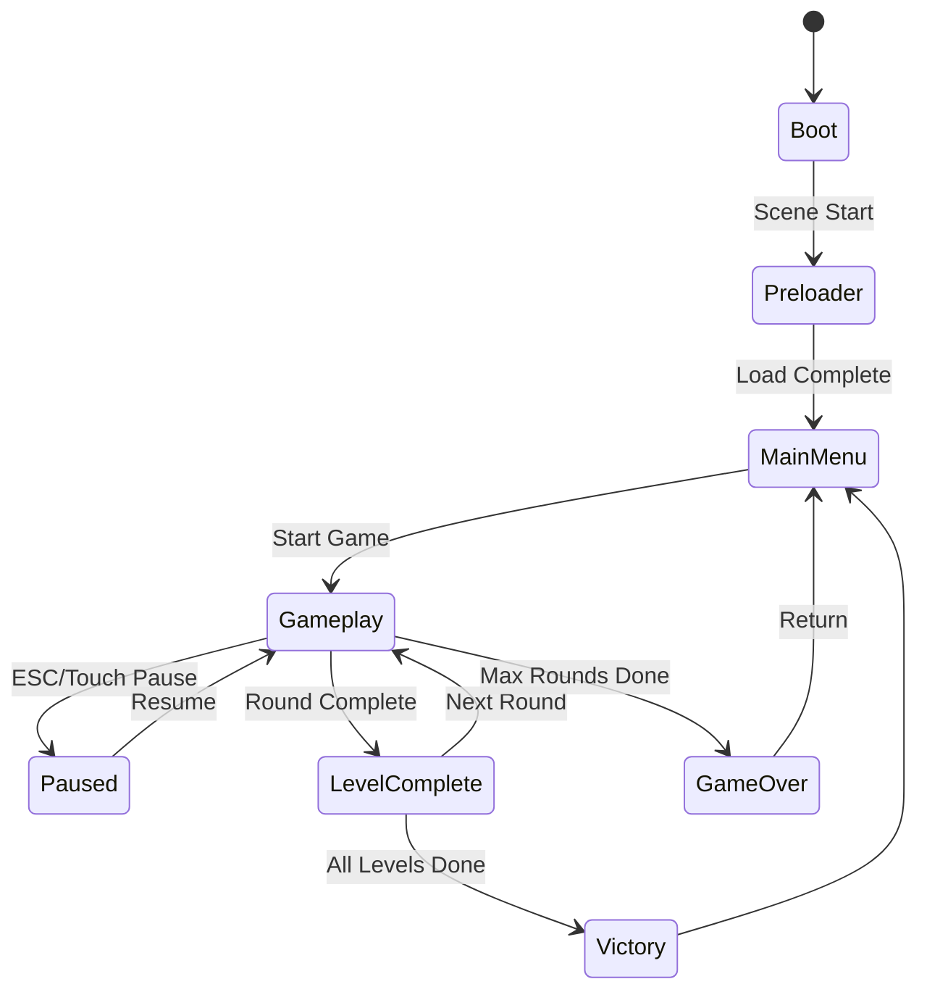

---

## 3. Scene Lifecycle (Phaser 3)

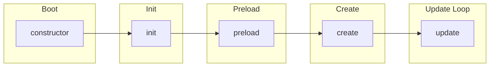

**Each Scene:**
- `Boot`: Initialize game config
- `Preloader`: Load assets (images, audio)
- `MainMenu`: Show game menu, difficulty selection
- `Gameplay`: Main game logic
- `GameOver`: Show results, save score

---

## 4. Zoo Detective Game Loop

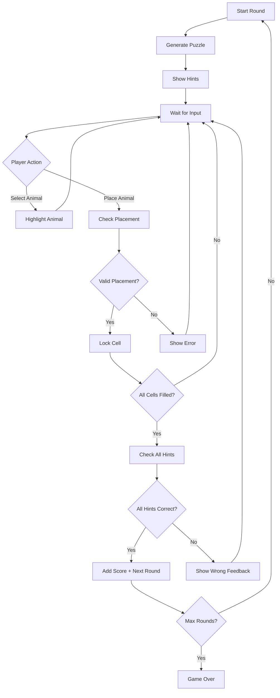

**Update Loop (Per Frame):**
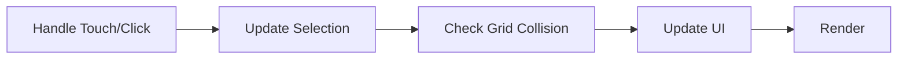

---

## 5. Zoo Feeder Game Loop

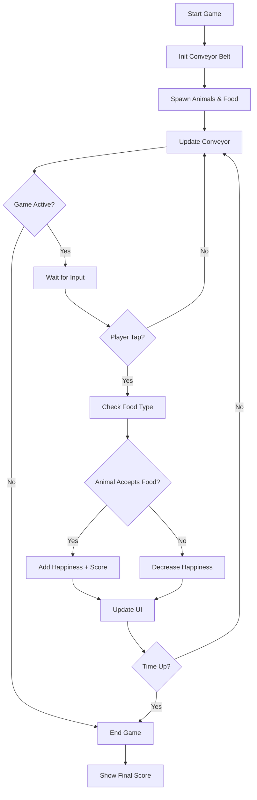

**Update Loop (Per Frame):**
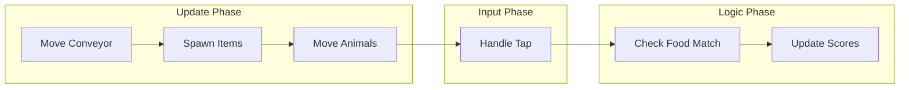

---

## 6. Context Clues Game Loop

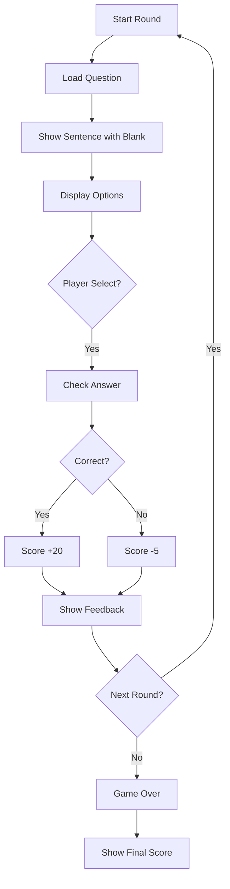

---

## 7. Symmetry Decor Game Loop

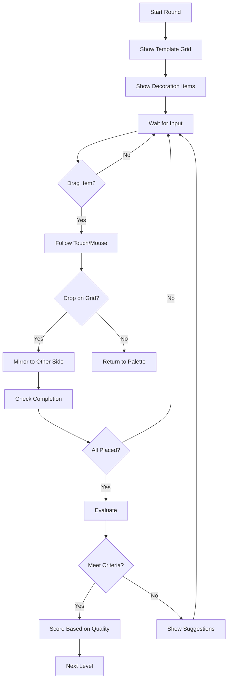

---

## 8. Postcard Reader Game Loop

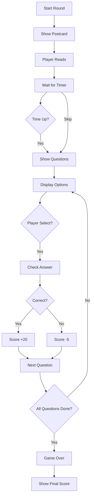

---

## 9. Input Handling Flow

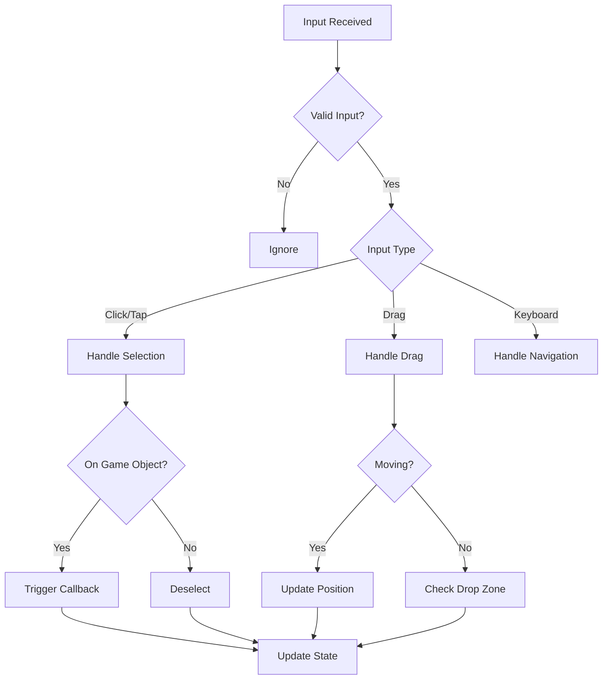

---

## 10. Score & Data Flow

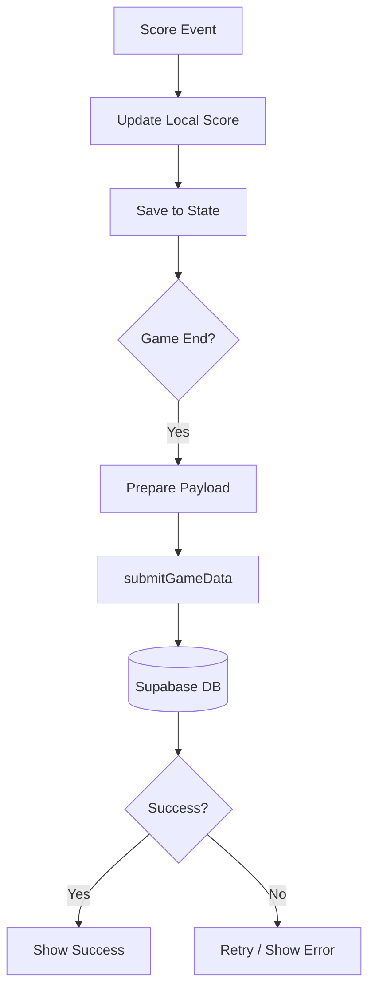

---

## 11. Render Pipeline

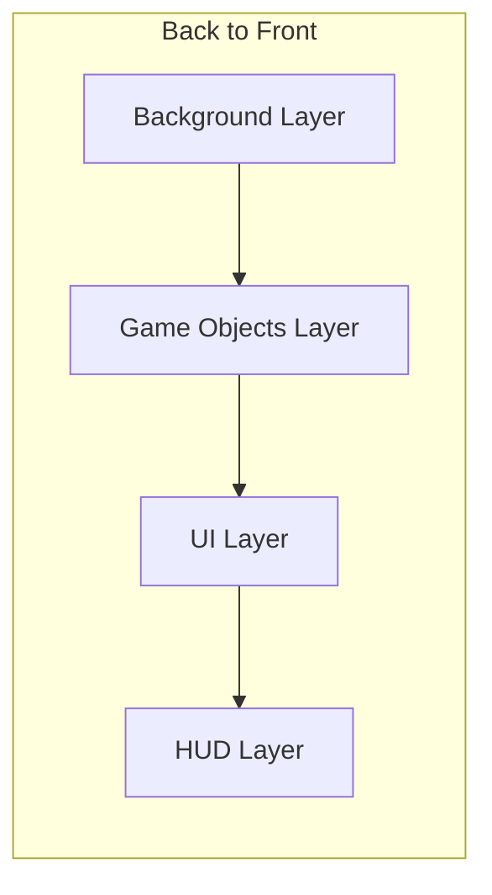

**Layer Details:**
- **Background**: Static backgrounds, patterns
- **Game Objects**: Animals, food, puzzles, cards
- **UI**: Panels, buttons, menus
- **HUD**: Score, timer, progress bar

---

## 12. State Management Flow

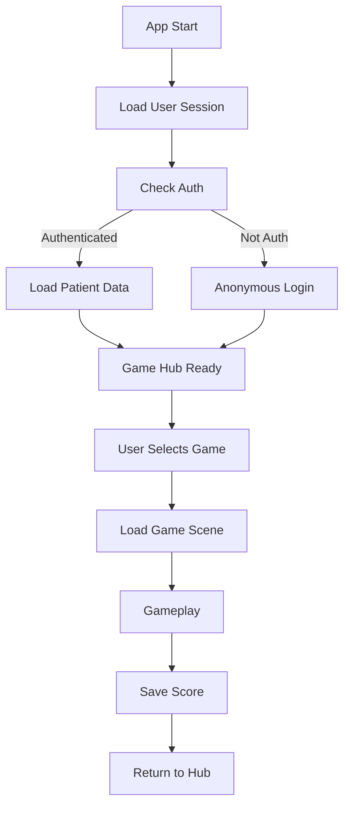

---

## Notes

### Target FPS
- **60 FPS** (Phaser 3 default)
- Adaptive performance for lower-end devices

### Delta Time
- Use `delta` parameter in `update()` for frame-independent movement
- Conveyor belt timing based on delta

### Render Strategy
- Phaser 3 WebGL with Canvas fallback
- Object pooling for frequently created/destroyed objects
- Texture atlas for sprite optimization

### Input Handling Strategy
- Touch/Mouse unified via Phaser input system
- Pointer events for cross-platform support
- Drag & drop for Symmetry Decor game

### Data Persistence
- Supabase for cloud save
- LocalStorage for session cache
- Patient session management via `patient-session.js`

---

## Appendix: Score Configuration

| Game | Easy Score | Medium Score | Hard Score | Penalty |
|------|------------|--------------|------------|---------|
| Zoo Detective | +15 | +16 | +17 | -5 to -7 |
| Zoo Feeder | +15 | +16 | +17 | -5 to -7 |
| Context Clues | +20 | +20 | +20 | -5 to -7 |
| Symmetry Decor | Based on quality | Based on quality | Based on quality | N/A |
| Postcard Reader | +20 | +20 | +20 | -5 to -7 |

---

## Appendix: Round Configuration

| Game | Easy Rounds | Medium Rounds | Hard Rounds |
|------|-------------|---------------|--------------|
| All Games | 10 | 10 | 10 |
