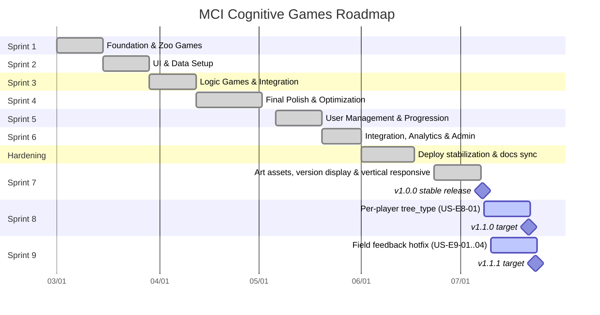

# Agile Sprint Plan - MCI Cognitive Games

---

**Last Updated:** 2026-07-14

## 📅 Sprint Schedule Overview (2-Week Cycles)

| Sprint                                    | Timeline      | Focus Area                           | Status    |
| :---------------------------------------- | :------------ | :----------------------------------- | :-------- |
| [sprint-01](sprint-backlogs/sprint-01.md) | Mar 01-14     | Foundation & Zoo Games               | Completed |
| [sprint-02](sprint-backlogs/sprint-02.md) | Mar 15-28     | UI & Data Setup                      | Completed |
| [sprint-03](sprint-backlogs/sprint-03.md) | Mar 29-Apr 11 | Logic Games & Integration            | Completed |
| [sprint-04](sprint-backlogs/sprint-04.md) | Apr 12-30     | Final Polish & Variety               | Completed |
| [sprint-05](sprint-backlogs/sprint-05.md) | May 06-19     | User Management & Progression Overhaul | Completed |
| [sprint-06](sprint-backlogs/sprint-06.md) | May 20-31     | Integration, Analytics & Admin | Completed |
| Post-Sprint Hardening | Jun 01-16 | Deployment stabilization, branch cleanup, documentation sync | Completed |
| [sprint-07](sprint-backlogs/sprint-07.md) | Jun 23-Jul 07 | Game Art Assets, Version Display & Mini-game Vertical Responsiveness → **v1.0.0 release** | Completed |
| [sprint-08](sprint-backlogs/sprint-08.md) | Jul 08-21 | Per-player progression tree (`tree_type`) → **v1.1.0** | Completed |
| [sprint-09](sprint-backlogs/sprint-09.md) | Jul 10-23 | Field Feedback Hotfix — P0 gameplay (US-E9-04 Backlog) | **Active** |
| [sprint-10](sprint-backlogs/sprint-10.md) | TBD | Field Feedback carry-over — export, A10s perf, font scale (US-E9-05/07/09) | Planned |

## 📊 Project Timeline (Gantt Chart)

---

## 🚀 Sprint Details

ดูรายละเอียดงานในแต่ละ Sprint ได้ที่ลิงก์ด้านล่าง:

- **[sprint-01](sprint-backlogs/sprint-01.md)**: Foundation & Zoo Games
- **[sprint-02](sprint-backlogs/sprint-02.md)**: UI Interactive & Data Foundation
- **[sprint-03](sprint-backlogs/sprint-03.md)**: Logic Games & Data Integration
- **[sprint-04](sprint-backlogs/sprint-04.md)**: Final Polish & Alternative Games
- **[sprint-05](sprint-backlogs/sprint-05.md)**: User Management & Progression Overhaul
- **[sprint-06](sprint-backlogs/sprint-06.md)**: Integration, Analytics & Admin Dashboard
- **Post-Sprint Hardening**: Stabilize deployment branches, verify Docker/nginx production build, fix stale leaderboard branch drift, and refresh documentation
- **[sprint-07](sprint-backlogs/sprint-07.md)**: Game Art Assets, Version Display & Mini-game Vertical Responsiveness — **Completed → [v1.0.0](../changelog.md) stable release (2026-07-07)**
- **[sprint-08](sprint-backlogs/sprint-08.md)**: Per-player progression tree (`tree_type` a/b/c/d) — **Completed → [v1.1.0](../changelog.md)** (US-E8-01 Done, 2026-07-14)
- **[sprint-09](sprint-backlogs/sprint-09.md)**: Field Feedback Hotfix — ลงพื้นที่ (แก้ด่วน UX มินิเกม) — **Active** (post-1.0, target `1.1.1`) — จาก [Meeting 2026-07-10](meeting-backlogs/2026-07-10.md)

## 📈 Epic Completeness Strategy (Alignment)

เพื่อให้โครงการเดินหน้าอย่างสมดุล เราจะพัฒนาทั้ง 3 Epics ขนานกันไปในแต่ละ Sprint:

### 🎮 E1: Core Cognitive Games (The Heart)
- **Sprint 1-2:** เน้นเกมกลุ่ม "Attention & Memory" (Zoo Games) เพื่อสร้าง Quick Win
- **Sprint 3:** เน้นเกมกลุ่ม "Executive Function & Language" (Symmetry, Context)
- **Sprint 4:** เพิ่มความหลากหลายใน "Memory & Reading" (Postcard Reader) และขัดเกลาทุกระบบ
- **Target:** สมบูรณ์ 100% เมื่อจบ Sprint 4

### 📊 E2: Patient Data & Tracking (The Brain)
- **Sprint 2:** วางโครงสร้างพื้นฐาน (Database Setup)
- **Sprint 3:** เชื่อมต่อระบบ (Integration) เพื่อให้แพทย์เริ่มเห็นข้อมูลการเล่น
- **Target:** ระบบพร้อมใช้งานจริง (Stable) เมื่อจบ Sprint 3

### ♿ E3: Accessibility & UX (The Soul)
- **Sprint 2:** เริ่มต้นด้วยมาตรฐานพื้นฐาน (Font/Button Size)
- **Sprint 4:** เพิ่มส่วนเสริมเพื่อการเข้าถึง (Voice Over) และขัดเกลา UI ทั้งหมด
- **Target:** ได้มาตรฐานการออกแบบเพื่อผู้สูงอายุเมื่อจบโครงการ

### 🛠 E6: Stabilization & Deployment
- **June hardening:** Reset/align staging with dev-approved code, restore environment/Docker deployment files, and validate production build on the test VM
- **Documentation:** Update GDD, software design, schema, UI components, backlog and roadmap to match the current app
- **Target:** Test VM and local builds use the same implementation baseline and no stale UI code remains in production bundles

### 🎨 E7: Game Art Assets & UI/UX Polish
- **Sprint 7:** เพิ่ม game art assets ให้หน้าจอ DOM หลัก (Leaderboard, Login, Sign-up, Player-Info, Popup), แสดงเลขเวอร์ชันบนตัวเกมหลัก (ซ่อนในมินิเกม) และทำให้มินิเกมยืดแนวตั้งได้ (Vertical Responsive)
- **Target:** ชั้นการนำเสนอ (presentation layer) มีเอกลักษณ์ภาพครบทุกหน้าจอหลัก — **shipped in v1.0.0** (2026-07-07). Post-1.0 follow-ups: US-E7-06 (vertical responsive). ~~US-E7-08/11/12~~ → **Done** (ฝ่ายอื่น, 2026-07-14).

### 🌳 E8: Check-in Personalization (Post-1.0)
- **Sprint 8:** ต้นคิดดีหลายชนิดต่อผู้เล่น — `game_tree_list` + `user_game_profile_data.tree_type`; สุ่มตอน signup; **lazy backfill** ผู้เล่น v1.0.0 ที่ `tree_type` เป็น NULL → [US-E8-01](user-stories/US-E8-01.md)
- **Target:** shipped **v1.1.0** — [US-E8-01](user-stories/US-E8-01.md) ✅ Done (owner verified 2026-07-14)

### 🔧 E9: Field Feedback Hotfixes (Post-1.0 — ลงพื้นที่)
- **Sprint 9:** P0 gameplay — ~~Symmetry Decor, Fry Food skip, Zoo Detective drag~~ ✅ Done; **Postcard font** → [US-E9-04](user-stories/US-E9-04.md)
- **Sprint 10 (planned):** ส่งออกข้อมูลครบชุด, A10s perf, system font scale → [US-E9-05](user-stories/US-E9-05.md), [US-E9-07](user-stories/US-E9-07.md), [US-E9-09](user-stories/US-E9-09.md)
- **Source:** [Meeting 2026-07-10](meeting-backlogs/2026-07-10.md)

**Shipped so far (Sprint 9):**

| Story | Version | Verified |
| :--- | :--- | :--- |
| [US-E9-08](user-stories/US-E9-08.md) Game Hub — ชื่อเกมบน / หมวดหมู่ล่าง | `1.1.1` | ✅ owner 2026-07-10 |
| [US-E9-06](user-stories/US-E9-06.md) Screen Wake Lock | `1.1.2` | ✅ owner 2026-07-10 |
| [US-E9-01](user-stories/US-E9-01.md) Symmetry Decor — UX ผู้สูงอายุ | — | ✅ Done 2026-07-14 (ไม่ bump version) |
| [US-E9-02](user-stories/US-E9-02.md) Fry Food — ปุ่มข้าม (ไม่มี Gyro) | — | ✅ Done 2026-07-14 (ไม่ bump version) |
| [US-E9-03](user-stories/US-E9-03.md) Zoo Detective — ลากเพื่อวาง | — | ✅ Done 2026-07-14 (มินิเกม version แยก) |
| [US-E9-11](user-stories/US-E9-11.md) Sign-up วันเกิด/วันที่เริ่มโปรแกรม เป็น พ.ศ. | `1.1.3` | ✅ owner 2026-07-13 |
| [US-E9-12](user-stories/US-E9-12.md) Popup ออกจากเกม — layout/art ตรง popup-dialog | `1.1.4` | ✅ owner 2026-07-14 |
| [US-E9-10](user-stories/US-E9-10.md) CLI `update-user-hn.js` | — | ✅ Done 2026-07-14 (ไม่ bump version) |

- **2026-07-14:** US-E9-01/02/03 ✅ Done; US-E9-05/07/09 เลื่อน [Sprint 10](sprint-backlogs/sprint-10.md)

---

Back to Index: [Index](../index.md)
