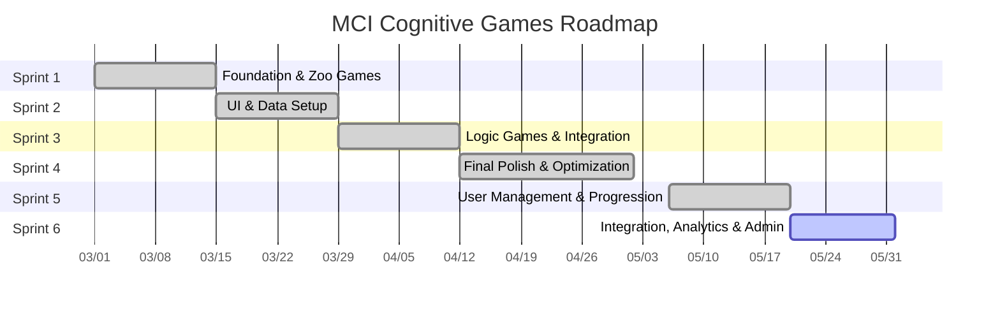

# Agile Sprint Plan - MCI Cognitive Games

---

## 📅 Sprint Schedule Overview (2-Week Cycles)

| Sprint                                    | Timeline      | Focus Area                           | Status    |
| :---------------------------------------- | :------------ | :----------------------------------- | :-------- |
| [sprint-01](sprint-backlogs/sprint-01.md) | Mar 01-14     | Foundation & Zoo Games               | Completed |
| [sprint-02](sprint-backlogs/sprint-02.md) | Mar 15-28     | UI & Data Setup                      | Completed |
| [sprint-03](sprint-backlogs/sprint-03.md) | Mar 29-Apr 11 | Logic Games & Integration            | Completed |
| [sprint-04](sprint-backlogs/sprint-04.md) | Apr 12-30     | Final Polish & Variety               | Completed |
| [sprint-05](sprint-backlogs/sprint-05.md) | May 06-19     | User Management & Progression Overhaul | Completed |
| [sprint-06](sprint-backlogs/sprint-06.md) | May 20-31     | **(Current)** Integration, Analytics & Admin | In-Progress |

## 📊 Project Timeline (Gantt Chart)

---

## 🚀 Sprint Details

ดูรายละเอียดงานในแต่ละ Sprint ได้ที่ลิงก์ด้านล่าง:

- **[sprint-01](sprint-backlogs/sprint-01.md)**: Foundation & Zoo Games
- **[sprint-02](sprint-backlogs/sprint-02.md)**: UI Interactive & Data Foundation
- **[sprint-03](sprint-backlogs/sprint-03.md)**: Logic Games & Data Integration
- **[sprint-04](sprint-backlogs/sprint-04.md)**: Final Polish & Alternative Games
- **[sprint-05](sprint-backlogs/sprint-05.md)**: User Management & Progression Overhaul
- **[sprint-06](sprint-backlogs/sprint-06.md)**: Integration, Analytics & Admin Dashboard

## 📈 Epic Completeness Strategy (Alignment)

เพื่อให้โครงการเดินหน้าอย่างสมดุล เราจะพัฒนาทั้ง 3 Epics ขนานกันไปในแต่ละ Sprint:

### 🎮 E1: Core Cognitive Games (The Heart)
- **Sprint 1-2:** เน้นเกมกลุ่ม "Attention & Memory" (Zoo Games) เพื่อสร้าง Quick Win
- **Sprint 3:** เน้นเกมกลุ่ม "Executive Function & Language" (Symmetry, Context)
- **Sprint 4:** เพิ่มความหลากหลายใน "Memory & Reading" (Postcard Reader) และขัดเกลาทุกระบบ
- **Target:** สมบูรณ์ 100% เมื่อจบ Sprint 4

### 📊 E2: Patient Data & Tracking (The Brain)
- **Sprint 2:** วางโครงสร้างพื้นฐาน (Database Setup)
- **Sprint 3:** เชื่อมต่อระบบ (Integration) เพื่อให้แพทย์เริ่มเห็นข้อมูลการเล่น
- **Target:** ระบบพร้อมใช้งานจริง (Stable) เมื่อจบ Sprint 3

### ♿ E3: Accessibility & UX (The Soul)
- **Sprint 2:** เริ่มต้นด้วยมาตรฐานพื้นฐาน (Font/Button Size)
- **Sprint 4:** เพิ่มส่วนเสริมเพื่อการเข้าถึง (Voice Over) และขัดเกลา UI ทั้งหมด
- **Target:** ได้มาตรฐานการออกแบบเพื่อผู้สูงอายุเมื่อจบโครงการ

---

Back to Index: [Index](../index.md)