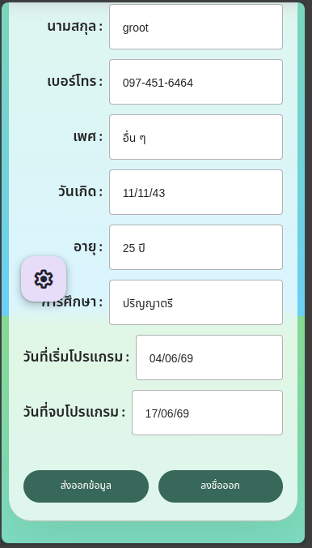

# Bug Report: BUG-006 - Background and FAB scroll with content on small screens (broken scroll containment)

**Status:** 🔴 Open
**Severity:** 🟠 Medium (Layout / UX)
**Affected Sprint:** [sprint-07](../../sprint-backlogs/sprint-07.md)

## 📖 Description
บนหน้าจอที่ **เล็กเกินไป** เมื่อ scroll ลง เนื้อหา (content) เลื่อนพร้อมกับ **พื้นหลัง (background)** และ **ปุ่ม FAB** ด้วย แทนที่จะเป็นเฉพาะเนื้อหาเลื่อน ทำให้:
- **สีพื้นหลังถูกตัด** (background ไม่เต็มจอเมื่อเลื่อน)
- **ปุ่ม FAB ไม่ float** — แทนที่จะลอยอยู่กับที่ มันเลื่อนตาม content ไปจนไปอยู่กลางจอ

พบบนหน้า **ข้อมูลผู้เล่น (Player-Info)** และน่าจะเกิดกับหน้า DOM อื่นที่ใช้ pattern การ scroll เดียวกัน

**Steps to reproduce:**
1. เปิดหน้า Player-Info บนหน้าจอเล็ก (เนื้อหายาวเกินความสูง viewport)
2. Scroll ลง
3. **ผลที่เกิด:** background และปุ่ม FAB เลื่อนตาม content (FAB ไปจบกลางจอ, พื้นหลังถูกตัด)
4. **ผลที่ควรเป็น:** เฉพาะ content เลื่อนภายใน container; background เต็มจอเสมอ; FAB ลอย (float) อยู่กับที่

## 🖼 Visual Reference

## 🛠 Proposed Fix
- ให้ **scroll เกิดภายใน inner content container** (มี `overflow-y:auto` + ความสูงจำกัด) แทนที่จะให้ทั้งหน้า/`body` เลื่อน
- ตั้ง **background** ที่ระดับ container/`fixed` ให้เต็ม viewport เสมอ ไม่เลื่อนตาม content
- ตั้งปุ่ม **FAB** เป็น `position: fixed` (หรือ sticky เทียบ viewport) เพื่อให้ลอยจริง ไม่ผูกกับ scroll ของ content
- ตรวจ pattern เดียวกันกับหน้า DOM อื่น (Hub/Profile/Leaderboard) ให้สอดคล้องกับ [TD-E6-05](../../01-product-backlog.md)

## 🔗 Related Files
- Screen: `src/ui/player-info-screen.js`
- FAB: `src/ui/components/fab-button.js`
- Styles: `public/style.css`, `public/components.css`

## 🔗 Related
- Sprint: [sprint-07](../../sprint-backlogs/sprint-07.md)
- Scroll containment audit: TD-E6-05
