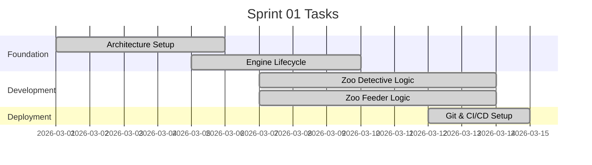

# Sprint 1: Foundation & Zoo Games

**Goal:** วางโครงสร้างพื้นฐานของโปรเจกต์ และพัฒนา Logic พื้นฐานของเกม Zoo Detective & Zoo Feeder
**Timeline:** 2026-03-01 → 2026-03-14

## 📅 Internal Timeline

## 📋 Committed Stories & Tasks
| ID | Story / Task | Owner | Estimate | Status |
|----|--------------|-------|----------|--------|
| [[US-E1-01]] | ระบบค้นหาภาพและตรรกะของ Zoo Detective | UI Dev | - | ✅ Done |
| [[US-E1-03]] | ระบบสายพานลำเลียงและฟิสิกส์ของ Zoo Feeder | UI Dev | - | ✅ Done |
| [[US-E1-05]] | ระบบคลังคำถามและประมวลผล Context Clues | Core Dev | - | ✅ Done |

## 🛠 Sprint 1 Specifics
- **Core Architecture:** จัดโครงสร้างโปรเจกต์ (Vite, Phaser, File Structure)
- **Game Engine:** ติดตั้ง Phaser 3 และกำหนด Scene Lifecycle พื้นฐาน
- **Dev Environment:** ตั้งค่า Git และเตรียม CI/CD เบื้องต้น
