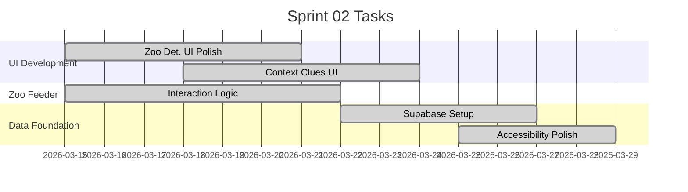

# Sprint 2: UI Interactive & Data Foundation

**Goal:** ทำให้เกม Zoo ชุดแรกสมบูรณ์ 100% และเตรียมระบบฐานข้อมูลให้พร้อมใช้งาน
**Timeline:** 2026-03-15 → 2026-03-28

## 📅 Internal Timeline

## 📋 Committed Stories & Tasks
| ID | Story / Task | Owner | Estimate | Status |
|----|--------------|-------|----------|--------|
| [US-E1-02](US-E1-02.md) | Zoo Detective UI & Feedback | UI Dev | - | ✅ Done |
| [US-E1-04](US-E1-04.md) | Zoo Feeder Interaction Logic | UI Dev | - | ✅ Done |
| [US-E1-06](US-E1-06.md) | UI สำหรับ Context Clues (Thai Support) | UI Dev | - | ✅ Done |
| [US-E2-01](US-E2-01.md) | Setup Supabase Tables | Core Dev | - | ✅ Done |
| [US-E3-01](US-E3-01.md) | ปรับขนาด Font/ปุ่ม (Accessibility Basics) | UI Dev | - | 🏗 In-Progress |

