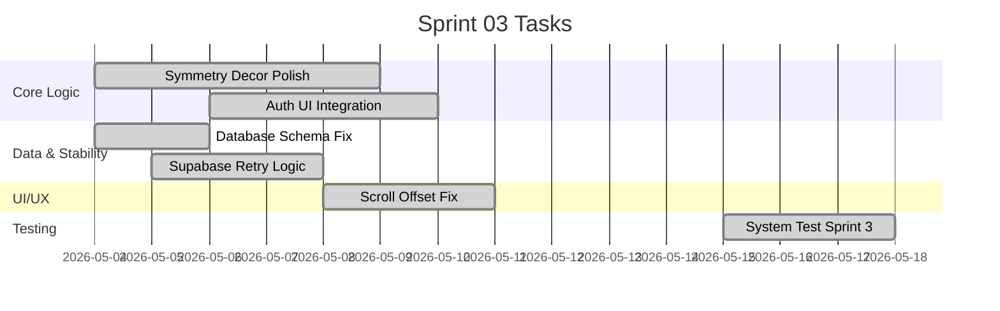

# Sprint 3: Logic Games & Data Integration

**Goal:** เพิ่มเกมฝึกตรรกะ (Symmetry Decor), เชื่อมต่อระบบ Authentication และแก้ไขปัญหาความเสถียรของข้อมูล
**Timeline:** 2026-05-04 → 2026-05-17

## 📅 Internal Timeline

## 📋 Committed Stories & Tasks
| ID           | Story / Task                                  | Owner    | Estimate | Done?  |
| ------------ | --------------------------------------------- | -------- | -------- | ------ |
| [[US-E1-07]] | ระบบ Grid และการวาดภาพสะท้อน (Symmetry Decor) | UI Dev   | 40h      | ✅ Done |
| [[US-E2-02]] | ระบบ Authentication สำหรับแพทย์และผู้ป่วย     | Core Dev | 24h      | ✅ Done |
| [[US-E2-03]] | API สำหรับส่งคะแนนและเวลาที่ใช้ (Integration) | Core Dev | 16h      | ✅ Done |
| [[BUG-001]]  | Supabase Transient Connection Fix             | Core Dev | 8h       | ✅ Done |
| [[BUG-002]]  | Zoo Detective Drag-and-Drop Scroll Offset     | UI Dev   | 8h       | ✅ Done |
| [[BUG-003]]  | Database Logging Foreign Key Fix              | Data Eng | 4h       | ✅ Done |

## 🛠 Sprint 3 Specifics
- **Definition of Done:** ผ่านการทดสอบ Game Loop, ข้อมูลบันทึกถูกต้อง 100%, UI รองรับ Tablet, Code Review เสร็จสิ้น
- **Risks & Blockers:** Supabase Rate Limiting (Mitigation: Batch Logging), Database Schema Sync Issues.
