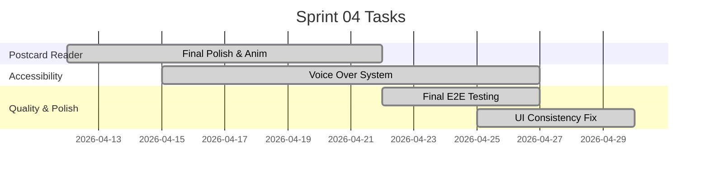

# Sprint 4: Final Polish & Alternative Games

**Goal:** ส่งมอบเกมทางเลือกอื่นๆ เพิ่มเติม และปรับปรุงความง่ายในการใช้งาน (UX) สำหรับผู้สูงอายุ
**Timeline:** 2026-04-12 → 2026-04-30

## 📅 Internal Timeline

## 📋 Committed Stories & Tasks
| ID           | Story / Task                                | Owner    | Estimate | Status         |
| ------------ | ------------------------------------------- | -------- | -------- | -------------- |
| [US-E1-08](../user-stories/archives/US-E1-08.md) | Postcard Reader (Final Polish & Animation)  | UI Dev   | 40h      | ✅ Done         |
| [US-E3-02](../user-stories/archives/US-E3-02.md) | ระบบ Voice Over คำแนะนำการเล่น (Web Speech) | Core Dev | 24h      | 🏗 In-Progress |
| [US-E4-04](../user-stories/archives/US-E4-04.md) | ระบบจัดเก็บบันทึกการเล่นซ้ำพฤติกรรม (Replay Event Logging - Foundation) | Core Dev | 24h | ✅ Done |
| [QA-001](../user-stories/QA-001.md)   | Final End-to-End System Testing             | QA Team  | 16h      | ✅ Done         |
| [POL-001](../user-stories/POL-001.md)  | UI Consistency & Animation Polish           | UI Dev   | 16h      | ✅ Done         |

## 🛠 Sprint 4 Specifics
- **Alternative Gameplay:** เพิ่มความหลากหลายของเนื้อหาใน Postcard Reader และปรับปรุงระบบการสุ่มโจทย์
- **Accessibility:** ระบบเสียงอ่านอัตโนมัติสำหรับผู้สูงอายุที่มีปัญหาด้านการสายตา
- **Final QA:** ตรวจสอบความถูกต้องของข้อมูลสถิติและการบันทึก Log ทั้งโปรเจกต์

---

Back to Index: [Index](../../index.md)
Back to Sprint Backlogs: [Sprint Backlogs](../02-sprint-planning.md)