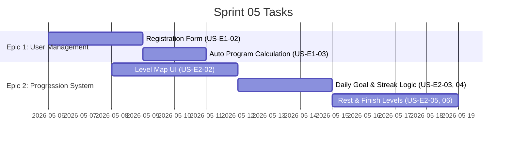

# Sprint 05: User Management & Progression Overhaul

**Goal:** พัฒนาระบบลงทะเบียนผู้ใช้แบบละเอียด และระบบความคืบหน้า (Progression) 14 วัน ตามที่ระบุใน GDD V.1
**Timeline:** 2026-05-06 → 2026-05-19

## 📅 Internal Timeline

## 📋 Committed Stories & Tasks
| ID | Story / Task | Priority | Status |
|----|--------------|----------|--------|
| [US-E1-02](../user-stories/US-E1-02.md) | ระบบลงทะเบียนผู้ใช้ใหม่ (ชื่อ, วันเกิด, เพศ, การศึกษา) | High | 🏗 In-Progress |
| [US-E1-03](../user-stories/US-E1-03.md) | ระบบคำนวณวันที่สิ้นสุดโปรแกรมอัตโนมัติ (14 วัน) | Med | 🏗 In-Progress |
| [US-E2-02](../user-stories/US-E2-02.md) | ระบบแผนที่ด่าน (Level Progression Map) | High | 🏗 In-Progress |
| [US-E2-03](../user-stories/US-E2-03.md) | ระบบ Daily Goal Progress Bar | High | 🏗 In-Progress |
| [US-E2-04](../user-stories/US-E2-04.md) | ระบบ Daily Streak Tracking | Med | 🏗 In-Progress |
| [US-E2-05](../user-stories/US-E2-05.md) | มินิเกมด่านจุดพัก (Rest Level) | Low | 🏗 In-Progress |
| [US-E2-06](../user-stories/US-E2-06.md) | ด่านเส้นชัยและระบบเช็คชื่อ (Finish Level) | High | 🏗 In-Progress |

## 🛠 Sprint Specifics
- **Definition of Done:**
  - ผ่าน Acceptance Criteria ของทุก User Story
  - ข้อมูลถูกบันทึกและดึงมาจาก Supabase ได้ถูกต้อง
  - UI/UX เป็นไปตามแนวทางที่กำหนดใน GDD
- **Risks & Blockers:**
  - ความซับซ้อนของการวาดเส้นทางในแผนที่ด่าน (Progression Map)
  - การจัดการสถานะ Locked/Unlocked ของด่านตามวันจริง