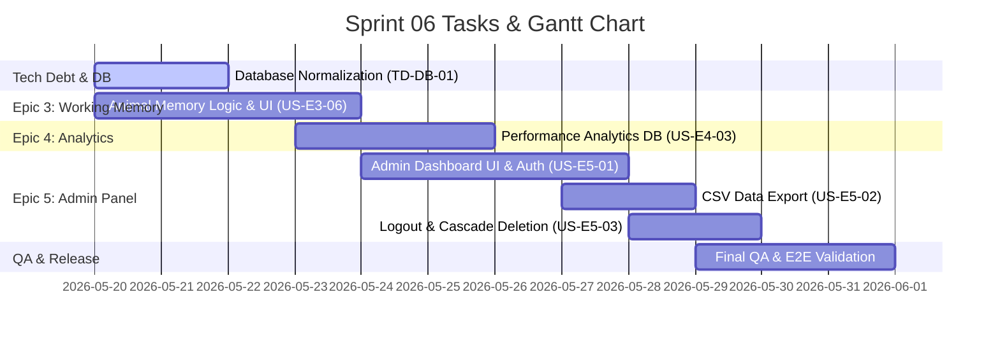

# Sprint 06: Final Integration, Analytics & Admin Dashboard

**Goal:** พัฒนามินิเกมด่านสุดท้าย (เกมจำสัตว์), ระบบบันทึกข้อมูลประสิทธิภาพเชิงลึก (Analytics), ระบบตรวจสอบสิทธิ์และแดชบอร์ดจัดการข้อมูลผู้ดูแล (Admin Screen), ระบบส่งออกไฟล์ CSV และจัดการหนี้ทางเทคนิคของฐานข้อมูล (Database Normalization) ให้เสร็จสมบูรณ์เพื่อปิดโครงการ  
**Timeline:** 2026-05-20 → 2026-05-31 (12 วัน)  

---

## 📅 Internal Timeline

---

## 📋 Committed Stories & Tasks
| ID | Story / Task / Tech Debt | Priority | Status |
|----|--------------------------|----------|--------|
| [US-E3-06](../user-stories/US-E3-06.md) | เกมจำสัตว์ (ความจำขณะทำงาน/Working Memory) - ระบบคำถามคั่นเวลา | High | 🏗 To Do |
| [US-E4-03](../user-stories/US-E4-03.md) | บันทึกข้อมูลเชิงลึก (Accuracy, Reaction Time, Fatigue Effect) | Med | 🏗 To Do |
| [US-E5-01](../user-stories/US-E5-01.md) | ระบบ Admin Login เพื่อดูข้อมูลผู้ป่วย | High | 🏗 To Do |
| [US-E5-02](../user-stories/US-E5-02.md) | ระบบส่งออกข้อมูลเป็นไฟล์ CSV | Med | 🏗 To Do |
| [US-E5-03](../user-stories/US-E5-03.md) | ระบบลบบัญชีและลงชื่อออก | Med | 🏗 To Do |
| [UX-RESP-01](../user-stories/UX-RESP-01.md) | **Research & Design**: ค้นคว้าความละเอียดหน้าจอมือถือ และแนวทางการพัฒนา UX/UI ให้ Responsive (Phaser + DOM) พร้อมแผนทดสอบ | High | ✅ Done |
| **TD-DB-01** | **Technical Debt**: ปรับแต่ง Database Naming (kebab-case `"check-in"` ⮕ snake_case `check_in` และเปลี่ยนชื่อคอลัมน์ `date` ⮕ `birth_date` ใน `user_patient_data` พร้อมปรับ SQL / API JS ในระบบให้สอดคล้องกัน) | High | 🏗 To Do |

---

## 📊 Sprint Summary & Velocity
- **งานที่วางแผนไว้ (Planned):** 5 User Stories + 1 Technical Debt Task
- **สถานะปัจจุบัน (Status):** 🏗 Planned / In-Progress (อยู่ระหว่างจัดเตรียมเอกสารและเตรียมเข้าสู่กระบวนการเขียนโปรแกรม)
- **เป้าหมายความสำเร็จ (Sprint Target):** ปิดงานฟังก์ชันทางคลินิกและระบบรายงานผลทั้งหมด พร้อมสำหรับการส่งมอบโครงการภายในวันที่ 31 พฤษภาคม 2026

---

## 🛠 Sprint Specifics
- **Definition of Done (DoD):**
  - ผ่านการทดสอบ Acceptance Criteria ทั้งหมดในทุก User Story ของ Sprint 6
  - มีการจัดระบบ Foreign Key Constraints แบบ ON DELETE CASCADE บน Supabase เพื่อการลบบัญชีที่สมบูรณ์
  - โครงสร้างคอลัมน์บนฐานข้อมูล Supabase ถูกแก้ไขให้ใช้ snake_case อย่างสมบูรณ์และไม่มีปัญหาการดึงข้อมูลย้อนหลัง
  - รหัสผ่านฝั่ง Admin ได้รับการตรวจสอบและกั้นสิทธิ์ (Authentication & Role Guard) แบบปลอดภัย
  - การดาวน์โหลดไฟล์ CSV สำหรับรายงานผลผู้สูงอายุ แสดงผลภาษาไทยครบถ้วนบน Excel
- **Risks & Blockers:**
  - **ความเสี่ยงในการเชื่อมโยงข้อมูลภาษาไทยในไฟล์ CSV**: หากเปิดด้วย Excel บน Windows อาจแสดงภาษาไทยเพี้ยน (อักษรต่างดาว) -> *แนวทางแก้ไข*: บังคับส่งออกไฟล์โดยแทรก UTF-8 BOM (`\ufeff`) ไว้หน้าสุดของสตรีมข้อมูลเสมอ
  - **ความเข้ากันได้ของการลบข้อมูล (Cascade Deletion)**: หากไม่มีคำสั่ง cascade ระบบอาจไม่อนุญาตให้ลบบัญชีผู้ป่วยเนื่องจากติดเงื่อนไขความสัมพันธ์ของตารางล็อกข้อมูล -> *แนวทางแก้ไข*: ตรวจสอบให้มั่นใจว่าตั้งค่า Cascade Delete บน Supabase ก่อนการทดสอบ

---
Back to Product Backlog: [Product Backlog](../01-product-backlog.md) | Back to Index: [Index](../../index.md)
