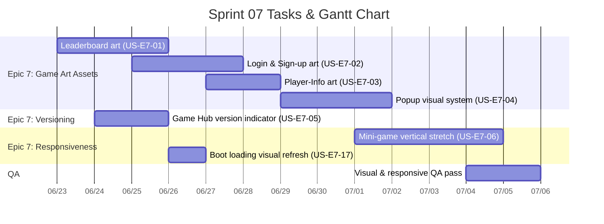

# Sprint 07: Game Art Assets, Version Display & Mini-game Vertical Responsiveness

**Goal:** ยกระดับชั้นการนำเสนอ (Presentation Layer) ของแอป โดย (1) เพิ่ม game art assets ให้หน้าจอ DOM หลัก (Leaderboard, Login, Sign-up, Player-Info, Popup และอื่น ๆ) ให้มีเอกลักษณ์ภาพตรงกับธีมเกม, (2) แสดงเลขเวอร์ชันของตัวเกมหลัก (Game Hub shell) โดยซ่อนตัวบ่งชี้นี้เมื่อผู้เล่นเข้าสู่มินิเกม และ (3) ทำให้มินิเกม (Phaser) รองรับการยืดในแนวตั้ง (Vertical Responsive) บนหน้าจอที่สูงได้อย่างถูกต้อง
**Timeline:** 2026-06-23 → 2026-07-06 (14 วัน)

---

## 📅 Internal Timeline

---

## 📋 Committed Stories & Tasks
| ID | Story / Task | Priority | Status |
|----|--------------|----------|--------|
| [US-E7-01](../user-stories/US-E7-01.md) | Game art assets สำหรับหน้า Leaderboard | High | ✅ Done |
| [US-E7-02](../user-stories/US-E7-02.md) | Game art assets สำหรับหน้า Login และ Sign-up | High | ✅ Done |
| [US-E7-03](../user-stories/US-E7-03.md) | Game art assets สำหรับหน้า Player-Info | Med | ✅ Done |
| [US-E7-04](../user-stories/US-E7-04.md) | Game art assets / ระบบภาพสำหรับ Popup (dialog) | Med | 🔍 Review / Testing |
| [US-E7-05](../user-stories/US-E7-05.md) | แสดงเลขเวอร์ชันบนตัวเกมหลัก (Game Hub) และซ่อนเมื่อเข้ามินิเกม | Med | 📋 Backlog |
| [US-E7-06](../user-stories/US-E7-06.md) | มินิเกมรองรับการยืดแนวตั้ง (Vertical Responsive) | High | 📋 Backlog |
| [US-E7-17](../user-stories/US-E7-17.md) | ปรับ Boot Loading ให้ใช้โลโก้เกม + dot progress 5 จุด | Med | ✅ Done |
| [US-E7-18](../user-stories/US-E7-18.md) | ย้าย feedback ข้อความ → Toast component แบบ Android | Med | 📋 Backlog |
| [US-E7-19](../user-stories/US-E7-19.md) | หน้า Welcome: เปลี่ยนปุ่มเข้าเกมเป็น art Start-Game-Button | Low | 🔍 Review / Testing |

---

## 📨 Customer Feedback Items — Doctor Meeting #2 (2026-06-24)
เพิ่มเข้า Sprint 7 จากข้อเสนอแนะของคุณหมอ (Sprint ยังไม่เริ่ม implement) — ดูบันทึกฉบับเต็ม: [2026-06-24](../meeting-backlogs/2026-06-24.md)

| ID | Story / Task | Priority | Status |
|----|--------------|----------|--------|
| [US-E7-07](../user-stories/US-E7-07.md) | ชื่อมินิเกมภาษาไทย (ปก + Gamehub) + ขยายตัวอักษรวิธีเล่น | High | ✅ Done |
| [US-E7-08](../user-stories/US-E7-08.md) | แก้คำศัพท์ยาก "สมอบก" ในเกมคำใบ้บริบท (เนื้อเรื่องกางเต็นท์) | High | 📋 Backlog |
| [US-E7-09](../user-stories/US-E7-09.md) | จดหมายจากหลานรัก — เสียง AI ใหม่/ถอดเสียง + ขยายตัวอักษรโจทย์ | Med | 📋 Backlog |
| [US-E7-10](../user-stories/US-E7-10.md) | ต้นคิดดีหลายรูปแบบ + เอฟเฟค Juicy | Med | ✅ Done* |
| [US-E7-11](../user-stories/US-E7-11.md) | ละครสั้น Mood&Tone แฮปปี้ + ความถูกต้องวิดีโอ + ไปป์ไลน์ AI | Med | 📋 Backlog |
| [US-E7-12](../user-stories/US-E7-12.md) | แสดงโดเมน Cognitive ในเกม + สรุปหลังบ้านรายด้าน + เตรียมข้อมูล AI | Med | 📋 Backlog |
| [US-E7-13](../user-stories/US-E7-13.md) | เอฟเฟคฉลองหน้า "เก่งมาก!!!" (ระเบิดริปปิ้น + อนิเมชันคนแก่ดีใจ) | Med | ✅ Done |

> \* US-E7-10 Done เฉพาะขอบเขตเอฟเฟค Juicy (growth transition + rainbow sparkle) ยืนยันโดยเจ้าของงาน 2026-07-06; งานต้นไม้ **หลายรูปแบบ** (art) ยกออกเป็นงานติดตามในภายหลัง

> **หมายเหตุนอกขอบเขต Dev:** การเก็บข้อมูล MOCA (กระดาษ → Google Sheet) เป็นกระบวนการของทีมแพทย์ และจุดเด่นของแอป/บทบาท AI/ทิศทางธีมใหม่ต่อเนื่อง เป็นประเด็นเชิงกลยุทธ์ — บันทึกไว้ในรายงานการประชุม

---

## 🐛 Stability & Bug Fixes
บั๊กที่พบในช่วง Sprint 7 และต้องแก้ในรอบนี้

| ID | Bug / Task | Severity | Status |
|----|------------|----------|--------|
| [BUG-004](../reports/bugs/BUG-004.md) | กลับจากมินิเกมโหมด full-screen แล้วพื้นหลัง Game Hub เป็นสีดำ | 🟠 Medium | 🔴 Open |
| [BUG-005](../reports/bugs/BUG-005.md) | โหลดข้อมูลช้า → ผู้ใช้เปิดเกม/Leaderboard ก่อนโหลดเสร็จแล้วถูกดีดกลับหน้า Game Hub (เสนอ: loading overlay หรือเลิก redirect) | 🔴 High | ✅ Resolved |
| [BUG-006](../reports/bugs/BUG-006.md) | จอเล็ก: scroll ลงแล้ว background ถูกตัด + ปุ่ม FAB ไม่ float (เลื่อนตาม content) — scroll containment เสีย | 🟠 Medium | ✅ Resolved |
| [BUG-007](../reports/bugs/BUG-007.md) | Game Hub header ไม่อยู่กึ่งกลางในบางเบราว์เซอร์ (`justify-items` บน element ที่ไม่ใช่ grid) | 🟡 Low | ✅ Resolved |

> หมายเหตุ: UI แสดงเวอร์ชันระดับ body ครอบทุกหน้า (และซ่อนในมินิเกม) อยู่ใน [US-E7-05](../user-stories/US-E7-05.md) แล้ว — ปรับ acceptance criteria ให้ครอบคลุมการ render ระดับ body/ทุกหน้า

---

## 👤 Owner Task Block — ก้องไผ่ (2026-06-24)
งานที่มอบหมายให้ **ก้องไผ่** ในรอบนี้ แต่ละข้อ map กับ User Story (มีอยู่/สร้างใหม่) หรือเป็น note/coordination

**หน้าหลัก (Game Hub)**
- [ ] ปรับระยะห่างแต่ละเลเวลให้ห่างขึ้น (ปุ่มเริ่มเกมไม่เบียดมินิเกมถัดไป) → [US-E7-14](../user-stories/US-E7-14.md)
- [ ] สลับตำแหน่งชื่อเกม ↔ ชื่อหมวด Cognitive ในหน้าหลัก → [US-E7-14](../user-stories/US-E7-14.md)
- [ ] เพิ่มเงาตัวละครในหน้าหลัก → [US-E7-14](../user-stories/US-E7-14.md)
- [ ] นำ **Assets พี่กวาง** มาใส่ (เป็นแหล่ง art ของงาน E7) → ใช้ร่วมกับ US-E7-01..04, US-E7-14

**ระบบสีปุ่ม**
- [ ] ปุ่มเขียว = "เริ่มเกม"/"ตกลง"/"ต่อไป", ปุ่มแดง = "ยกเลิก" → [US-E7-15](../user-stories/US-E7-15.md)

**Art หน้าจอ DOM**
- [x] หน้าลงชื่อเข้าใช้ (Login, v0.17.0) + สมัครสมาชิก (Sign-up, v0.18.0) → [US-E7-02](../user-stories/US-E7-02.md) *(✅ ยืนยันมือถือ 2026-06-29)*
- [x] หน้า Login ของ Admin → [US-E7-02](../user-stories/US-E7-02.md) (ขยายขอบเขตให้รวม Admin Login)
- [x] หน้าข้อมูลผู้เล่น (Player-Info, v0.18.0) → [US-E7-03](../user-stories/US-E7-03.md) *(✅ ยืนยันมือถือ 2026-06-29)*
- [x] หน้า Leaderboard → [US-E7-01](../user-stories/US-E7-01.md) *(v0.25.0, ✅ ยืนยันการแสดงผลโดยเจ้าของงาน 2026-07-06)*
- [x] หน้า Welcome: ปุ่มเข้าเกมใช้ art Start-Game-Button ("เริ่มเล่นเกม") → [US-E7-19](../user-stories/US-E7-19.md) *(v0.19.0, รอ QA มือถือ)*

**Popup**
- [x] กรอบ Popup (Frame_Form_Panel + Start-Game-Button) → check-in success / resting / day+program completion → [US-E7-04](../user-stories/US-E7-04.md) *(v0.20.0, รอ QA; popup-dialog.js เป็นดีไซน์อื่น ยังไม่แตะ)*
- [x] **ตัด** Popup หลังดูละครเสร็จ ("พบกันใหม่วันพรุ่งนี้") ออก → [US-E7-16](../user-stories/US-E7-16.md) *(ยืนยันด้วยโค้ด/grep 2026-06-26: ไม่มี popup นี้ในระบบ)*
- [x] แก้ Popup เมื่อผู้เล่นเล่นจบของวันแล้วเข้ามาในวันเดิม ("วันนี้พักก่อน" + คุณตา/คุณยายนั่งพัก) → [US-E7-16](../user-stories/US-E7-16.md) *(v0.15.0, ✅ ยืนยันบนมือถือ 2026-06-26)*
- [ ] เปลี่ยน emoji บน popup "ยินดีด้วย จบโปรแกรม 14 วัน" เป็นคุณตา/คุณยายตามเพศ + layout แบบ "วันนี้พักก่อน" → [US-E7-16](../user-stories/US-E7-16.md) AC#6 *(เพิ่มขอบเขต 2026-06-26)*

**Boot Loading**
- [x] ปรับ boot loading ตอนเปิดเกมให้ใช้โลโก้เกมเหมือนหน้า Welcome และ dot progress จำนวน 5 จุด → [US-E7-17](../user-stories/US-E7-17.md)

**Feedback / Toast**
- [ ] ย้าย feedback ข้อความ (error/สถานะกำลังทำงาน) ใต้ช่องกรอกใน Login/Sign-up/Player-Info ฯลฯ → **Toast แบบ Android** (component แยกใน `src/ui/components/`) → [US-E7-18](../user-stories/US-E7-18.md) *(requirement ใหม่ 2026-06-29)*

**ข้อมูลหลังบ้าน (coordination)**
- [ ] ตกลงกับ **น้องเกม** เรื่องข้อมูลหลังบ้าน เช่น เงื่อนไข/ขั้นตอน **ลบข้อมูลผู้เล่นทั้งหมด** ให้ลบได้เลยโดยไม่ติดปัญหาทั้งฝั่ง SE และฝั่งเรา → เกี่ยวข้องกับ [US-E5-03](../user-stories/US-E5-03.md) และ [TD-DB-01](../user-stories/TD-DB-01.md) (Owner: ก้องไผ่ + น้องเกม)

---

## 👤 Owner Task Block — ก้องไผ่ (2026-07-06)
งานเพิ่มเติมรอบล่าสุด แต่ละข้อสร้างเป็น User Story ใหม่

| ID | Story / Task | Priority | Status |
|----|--------------|----------|--------|
| [US-E7-23](../user-stories/US-E7-23.md) | ขยาย collision กล่องวางคำตอบเกม Context Clues | Med | ✅ Done (v0.28.0) |
| [US-E7-24](../user-stories/US-E7-24.md) | ย้ายชื่อเกม "ทอดอาหาร" (Fry Food) ขึ้นแทนหมวดหมู่ MCI + จัดเป็นหมวด Physical | Med | 📋 Backlog |
| [US-E7-25](../user-stories/US-E7-25.md) | ใส่ตัวละครคุณตา/คุณยายนั่งพักใน Popup "วันนี้พักก่อน" | Med | ✅ Done (v0.26.0) |
| [US-E7-26](../user-stories/US-E7-26.md) | จัด Layout หน้า Leaderboard เพิ่มเติม | Med | ✅ Done (v0.27.0) |
| [US-E7-27](../user-stories/US-E7-27.md) | Popup แจ้งเตือนเมื่ออินเทอร์เน็ตหลุด/ไม่มีอินเทอร์เน็ต | High | 📋 Backlog |
| [US-E7-28](../user-stories/US-E7-28.md) | Popup "โปรแกรมจบแล้ว" แสดงวันเริ่ม–วันสิ้นสุดโปรแกรม | Med | 📋 Backlog |

**มินิเกม**
- [x] ขยาย collision กล่องวางคำตอบเกม Context Clues ให้กดง่ายขึ้น → [US-E7-23](../user-stories/US-E7-23.md) *(v0.28.0, ✅ เจ้าของงานแก้ไข/ยืนยันเอง 2026-07-06 — hit area ปรับแยกได้ + overlap drop)*

**หน้าหลัก (Game Hub)**
- [ ] ย้ายชื่อเกม "ทอดอาหาร" ขึ้นแทนที่หมวดหมู่ MCI → [US-E7-24](../user-stories/US-E7-24.md) (ต่อเนื่องกับ [US-E7-14](../user-stories/US-E7-14.md) ข้อ 2)
- [ ] จัดเกมเจียวไข่/ทอดอาหาร (`PHY001`) เป็นหมวด **Physical** + ให้ Game Hub แสดงหมวดเป็น Physical (เพิ่มหมวดใน `CATEGORY_META`, เปลี่ยน `mci_group` จาก `Executive`) → [US-E7-24](../user-stories/US-E7-24.md) *(เพิ่มขอบเขต 2026-07-06)*

**Popup**
- [x] เอาตัวละครคุณตา/คุณยาย **นั่งพัก** ไปใส่ Popup "วันนี้พักก่อน" → [US-E7-25](../user-stories/US-E7-25.md) *(v0.26.0: art beanbag `*_resting_02.png` + ขยับเงา)* (ต่อเนื่องกับ [US-E7-16](../user-stories/US-E7-16.md) AC#2)
- [ ] เพิ่ม Popup แจ้งเตือนเมื่อ **อินเทอร์เน็ตหลุด/ไม่มีเน็ต** ("อินเทอร์เน็ตหายไปแล้ว" + ปุ่ม "ลองอีกครั้ง") → [US-E7-27](../user-stories/US-E7-27.md) *(เพิ่ม 2026-07-06)*
- [ ] Popup **"โปรแกรมจบแล้ว"** แสดง **วันเริ่ม–วันสิ้นสุดโปรแกรม** (เริ่มต้น/สิ้นสุด) → [US-E7-28](../user-stories/US-E7-28.md) *(เพิ่ม 2026-07-06; ต่อยอด [US-E7-16](../user-stories/US-E7-16.md) AC#6)*

**Leaderboard**
- [x] จัด layout หน้า Leaderboard เพิ่มเติม → [US-E7-26](../user-stories/US-E7-26.md) (ต่อยอดจาก [US-E7-01](../user-stories/US-E7-01.md)) *(v0.27.0, ✅ เจ้าของงานแก้ไข/ยืนยันเอง 2026-07-06)*

---

## 📊 Sprint Summary & Velocity
- **งานที่วางแผนไว้ (Planned):** 21 User Stories ภายใต้ Epic E7 (6 เดิม + 7 จาก Doctor Feedback ครั้งที่ 2 + 8 จาก Owner Task Block ก้องไผ่) และบั๊ก BUG-004/005/006/007
- **สถานะปัจจุบัน (Status):** 🏗 In-Progress — เจ้าของงานยืนยัน Done เพิ่ม 2026-07-06: US-E7-01, US-E7-07, US-E7-10*, US-E7-22, US-E7-23, US-E7-25, US-E7-26 (ล่าสุด v0.28.0); เพิ่มงานใหม่ US-E7-27 (offline popup), US-E7-28 (program-complete dates)
- **เป้าหมายความสำเร็จ (Sprint Target):** ทุกหน้าจอ DOM หลักมี art asset ตรงธีม, ตัวเกมหลักแสดงเลขเวอร์ชันที่ sync กับ `package.json` (และซ่อนในมินิเกม), และมินิเกมทุกเกมยืดแนวตั้งได้โดยไม่มีการตัดขอบ/letterbox ภายในวันที่ 6 กรกฎาคม 2026

---

## 🛠 Sprint Specifics
- **Definition of Done (DoD):**
  - หน้าจอ Leaderboard, Login, Sign-up, Player-Info และ Popup ใช้ art asset จากธีมเกม (ไม่ใช่ placeholder) และผ่านการตรวจบนมือถือจริง
  - art asset ทั้งหมดถูกจัดเก็บภายใต้ `public/assets/` ตาม convention และไม่ทำให้ bundle หลักโตเกินจำเป็น
  - ตัวบ่งชี้เวอร์ชันบน Game Hub อ่านค่ามาจากแหล่งความจริงเดียว (`package.json`) และหายไปเมื่อมินิเกม (Phaser) ทำงานอยู่
  - boot loading overlay ใช้โลโก้เกมเดียวกับหน้า Welcome และ dot progress 5 จุด โดยยังปิดตาม first usable paint / `finishBootLoading()` เดิม
  - มินิเกมทุกเกมรองรับการยืดแนวตั้งบน viewport ที่สูง โดย element ภายในจัดตำแหน่ง/anchor ถูกต้อง ไม่มีพื้นที่ว่างผิดปกติหรือ asset ถูกตัด
  - ผ่าน visual QA และ responsive QA บนอัตราส่วนหน้าจอแนวตั้งหลายขนาด
- **Risks & Blockers:**
  - **ขนาด bundle จาก art assets**: ภาพจำนวนมากอาจทำให้แอปโหลดช้า -> *แนวทางแก้ไข*: บีบอัด/ใช้รูปแบบที่เหมาะสม (เช่น WebP/SVG), โหลดเฉพาะที่จำเป็น และพิจารณาทำ Figma เป็น CSS แทนรูปภาพในจุดที่ทำได้
  - **ความหลากหลายของอัตราส่วนหน้าจอแนวตั้ง**: การยืดแนวตั้งอาจทำให้ layout ของบางมินิเกมเพี้ยน -> *แนวทางแก้ไข*: เลือกกลยุทธ์ Phaser Scale ที่เหมาะ (RESIZE/FIT + reflow) และทดสอบบนช่วงความสูงที่กว้าง
  - **การ sync เลขเวอร์ชัน**: เลขที่ฮาร์ดโค้ดอาจไม่ตรงกับ release -> *แนวทางแก้ไข*: ดึงค่าจาก `package.json` ตอน build (Vite `define`/import) ไม่ฮาร์ดโค้ด

---
Back to Product Backlog: [Product Backlog](../01-product-backlog.md) | Back to Index: [Index](../../index.md)
