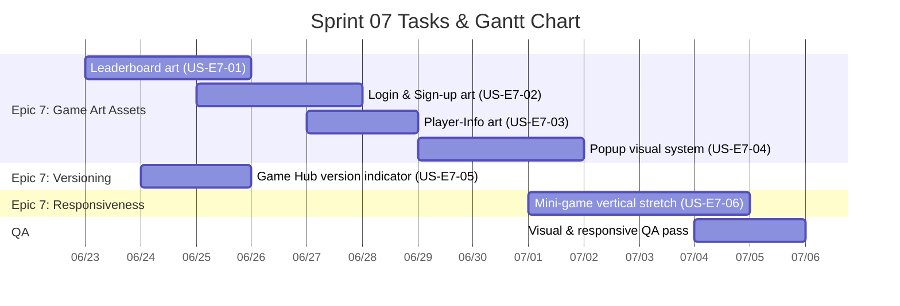

# Sprint 07: Game Art Assets, Version Display & Mini-game Vertical Responsiveness

**Goal:** ยกระดับชั้นการนำเสนอ (Presentation Layer) ของแอป โดย (1) เพิ่ม game art assets ให้หน้าจอ DOM หลัก (Leaderboard, Login, Sign-up, Player-Info, Popup และอื่น ๆ) ให้มีเอกลักษณ์ภาพตรงกับธีมเกม, (2) แสดงเลขเวอร์ชันของตัวเกมหลัก (Game Hub shell) โดยซ่อนตัวบ่งชี้นี้เมื่อผู้เล่นเข้าสู่มินิเกม และ (3) ทำให้มินิเกม (Phaser) รองรับการยืดในแนวตั้ง (Vertical Responsive) บนหน้าจอที่สูงได้อย่างถูกต้อง
**Timeline:** 2026-06-23 → 2026-07-06 (14 วัน)

---

## 📅 Internal Timeline

---

## 📋 Committed Stories & Tasks
| ID | Story / Task | Priority | Status |
|----|--------------|----------|--------|
| [US-E7-01](../user-stories/US-E7-01.md) | Game art assets สำหรับหน้า Leaderboard | High | 📋 Backlog |
| [US-E7-02](../user-stories/US-E7-02.md) | Game art assets สำหรับหน้า Login และ Sign-up | High | 📋 Backlog |
| [US-E7-03](../user-stories/US-E7-03.md) | Game art assets สำหรับหน้า Player-Info | Med | 📋 Backlog |
| [US-E7-04](../user-stories/US-E7-04.md) | Game art assets / ระบบภาพสำหรับ Popup (dialog) | Med | 📋 Backlog |
| [US-E7-05](../user-stories/US-E7-05.md) | แสดงเลขเวอร์ชันบนตัวเกมหลัก (Game Hub) และซ่อนเมื่อเข้ามินิเกม | Med | 📋 Backlog |
| [US-E7-06](../user-stories/US-E7-06.md) | มินิเกมรองรับการยืดแนวตั้ง (Vertical Responsive) | High | 📋 Backlog |

---

## 📊 Sprint Summary & Velocity
- **งานที่วางแผนไว้ (Planned):** 6 User Stories ภายใต้ Epic E7 (Presentation Layer)
- **สถานะปัจจุบัน (Status):** 📋 Planned — เริ่มต้น Sprint
- **เป้าหมายความสำเร็จ (Sprint Target):** ทุกหน้าจอ DOM หลักมี art asset ตรงธีม, ตัวเกมหลักแสดงเลขเวอร์ชันที่ sync กับ `package.json` (และซ่อนในมินิเกม), และมินิเกมทุกเกมยืดแนวตั้งได้โดยไม่มีการตัดขอบ/letterbox ภายในวันที่ 6 กรกฎาคม 2026

---

## 🛠 Sprint Specifics
- **Definition of Done (DoD):**
  - หน้าจอ Leaderboard, Login, Sign-up, Player-Info และ Popup ใช้ art asset จากธีมเกม (ไม่ใช่ placeholder) และผ่านการตรวจบนมือถือจริง
  - art asset ทั้งหมดถูกจัดเก็บภายใต้ `public/assets/` ตาม convention และไม่ทำให้ bundle หลักโตเกินจำเป็น
  - ตัวบ่งชี้เวอร์ชันบน Game Hub อ่านค่ามาจากแหล่งความจริงเดียว (`package.json`) และหายไปเมื่อมินิเกม (Phaser) ทำงานอยู่
  - มินิเกมทุกเกมรองรับการยืดแนวตั้งบน viewport ที่สูง โดย element ภายในจัดตำแหน่ง/anchor ถูกต้อง ไม่มีพื้นที่ว่างผิดปกติหรือ asset ถูกตัด
  - ผ่าน visual QA และ responsive QA บนอัตราส่วนหน้าจอแนวตั้งหลายขนาด
- **Risks & Blockers:**
  - **ขนาด bundle จาก art assets**: ภาพจำนวนมากอาจทำให้แอปโหลดช้า -> *แนวทางแก้ไข*: บีบอัด/ใช้รูปแบบที่เหมาะสม (เช่น WebP/SVG), โหลดเฉพาะที่จำเป็น และพิจารณาทำ Figma เป็น CSS แทนรูปภาพในจุดที่ทำได้
  - **ความหลากหลายของอัตราส่วนหน้าจอแนวตั้ง**: การยืดแนวตั้งอาจทำให้ layout ของบางมินิเกมเพี้ยน -> *แนวทางแก้ไข*: เลือกกลยุทธ์ Phaser Scale ที่เหมาะ (RESIZE/FIT + reflow) และทดสอบบนช่วงความสูงที่กว้าง
  - **การ sync เลขเวอร์ชัน**: เลขที่ฮาร์ดโค้ดอาจไม่ตรงกับ release -> *แนวทางแก้ไข*: ดึงค่าจาก `package.json` ตอน build (Vite `define`/import) ไม่ฮาร์ดโค้ด

---
Back to Product Backlog: [Product Backlog](../01-product-backlog.md) | Back to Index: [Index](../../index.md)
