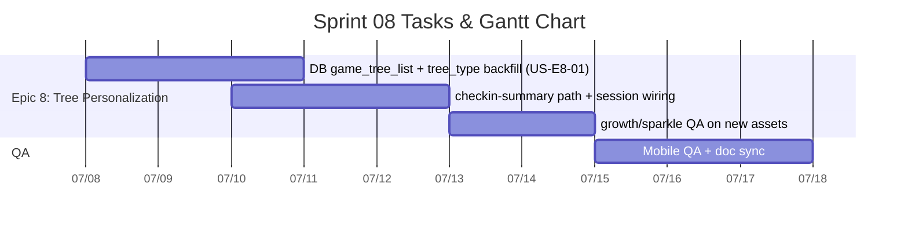

# Sprint 08: Per-Player Progression Tree & Post-1.0 Line

**Goal:** เริ่มเส้นทาง **post-1.0 (`1.0.x` → `1.1.0`)** โดยทำให้ต้นคิดดี (progression tree) แสดง **ชนิดต้นไม้ที่แตกต่างกันต่อผู้เล่น** อ่านจาก `user_game_profile_data.tree_type` (ค่า `a` / `b` / `c` / `d`) พร้อม art asset ที่จัดเก็บแล้วใน `public/assets/checkin-popup/`
**Timeline:** 2026-07-08 → 2026-07-21 (14 วัน)
**Release target:** `1.1.0` (MINOR) เมื่อ [US-E8-01](../user-stories/US-E8-01.md) ผ่าน DoD และ owner ยืนยัน

---

## 📅 Internal Timeline

---

## 📋 Committed Stories & Tasks
| ID | Story / Task | Priority | Status |
|----|--------------|----------|--------|
| [US-E8-01](../user-stories/US-E8-01.md) | ต้นคิดดีหลายชนิดต่อผู้เล่น — `tree_type` + `game_tree_list` + lazy backfill ผู้เล่น v1.0.0 ที่ `tree_type` เป็น NULL | High | 🧪 Review / Testing |

---

## 📌 Context — ต่อจาก v1.0.0
- Sprint 7 ปิดที่ [v1.0.0](../../changelog.md) (2026-07-07) — progression tree ยังใช้ asset ชุดเดียว `tree_0{N}.png`
- [US-E7-10](../user-stories/US-E7-10.md) ปิดเอฟเฟค Juicy แล้ว แต่ **ต้นไม้หลายรูปแบบ** ถูกยกมาเป็น US-E8-01 ใน sprint นี้
- Art ชนิด a–d อยู่ใน repo แล้ว (`public/assets/checkin-popup/{a,b,c,d}/`) — รอ wiring กับ DB + UI
- **ผู้เล่นที่เริ่มโปรแกรมบน v1.0.0 แล้ว** — ณ 2026-07-08 มี **17 profile** (`tree_type = NULL` ทั้งหมด, `program = 5`) ต้อง **lazy backfill** ตอน login หลัง v1.1.0 — ดู [Production Snapshot](../user-stories/US-E8-01.md#-production-snapshot-2026-07-08)

### Schema อ้างอิง
- `user_game_profile_data.tree_type` — [US-E8-01](../user-stories/US-E8-01.md#-database-schema-user_game_profile_data)
- `game_tree_list` — รายการชนิดต้นไม้ที่สุ่มได้ (id = `a`/`b`/`c`/`d`)

---

## 🔜 Carried Over (ไม่ commit ใน Sprint 8 — คงใน product backlog)
งาน post-1.0 ที่ยังเปิดจาก Sprint 7 / backlog เดิม (ทำหลังหรือขนานกับ E8-01 ตาม capacity):

| ID | สรุป | สถานะ |
|----|------|--------|
| [US-E7-06](../user-stories/US-E7-06.md) | มินิเกม vertical responsive | 📋 Backlog |
| [US-E7-08](../user-stories/US-E7-08.md) | แก้คำ "สมอบก" ใน Context Clues | 📋 Backlog |
| [US-E7-11](../user-stories/US-E7-11.md) | ละครสั้น mood & tone | 📋 Backlog |
| [US-E7-12](../user-stories/US-E7-12.md) | โดเมน Cognitive + สรุปหลังบ้าน | 📋 Backlog |
| [US-E5-03](../user-stories/US-E5-03.md) | ลบบัญชี / ลงชื่อออก | 🏗 In-Progress |
| [TD-DB-01](../user-stories/TD-DB-01.md) | DB normalization | 🏗 In-Progress |

---

## 🛠 Sprint Specifics
- **Definition of Done (DoD):**
  - ตาราง `game_tree_list` มี seed ชนิดต้นไม้ (`a`–`d`) และเป็นแหล่งรายการที่ใช้สุ่ม
  - `tree_type` ถูกสุ่มและบันทึกตอนสร้าง `user_game_profile_data` ใหม่
  - ผู้เล่น v1.0.0 ที่ `tree_type IS NULL` ได้รับ **lazy backfill** (สุ่ม + `UPDATE`) ตอนโหลด profile — ค่าคงที่หลัง login ครั้งแรก
  - Check-in progression tree แสดง asset ตาม `tree_type` ของผู้เล่นที่ล็อกอิน
  - Growth transition + sparkle ทำงานกับ asset ชนิดใหม่
  - ผ่านทดสอบ: ผู้เล่นใหม่ 2 คน + ผู้เล่นเก่า NULL backfill บนมือถือจริง
  - อัปเดต `docs/software/03-data-schema.md` และ bump เป็น **`1.1.0`** ตาม semantic-versioning skill
- **Risks & Blockers:**
  - **Race ตอน backfill:** ผู้เล่นเปิดหลายแท็บพร้อมกันอาจเรียก `ensureUserGameProfileTreeType` ซ้ำ → ใช้ `UPDATE … WHERE tree_type IS NULL` หรือ transaction เดียว
  - **ขนาด asset × 4 ชนิด:** โหลดเฉพาะชนิดของผู้เล่น; พิจารณา SW precache เฉพาะ path ที่ใช้
  - **ชื่อไฟล์สเตจ:** ชุดใหม่ใช้ `_01`..`_14` (สองหลัก) ต่างจากชุดเก่า `tree_010` — ต้อง pad stage ให้ตรงใน `getTreeImagePath`
  - **`game_tree_list` ว่าง/ถูก RLS ซ่อน:** fail closed และไม่ persist fallback — ป้องกันผู้เล่นทั้งหมดถูกกำหนดเป็นชนิดเดียวโดยไม่ตั้งใจ

---

## 📊 Sprint Summary
- **งานที่ commit:** 1 story (US-E8-01)
- **เป้าหมาย:** ship **1.1.0** — personalization ต้นคิดดีต่อผู้เล่น
- **สถานะ:** 🟡 **Sprint 8 Open** (เริ่ม 2026-07-08)

---
Back to Product Backlog: [Product Backlog](../01-product-backlog.md) | Roadmap: [Sprint Planning](../02-sprint-planning.md) | Back to Index: [Index](../../index.md)
