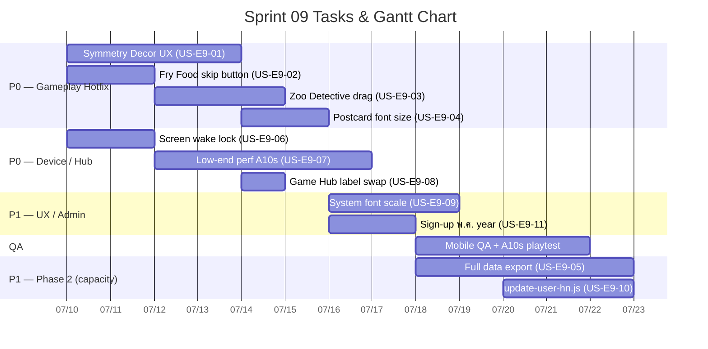

# Sprint 09: Field Feedback Hotfix — ลงพื้นที่ (แก้ด่วน)

**Goal:** แก้ปัญหาเร่งด่วนจากการลงพื้นที่จริงกับผู้สูงอายุที่เริ่มเล่นโปรแกรม 14 วันแล้ว — เน้น **UX ระหว่างเล่นเกม** และ **เครื่องสเปคต่ำ** ก่อน แล้วค่อยทำระบบหลังบ้าน
**Timeline:** 2026-07-10 → 2026-07-23 (14 วัน) — *อาจขยายถ้า scope เพิ่ม*
**Release target:** `1.1.1` (PATCH) สำหรับ P0 + P1 gameplay/device fixes; `1.2.0` (MINOR) ถ้ารวม US-E9-05 / US-E9-10
**Source:** [Field Feedback — ลงพื้นที่ (2026-07-10)](../meeting-backlogs/2026-07-10.md)

---

## 📅 Internal Timeline

---

## 📋 Committed Stories & Tasks

### 🔴 P0 — แก้ด่วน (Gameplay)
| ID | Story / Task | Priority | Status |
|----|--------------|----------|--------|
| [US-E9-01](../user-stories/US-E9-01.md) | ภัยพิบัติระดับ Symmetry — บล็อกฝั่งโจทย์, ลดโหมดสะท้อน, ลดช่อง 2×2/4×4/6×6, เส้นแบ่งชัด, จบเมื่อหมดเวลา | High | 📋 Backlog |
| [US-E9-02](../user-stories/US-E9-02.md) | เกมทำอาหาร — ปุ่มข้ามเมื่อไม่มี Gyroscope (ไม่ได้คะแนน) | High | 📋 Backlog |
| [US-E9-03](../user-stories/US-E9-03.md) | เกมสัตว์นักสืบ — เปลี่ยน input เป็นลากเพื่อวาง | High | 📋 Backlog |
| [US-E9-04](../user-stories/US-E9-04.md) | จดหมายจากหลานรัก — ขยายตัวอักษรโจทย์เพิ่มเติม | High | 📋 Backlog |

### 🔴 P0 — แก้ด่วน (Device / Game Hub)
| ID | Story / Task | Priority | Status |
|----|--------------|----------|--------|
| [US-E9-06](../user-stories/US-E9-06.md) | ป้องกันหน้าจอดับระหว่างเล่นเกม (Screen Wake Lock) | High | 📋 Backlog |
| [US-E9-07](../user-stories/US-E9-07.md) | Optimize สเปคต่ำ — เอฟเฟคเก่งมาก + Phaser (Galaxy A10s baseline) | High | 📋 Backlog |
| [US-E9-08](../user-stories/US-E9-08.md) | Game Hub — ชื่อเกมบน / หมวดหมู่ล่าง (แก้จากลงพื้นที่) | High | ✅ Done (`a3ffc8d`) |

### 🟠 P1 — สำคัญ (UX / Accessibility)
| ID | Story / Task | Priority | Status |
|----|--------------|----------|--------|
| [US-E9-09](../user-stories/US-E9-09.md) | Layout ทนต่อการขยายฟอนต์ระบบ (System Font Scale) | Med | 📋 Backlog |
| [US-E9-11](../user-stories/US-E9-11.md) | หน้าสร้างบัญชี — แสดงปีเกิดเป็น พ.ศ. | Med | 📋 Backlog |

### 🟡 P1 — Phase 2 (ระบบ / Admin — ทำหลัง P0 หรือขนานถ้ามี capacity)
| ID | Story / Task | Priority | Status |
|----|--------------|----------|--------|
| [US-E9-05](../user-stories/US-E9-05.md) | ส่งออกข้อมูลผู้เล่นครบถ้วนไม่สูญหาย | Med | 📋 Backlog |
| [US-E9-10](../user-stories/US-E9-10.md) | CLI `update-user-hn.js` — แก้ HN ที่ลงทะเบียนผิด | Med | 📋 Backlog |

### ✅ ครอบคลุมแล้ว (Sprint 08)
| ID | Story / Task | หมายเหตุ |
|----|--------------|----------|
| [US-E8-01](../user-stories/US-E8-01.md) | ต้นคิดดีสุ่ม 4 ชนิด (`a`/`b`/`c`/`d`) | 🧪 Review / Testing ใน Sprint 08 → target `1.1.0` |

---

## 📌 Context — ต่อจาก v1.0.0 / Sprint 08

- [v1.0.0](../../changelog.md) (2026-07-07) — ผู้สูงอายุเริ่มเล่นโปรแกรม 14 วันแล้ว → **แก้อย่างระมัดระวัง**
- [Sprint 08](sprint-08.md) ยังปิด [US-E8-01](../user-stories/US-E8-01.md) (ต้นคิดดีสุ่ม) → target `1.1.0`
- Sprint 09 เริ่ม **ขนานกับ** Sprint 08 wrap-up เพราะ feedback เป็น **แก้ด่วน**
- Feedback มาจาก [Meeting 2026-07-10](../meeting-backlogs/2026-07-10.md) (รอบ 1 + รอบ 2)

### ลำดับความสำคัญ (ตาม owner)
1. **P0:** ปัญหาระหว่างเล่นเกม + เครื่องสเปคต่ำ (US-E9-01..04, 06..08)
2. **P1:** UX/A11y + Signup (US-E9-09, 11)
3. **P1 Phase 2:** ระบบหลังบ้าน (US-E9-05, 10)
4. **Done/In-review:** ต้นคิดดีสุ่ม (US-E8-01)

### การรวม Story
| รวมแล้ว | จาก feedback |
| --- | --- |
| [US-E9-07](../user-stories/US-E9-07.md) | เอฟเฟคเก่งมากค้าง + Phaser เข้าเกมไม่ได้บน A10s |
| แยกต่างหาก | Wake lock, Game Hub labels, font scale, HN script, พ.ศ. |

### เครื่องอ้างอิงขั้นต่ำสุด
**Samsung Galaxy A10s** (SM-A107F/M) — Helio P22, 2–3 GB RAM, PowerVR GE8320 — ใช้ทดสอบ US-E9-07

---

## 🛠 Sprint Specifics
- **Definition of Done (DoD):**
  - P0 stories ผ่าน AC ครบ + ทดสอบบนมือถือจริง (รวม A10s สำหรับ US-E9-07)
  - ไม่กระทบข้อมูลผู้เล่นที่เล่นโปรแกรมอยู่แล้ว (backward-compatible)
  - Bump เป็น **`1.1.1`** PATCH เมื่อ ship P0+P1 UX (ตาม semantic-versioning skill)
  - อัปเดต GDD/mechanics ที่เกี่ยวข้อง
- **Risks & Blockers:**
  - **Scope เพิ่ม:** จาก 5 → 11 stories — อาจต้องขยาย timeline หรือเลื่อน US-E9-05/10 ไป Sprint 10
  - **ผู้เล่นกำลังเล่นอยู่:** เปลี่ยน grid size / input mode อาจสับสนผู้ที่คุ้นเคยกับเวอร์ชันเก่า
  - **A10s optimization:** อาจต้อง trade-off เอฟเฟคบนเครื่องสเปคต่ำ
  - **HN update script:** ต้อง transaction ครบทุกตาราง FK — ทดสอบ dry-run บน staging ก่อน

---

## 📊 Sprint Summary
- **งานที่ commit:** 10 stories (7 P0 + 2 P1 UX + 2 P1 Phase 2) + US-E8-01 ใน Sprint 08
- **เป้าหมาย:** ship **`1.1.1`** — แก้ UX + device จากการลงพื้นที่
- **สถานะ:** 🟢 **Sprint 9 Open** (อัปเดต 2026-07-10)

---
Back to Product Backlog: [Product Backlog](../01-product-backlog.md) | Roadmap: [Sprint Planning](../02-sprint-planning.md) | Back to Index: [Index](../../index.md)
