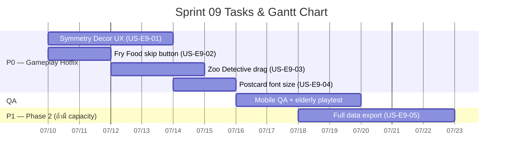

# Sprint 09: Field Feedback Hotfix — ลงพื้นที่ (แก้ด่วน)

**Goal:** แก้ปัญหาเร่งด่วนจากการลงพื้นที่จริงกับผู้สูงอายุที่เริ่มเล่นโปรแกรม 14 วันแล้ว — เน้น **UX ระหว่างเล่นเกม** ก่อน แล้วค่อยทำระบบหลังบ้าน
**Timeline:** 2026-07-10 → 2026-07-23 (14 วัน)
**Release target:** `1.1.1` (PATCH) สำหรับ P0 gameplay fixes; `1.2.0` (MINOR) ถ้ารวม US-E9-05
**Source:** [Field Feedback — ลงพื้นที่ (2026-07-10)](../meeting-backlogs/2026-07-10.md)

---

## 📅 Internal Timeline

---

## 📋 Committed Stories & Tasks

### 🔴 P0 — แก้ด่วน (Gameplay)
| ID | Story / Task | Priority | Status |
|----|--------------|----------|--------|
| [US-E9-01](../user-stories/US-E9-01.md) | ภัยพิบัติระดับ Symmetry — บล็อกฝั่งโจทย์, ลดโหมดสะท้อน, ลดช่อง 2×2/4×4/6×6, เส้นแบ่งชัด, จบเมื่อหมดเวลา | High | 📋 Backlog |
| [US-E9-02](../user-stories/US-E9-02.md) | เกมทำอาหาร — ปุ่มข้ามเมื่อไม่มี Gyroscope (ไม่ได้คะแนน) | High | 📋 Backlog |
| [US-E9-03](../user-stories/US-E9-03.md) | เกมสัตว์นักสืบ — เปลี่ยน input เป็นลากเพื่อวาง | High | 📋 Backlog |
| [US-E9-04](../user-stories/US-E9-04.md) | จดหมายจากหลานรัก — ขยายตัวอักษรโจทย์เพิ่มเติม | High | 📋 Backlog |

### 🟡 P1 — Phase 2 (ระบบ — ทำหลัง P0 หรือขนานถ้ามี capacity)
| ID | Story / Task | Priority | Status |
|----|--------------|----------|--------|
| [US-E9-05](../user-stories/US-E9-05.md) | ส่งออกข้อมูลผู้เล่นครบถ้วนไม่สูญหาย | Med | 📋 Backlog |

### ✅ ครอบคลุมแล้ว (Sprint 08)
| ID | Story / Task | หมายเหตุ |
|----|--------------|----------|
| [US-E8-01](../user-stories/US-E8-01.md) | ต้นคิดดีสุ่ม 4 ชนิด (`a`/`b`/`c`/`d`) | 🧪 Review / Testing ใน Sprint 08 → target `1.1.0` |

---

## 📌 Context — ต่อจาก v1.0.0 / Sprint 08

- [v1.0.0](../../changelog.md) (2026-07-07) — ผู้สูงอายุเริ่มเล่นโปรแกรม 14 วันแล้ว → **แก้อย่างระมัดระวัง**
- [Sprint 08](sprint-08.md) ยังปิด [US-E8-01](../user-stories/US-E8-01.md) (ต้นคิดดีสุ่ม) → target `1.1.0`
- Sprint 09 เริ่ม **ขนานกับ** Sprint 08 wrap-up เพราะ feedback เป็น **แก้ด่วน**
- Feedback มาจาก [Meeting 2026-07-10](../meeting-backlogs/2026-07-10.md)

### ลำดับความสำคัญ (ตาม owner)
1. **P0:** ปัญหาระหว่างเล่นเกม (US-E9-01..04)
2. **P1:** ระบบหลังบ้าน (US-E9-05)
3. **Done/In-review:** ต้นคิดดีสุ่ม (US-E8-01)

---

## 🛠 Sprint Specifics
- **Definition of Done (DoD):**
  - P0 stories ผ่าน AC ครบ + ทดสอบบนมือถือจริง
  - ไม่กระทบข้อมูลผู้เล่นที่เล่นโปรแกรมอยู่แล้ว (backward-compatible)
  - Bump เป็น **`1.1.1`** PATCH เมื่อ ship P0 (ตาม semantic-versioning skill)
  - อัปเดต GDD/mechanics ที่เกี่ยวข้อง (Symmetry, Fry Food, Zoo Detective, Postcard)
- **Risks & Blockers:**
  - **ผู้เล่นกำลังเล่นอยู่:** เปลี่ยน grid size / input mode อาจสับสนผู้ที่คุ้นเคยกับเวอร์ชันเก่า → ทดสอบกับกลุ่มเล็กก่อน deploy
  - **Symmetry grid resize:** ต้องตรวจ level generator + existing difficulty mapping ไม่พัง
  - **Zoo Detective drag:** ต้องไม่ทำให้ hint system / puzzle logic พัง
  - **Capacity:** US-E9-05 อาจเลื่อนไป Sprint 10 ถ้า P0 ใช้เวลามาก

---

## 📊 Sprint Summary
- **งานที่ commit:** 4 stories P0 + 1 story P1 (Phase 2)
- **เป้าหมาย:** ship **`1.1.1`** — แก้ UX เร่งด่วนจากการลงพื้นที่
- **สถานะ:** 🟢 **Sprint 9 Open** (เริ่ม 2026-07-10)

---
Back to Product Backlog: [Product Backlog](../01-product-backlog.md) | Roadmap: [Sprint Planning](../02-sprint-planning.md) | Back to Index: [Index](../../index.md)
