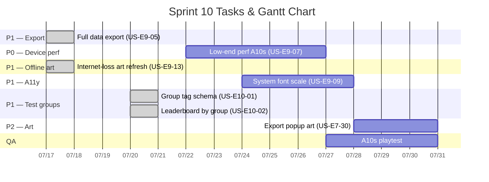

# Sprint 10: Field Feedback — ต่อจาก Sprint 09

**Status:** 🟢 **Active** (kickoff 2026-07-17)
**Goal:** รับงานที่เลื่อนจาก Sprint 09 — **full data export**, low-end perf (A10s), system font scale
**Timeline:** 2026-07-17 → 2026-07-30 (14 วัน)
**Release target:** **US-E9-05 `1.1.6`**, **US-E9-13 `1.1.7`** (PATCH), **US-E10-01/02 `1.2.0`** (MINOR — ฟีเจอร์ใหม่); US-E9-07/09 ตามที่ ship ถัดไป
**Source:** [Field Feedback — ลงพื้นที่ (2026-07-10)](../meeting-backlogs/2026-07-10.md)

---

## 📅 Internal Timeline

---

## 📋 Committed Stories & Tasks

### 🔵 In Progress
| ID | Story / Task | Priority | สถานะ |
|----|--------------|----------|--------|
| — | *(ว่าง)* | — | — |

### ✅ Shipped ใน Sprint 10
| ID | Story / Task | Priority | สถานะ |
|----|--------------|----------|--------|
| [US-E9-13](../user-stories/US-E9-13.md) | อัปเดต art popup อินเทอร์เน็ตหาย — `*_internet_loss.png` | P1 | ✅ Done (v1.1.7, 2026-07-17) |
| [US-E9-05](../user-stories/US-E9-05.md) | ส่งออกข้อมูลผู้เล่นครบถ้วนไม่สูญหาย (Edge Function / pagination) | P1 | ✅ Done (v1.1.6, 2026-07-17) |
| [US-E10-01](../user-stories/US-E10-01.md) | Tag แบ่งกลุ่มผู้เล่น — `user_group_tag` + `GRPID` *(AC#3/#4 descoped)* | P1 | ✅ Done (v1.2.0, 2026-07-20) |
| [US-E10-02](../user-stories/US-E10-02.md) | Leaderboard แยกตามกลุ่ม `GRPID` — `UNTAGGED` เห็นทุกกลุ่ม | P1 | ✅ Done (v1.2.0, 2026-07-20) |

### 📋 Backlog (Sprint 10)
| ID | Story / Task | Priority | สถานะ |
|----|--------------|----------|--------|
| [US-E9-07](../user-stories/US-E9-07.md) | Optimize สเปคต่ำ — เอฟเฟคเก่งมาก + Phaser (Galaxy A10s) | P0 | 📋 Backlog *(sparkle slice ✅ v1.1.5; confetti + Phaser ค้าง)* |
| [US-E9-09](../user-stories/US-E9-09.md) | Layout ทนต่อการขยายฟอนต์ระบบ (System Font Scale) | P1 | 📋 Backlog |
| [US-E7-30](../user-stories/US-E7-30.md) | Art assets popup export CSV หน้าข้อมูลผู้เล่น | P2 | 📋 Backlog |

> **2026-07-20:** [US-E10-01](../user-stories/US-E10-01.md)/[US-E10-02](../user-stories/US-E10-02.md) ✅ Done (**v1.2.0**) — leaderboard แยกตามกลุ่ม; owner ปรับ CSS หัวข้อให้รองรับชื่อกลุ่มที่ยาวขึ้น
> **2026-07-18:** Owner เพิ่มงานใหม่เข้า Sprint 10 — [US-E10-01](../user-stories/US-E10-01.md)/[US-E10-02](../user-stories/US-E10-02.md) (Tag กลุ่มทดสอบ + Leaderboard กรองตามกลุ่ม) และ [US-E7-30](../user-stories/US-E7-30.md) (art popup export CSV)
> **2026-07-17:** [US-E9-13](../user-stories/US-E9-13.md) ✅ Done (**v1.1.7**) — internet-loss art + SW `CACHE_VERSION` v3
> **2026-07-17:** [US-E9-05](../user-stories/US-E9-05.md) ✅ Done (**v1.1.6**) — full data export
> **2026-07-17:** Sprint 10 kickoff
> **2026-07-15:** US-E9-07 sparkle slice shipped ใน **v1.1.5** — remainder ค้าง Backlog
> **2026-07-14:** Owner เลื่อน US-E9-05/07/09 จาก Sprint 09

### 📱 เครื่องอ้างอิงขั้นต่ำสุด
**Samsung Galaxy A10s** (SM-A107F/M) — ใช้ทดสอบ [US-E9-07](../user-stories/US-E9-07.md)

---

## 📌 Context

- [Sprint 09](sprint-09.md) ✅ **Completed** (2026-07-17) — P0 gameplay [US-E9-01](../user-stories/US-E9-01.md)..[US-E9-04](../user-stories/US-E9-04.md) Done
- [US-E9-10](../user-stories/US-E9-10.md) ✅ Done ใน Sprint 09 (CLI, ไม่ bump version)
- **Current shipped:** `1.2.0` (US-E10-01/02 leaderboard แยกตามกลุ่ม)
- **Focus รอบนี้:** US-E9-07 / US-E9-09; งานใหม่ 2026-07-18 — US-E10-01/02 (Tag กลุ่มทดสอบ + Leaderboard ตามกลุ่ม), US-E7-30 (art popup export CSV)

---

## 📊 Sprint Summary
- **งานที่ commit:** US-E9-13 / US-E9-05 / US-E10-01 / US-E10-02 ✅ Done; US-E9-07/09 + US-E7-30 Backlog
- **สถานะ:** 🟢 **Sprint 10 Open** (ล่าสุด US-E10-01/02 shipped **v1.2.0** 2026-07-20; เหลือ US-E9-07/09 + US-E7-30)

---

Back to Product Backlog: [Product Backlog](../01-product-backlog.md) | Roadmap: [Sprint Planning](../02-sprint-planning.md) | Back to Index: [Index](../../index.md)
