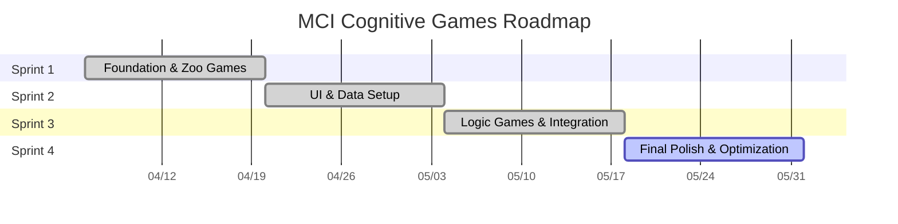

# Agile Sprint Plan - MCI Cognitive Games

---

## 📅 Sprint Schedule Overview (2-Week Cycles)

| Sprint | Timeline | Focus Area | Status |
|:---|:---|:---|:---|
| [[sprint-01]] | Week 1-2 | Foundation & Zoo Games | Completed |
| [[sprint-02]] | Week 3-4 | UI & Data Setup | Completed |
| [[sprint-03]] | Week 5-6 | Logic Games & Integration | Completed |
| [[sprint-04]] | Week 7-8 | **(Current)** Final Polish & Variety | In-Progress |

## 📊 Project Timeline (Gantt Chart)

---

## 🚀 Sprint Details

ดูรายละเอียดงานในแต่ละ Sprint ได้ที่ลิงก์ด้านล่าง:

- **[[sprint-01]]**: Foundation & Zoo Games
- **[[sprint-02]]**: UI Interactive & Data Foundation
- **[[sprint-03]]**: Logic Games & Data Integration
- **[[sprint-04]]**: Final Polish & Alternative Games

## 📈 Epic Completeness Strategy (Alignment)

เพื่อให้โครงการเดินหน้าอย่างสมดุล เราจะพัฒนาทั้ง 3 Epics ขนานกันไปในแต่ละ Sprint:

### 🎮 E1: Core Cognitive Games (The Heart)
- **Sprint 1-2:** เน้นเกมกลุ่ม "Attention & Memory" (Zoo Games) เพื่อสร้าง Quick Win
- **Sprint 3:** เน้นเกมกลุ่ม "Executive Function & Language" (Symmetry, Context)
- **Sprint 4:** เพิ่มความหลากหลายใน "Memory & Reading" (Postcard Reader) และขัดเกลาทุกระบบ
- **Target:** สมบูรณ์ 100% เมื่อจบ Sprint 4

### 📊 E2: Patient Data & Tracking (The Brain)
- **Sprint 2:** วางโครงสร้างพื้นฐาน (Database Setup)
- **Sprint 3:** เชื่อมต่อระบบ (Integration) เพื่อให้แพทย์เริ่มเห็นข้อมูลการเล่น
- **Target:** ระบบพร้อมใช้งานจริง (Stable) เมื่อจบ Sprint 3

### ♿ E3: Accessibility & UX (The Soul)
- **Sprint 2:** เริ่มต้นด้วยมาตรฐานพื้นฐาน (Font/Button Size)
- **Sprint 4:** เพิ่มส่วนเสริมเพื่อการเข้าถึง (Voice Over) และขัดเกลา UI ทั้งหมด
- **Target:** ได้มาตรฐานการออกแบบเพื่อผู้สูงอายุเมื่อจบโครงการ
