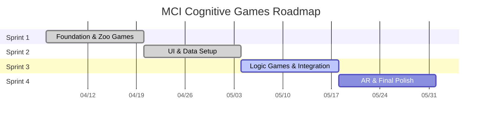

# Agile Sprint Plan - MCI Cognitive Games

---

## 📅 Sprint Schedule Overview (2-Week Cycles)

| Sprint | Timeline | Focus Area | Key Deliverables |
|:---|:---|:---|:---|
| **Sprint 1** | Week 1-2 | Foundation & Zoo Games | Logic พื้นฐานของ Zoo Detective & Zoo Feeder (Completed) |
| **Sprint 2** | Week 3-4 | UI & Data Setup | Zoo Games สมบูรณ์, Context Clues UI, Setup Database (Finalizing) |
| **Sprint 3** | Week 5-6 | **(Next)** Logic Games & Integration | Symmetry Decor, ระบบ Auth, ระบบบันทึกคะแนน (Score API) |
| **Sprint 4** | Week 7-8 | AR & Accessibility Polish | Postcard Reader (AR), Voice Over, UX Final Polish |

## 📊 Project Timeline (Gantt Chart)

---

## 🚀 Sprint Breakdown

### Sprint 2: UI Interactive & Data Foundation (Completed)
**Goal:** ทำให้เกม Zoo ชุดแรกสมบูรณ์ 100% และเตรียมระบบฐานข้อมูลให้พร้อมใช้งาน
- [x] [[US-E1-02]] Zoo Detective UI & Feedback (Finish)
- [x] [[US-E1-04]] Zoo Feeder Interaction Logic (Finish)
- [x] [[US-E1-06]] UI สำหรับ Context Clues (Thai Support)
- [ ] [[US-E2-01]] Setup Supabase Tables (Data Structure) - *In Progress: ติดปัญหา Sync ข้อมูล*
- [x] [[US-E3-01]] ปรับขนาด Font/ปุ่ม (Accessibility Basics)

### Sprint 3: Logic Games & Data Integration (Next)
**Goal:** เพิ่มเกมฝึกตรรกะและเชื่อมต่อระบบบันทึกข้อมูลผู้ป่วยจริง
- [ ] [[US-E1-07]] Symmetry Decor - Grid & Mirroring
- [ ] [[US-E2-02]] Authentication สำหรับแพทย์และผู้ป่วย
- [ ] [[US-E2-03]] API สำหรับส่งคะแนน (Score Integration)

### Sprint 4: AR Experience & Final Polish
**Goal:** ส่งมอบเกม AR และปรับปรุงความง่ายในการใช้งาน (UX) สำหรับผู้สูงอายุ
- [ ] [[US-E1-08]] Postcard Reader (AR System)
- [ ] [[US-E3-02]] ระบบ Voice Over คำแนะนำการเล่น
- [ ] Final QA & Bug Fixing across all Epics

---

## 📈 Epic Completeness Strategy (Alignment)

เพื่อให้โครงการเดินหน้าอย่างสมดุล เราจะพัฒนาทั้ง 3 Epics ขนานกันไปในแต่ละ Sprint:

### 🎮 E1: Core Cognitive Games (The Heart)
- **Sprint 1-2:** เน้นเกมกลุ่ม "Attention & Memory" (Zoo Games) เพื่อสร้าง Quick Win
- **Sprint 3:** เน้นเกมกลุ่ม "Executive Function & Language" (Symmetry, Context)
- **Sprint 4:** เพิ่มความล้ำสมัยด้วย "Visuospatial" (Postcard AR)
- **Target:** สมบูรณ์ 100% เมื่อจบ Sprint 4

### 📊 E2: Patient Data & Tracking (The Brain)
- **Sprint 2:** วางโครงสร้างพื้นฐาน (Database Setup)
- **Sprint 3:** เชื่อมต่อระบบ (Integration) เพื่อให้แพทย์เริ่มเห็นข้อมูลการเล่น
- **Target:** ระบบพร้อมใช้งานจริง (Stable) เมื่อจบ Sprint 3

### ♿ E3: Accessibility & UX (The Soul)
- **Sprint 2:** เริ่มต้นด้วยมาตรฐานพื้นฐาน (Font/Button Size)
- **Sprint 4:** เพิ่มส่วนเสริมเพื่อการเข้าถึง (Voice Over) และขัดเกลา UI ทั้งหมด
- **Target:** ได้มาตรฐานการออกแบบเพื่อผู้สูงอายุเมื่อจบโครงการ
