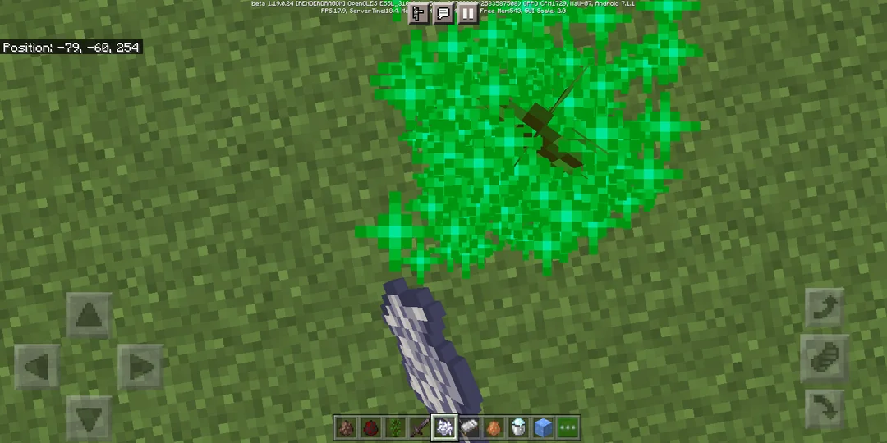
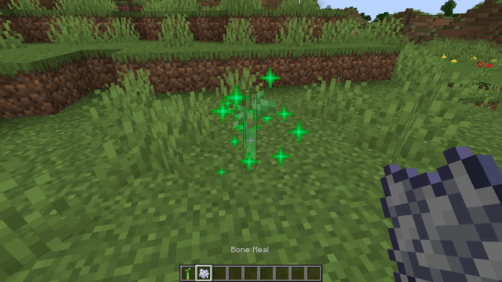

# User Story: US-E7-10 - ต้นคิดดีหลายรูปแบบ + เอฟเฟค Juicy

**Status:** 🏗 In-Progress (Sprint 7)
**Epic:** [E7: Game Art Assets & UI/UX Polish](../01-product-backlog.md)
**Owner:** [Developer/AI]
**Source:** [Doctor Feedback — Meeting #2 (2026-06-24)](../meeting-backlogs/2026-06-24.md) §2.4

---

## 📖 Description
**ในฐานะ** ผู้เล่นที่เล่นต่อเนื่องหลายวัน
**ฉันต้องการ** ให้ต้นคิดดี (ต้นไม้ในระบบเช็คอิน) มีหลายรูปแบบและมีเอฟเฟคที่ดู "Juicy"
**เพื่อให้** รู้สึกสดใหม่ ไม่เบื่อ และได้รางวัลทางสายตาเมื่อก้าวหน้า

---

## ✅ Acceptance Criteria
1. [ ] ต้นคิดดีมี **หลายรูปแบบ** อย่างน้อยตามที่คุณหมอแนะนำ เช่น ต้นกุหลาบ, กล้วยไม้, ต้นไม้ดอกเยอะ, ต้นทุเรียน, ต้นไม้มีผล
2. [ ] เพิ่ม **เอฟเฟค Juicy** เมื่อต้นไม้เติบโต/เปลี่ยนสถานะ (เช่น อนิเมชัน, particle, แสง)
3. [ ] **อนิเมชันต้นไม้โต (growth transition)** ตาม flow: แสดง **ต้นไม้สเตจก่อนหน้า** ก่อน → เด้ง **ขยายขึ้นเล็กน้อย** แล้ว **ยุบลง** (scale ลง) → แล้ว **เด้งขยายต้นใหม่ (สเตจถัดไป) ขึ้นมา**
4. [ ] วันที่ 1 มีภาพสเตจเริ่มต้น (`tree_01`) อยู่แล้ว → การ transition มี "ต้นก่อนหน้า" ให้แสดงเสมอ ไม่ต้องจัดการเคสว่างเปล่า
5. [x] **Sparkle Particle Effect** — อนุภาคประกายดาว (sparkle) คล้ายเอฟเฟค **bone meal ของ Minecraft** แต่**ไม่เหมือนเป๊ะ**: **สีรุ้งแบบ random** และ **ค่อย ๆ กระจายออก** (rise + spread + fade) — *ตอนนี้แสดงเมื่อเข้าหน้า tree progression (ยังไม่ผูกกับจังหวะต้นไม้โต เพราะ growth transition ยังไม่ทำ)*
6. [ ] รูปแบบต้นไม้สอดคล้องกับสไตล์ภาพ **กึ่งสมจริง** ที่คุณหมอชอบ
7. [ ] เอฟเฟคไม่ทำให้เฟรมเรตตกบนมือถือรุ่นกลาง และ asset ไม่ทำให้ bundle โตเกินจำเป็น

### 🖼 Sparkle Reference (Minecraft bone meal — เอาแนวคิด ไม่เอาสีเขียว)
| Ref 1 | Ref 2 |
| :---: | :---: |
|  |  |

> หมายเหตุ: ของเราเป็น **สีรุ้ง random** (ไม่ใช่เขียวล้วนแบบ Minecraft) และเน้นการ **ค่อย ๆ กระจาย** ออกแบบนุ่มนวล

---

## 🛠 Technical Tasks
- [ ] ออกแบบ/จัดหา art asset ต้นไม้หลายชนิด (กึ่งสมจริง) และจัดเก็บใน `public/assets/`
- [ ] เพิ่มระบบเลือก/สุ่มชนิดต้นไม้ในระบบเช็คอิน
- [ ] ทำ **growth transition** บน `.tree-progress-plant` ใน `checkin-summary-screen.js`: scale ต้นเก่า (สเตจ `getTreeStage` เดิม) เด้งขึ้น→ยุบลง แล้วสลับ `src` เป็น `getTreeImagePath(stage+1)` (`tree_01`..`tree_014`) แล้วเด้งขยายต้นใหม่ขึ้น
- [ ] (ออปชัน) แยกเป็น helper เฉพาะหน้า เช่น `growTreeTransition()` เลียนแบบแนวทาง `bounceCheckInCharacter()` (ไม่ยัดลง component กลาง)
- [x] ทำ **Sparkle Particle Effect** เป็น component ใช้ซ้ำได้ `src/ui/components/effects/sparkle-effect.js` — sparkle สีรุ้ง random กระจายรอบ anchor (rise/spread/fade) ด้วย Web Animations API, `position: fixed`, `pointer-events: none`, `cancel()` handle
- [x] ต่อเข้า `checkin-summary-screen.js` หน้า tree progression (calendar step) — anchor ที่ `.tree-progress-frame`, ยกเลิกใน `cleanup()`
- [x] รองรับ `prefers-reduced-motion` (ลดจำนวน sparkle)
- [ ] ผูก sparkle เข้ากับจังหวะ **growth transition** เมื่อต้นไม้โต (รอ growth transition ก่อน)
- [ ] ทดสอบประสิทธิภาพบนมือถือจริง (sparkle + growth transition รวมกันต้องไม่ทำเฟรมตก)

---

## 🔗 Related Files
- Sparkle (new): `src/ui/components/effects/sparkle-effect.js`
- Check-in: `src/ui/checkin-summary-screen.js`, `src/ui/resting-point-popup.js`
- Components: `src/ui/components/nodes`
- Backlog: [01-product-backlog](../01-product-backlog.md)

---
Back to Product Backlog: [Product Backlog](../01-product-backlog.md) | Back to Index: [Index](../../index.md)
