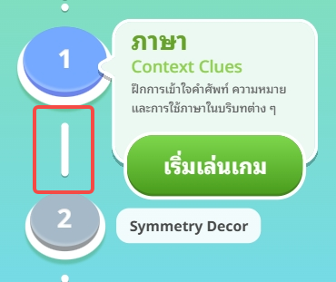

# User Story: US-E7-14 - ปรับ Layout หน้าหลัก Game Hub (ระยะเลเวล, สลับชื่อเกม/หมวด, เงาตัวละคร)

**Status:** ✅ Done (v0.30.0, 2026-07-07 — verified by owner: แสดงผลได้ปกติ)
**Epic:** [E7: Game Art Assets & UI/UX Polish](../01-product-backlog.md)
**Owner:** ก้องไผ่
**Source:** Owner Task Block — ก้องไผ่ (2026-06-24), [Sprint 07](../sprint-backlogs/sprint-07.md)

---

## 📖 Description
**ในฐานะ** ผู้เล่นสูงอายุ
**ฉันต้องการ** ให้หน้าหลัก (Game Hub) จัด layout ชัดเจน ไม่เบียดกัน และอ่านง่าย
**เพื่อให้** กดปุ่มเริ่มเกมได้ถูกต้องโดยไม่ชนกับมินิเกมถัดไป และเห็นข้อมูลเกมได้ชัด

---

## ✅ Acceptance Criteria
1. [x] เพิ่ม **ระยะห่างระหว่างแต่ละเลเวล** ให้มากขึ้น เพื่อให้ **ปุ่มเริ่มเกมไม่ไปเบียดมินิเกมถัดไป** — ดู [ภาพอ้างอิงจุดที่เบียด](assets/us-e7-14-level-spacing.png)
2. [x] **สลับตำแหน่ง** ระหว่าง **ชื่อเกม** กับ **ชื่อหมวดหมู่ Cognitive** ในหน้าหลัก ตามที่กำหนด *(รวม instance Fry Food ใน [US-E7-24](US-E7-24.md))*
3. [x] เพิ่ม **เงาตัวละคร (shadow)** ในหน้าหลักให้ดูมีมิติ
4. [x] ใส่ **เงาด้านล่างตัวละครคนแก่ทั้งใน node และใน popup** (ไม่ใช่เฉพาะหน้าหลัก) — ใช้กับ Popup ใน [US-E7-16](US-E7-16.md) ด้วย (`.character-shadow`)
5. [x] Layout ใหม่ยังเลื่อน (scroll) และ scroll-to-current ทำงานถูกต้อง ไม่มี element ทับซ้อน
6. [x] แสดงผลถูกต้องบนมือถือจริง — owner ยืนยันแล้ว (2026-07-07)

### 🖼 Visual Reference

---

## 🛠 Technical Tasks
- [x] ปรับระยะ spacing ของ level path/nodes ใน Game Hub
- [x] สลับลำดับการ render ชื่อเกม ↔ หมวด Cognitive (ดู [US-E7-12](US-E7-12.md) สำหรับข้อมูลหมวด)
- [x] เพิ่มเงาให้ตัวละครคนแก่ทั้งใน node (หน้าหลัก) และใน popup (CSS/asset — `.character-shadow`)
- [x] ตรวจสอบ scroll/`--gh-scale` และตำแหน่งปุ่มเริ่มเกมบนมือถือจริง — owner ยืนยันแล้ว

---

## 🔗 Related Files
- Hub: `src/ui/game-hub-screen.js`
- Components: `src/ui/components/level-path.js`, `src/ui/components/nodes`, `src/ui/components/start-game-button.js`
- Styles: `public/components.css`
- Backlog: [01-product-backlog](../01-product-backlog.md)

---
Back to Product Backlog: [Product Backlog](../01-product-backlog.md) | Back to Index: [Index](../../index.md)
