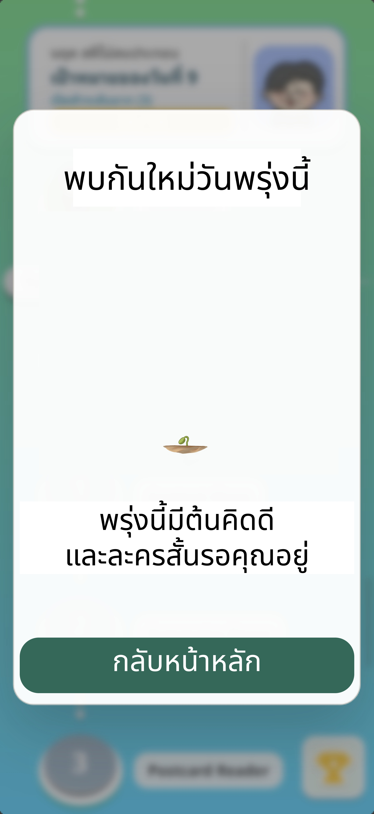
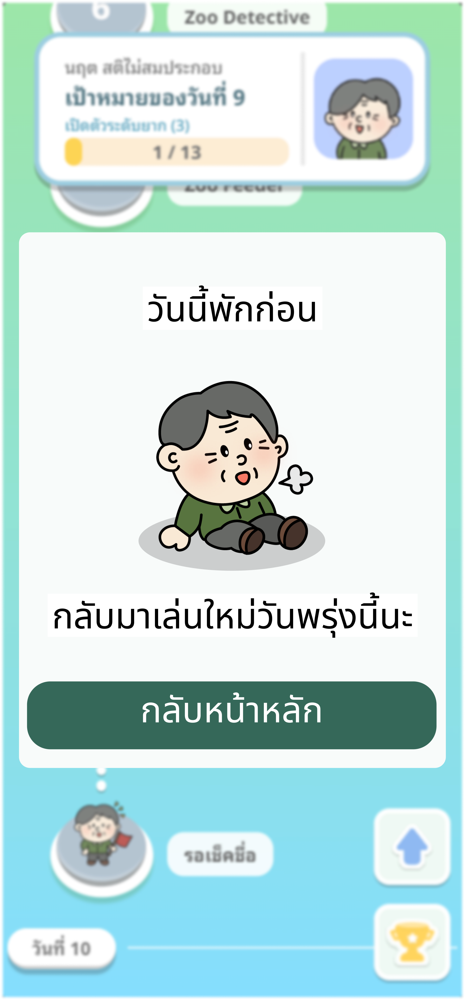

# User Story: US-E7-16 - แก้ Popup (ตัด popup หลังดูละคร + เข้าเกมซ้ำในวันที่เล่นจบแล้ว)

**Status:** 🔍 Review / Testing (Sprint 7) — AC#1–4 เสร็จ (โค้ด v0.15.0); เหลือ AC#5 ทดสอบบนมือถือจริง (รอ QA)
**Epic:** [E7: Game Art Assets & UI/UX Polish](../01-product-backlog.md)
**Owner:** ก้องไผ่
**Source:** Owner Task Block — ก้องไผ่ (2026-06-24), [Sprint 07](../sprint-backlogs/sprint-07.md)

---

## 📖 Description
**ในฐานะ** ผู้เล่นสูงอายุ
**ฉันต้องการ** ให้ Popup ในจังหวะสำคัญแสดงผลถูกต้องและสื่อสารชัดเจน
**เพื่อให้** เข้าใจสถานะของตัวเอง (ดูละครจบ / เล่นครบของวันแล้ว) โดยไม่สับสน

---

## ✅ Acceptance Criteria
1. [x] **ตัด Popup หลังจากดูละครเสร็จ** ("พบกันใหม่วันพรุ่งนี้" / "พรุ่งนี้มีต้นคิดดี และละครสั้นรอคุณอยู่") **ออก** — ไม่แสดง popup นี้อีก หลังดูละครจบให้ปิด check-in flow แล้วกลับหน้าหลักได้เลย (ตัดความซ้ำซ้อนกับหน้าต้นคิดดี/ละครก่อนหน้า) — ดู [ภาพอ้างอิงของหน้าที่ถูกตัด](assets/us-e7-16-popup-after-drama.jpg)
   > **เปลี่ยนแปลงขอบเขต (2026-06-25):** เดิมข้อนี้คือ "sync ขนาดต้นคิดดีให้ตรงกับหน้าก่อน" → เปลี่ยนเป็น **ตัดหน้านี้ออกทั้งหมด** ตามที่เจ้าของงานสั่ง (หน้านี้ยังไม่ถูก implement ใน code — เป็นการตัดออกจากแบบ/ขอบเขต)
   > **ยืนยันด้วยโค้ด (2026-06-26):** ตรวจ `src/ui/checkin-summary-screen.js` แล้ว — flow คือ `success → calendar → video` เท่านั้น; หลัง video `ended` แสดงเพียงปุ่ม "กลับสู่หน้าหลัก" → `cleanup(true)` ไม่มี step/popup ต่อท้าย และ `grep` ทั้ง `src/` ไม่พบข้อความ "พบกันใหม่/พรุ่งนี้มีต้นคิดดี/ละครสั้นรอคุณ" ที่ใดเลย → ไม่มี popup นี้ในระบบจริง ✅
2. [x] **Popup เมื่อผู้เล่นเล่นจบของวันแล้วและกลับเข้ามาในวันเดิม** ("วันนี้พักก่อน") — แสดง **ตัวละครคนแก่นั่งพัก** ตามเพศ: เพศชาย = **คุณตา**, เพศหญิง = **คุณยาย** — ดู [ภาพอ้างอิง](assets/us-e7-16-popup-same-day-reentry.png)
   > **ทำแล้ว (2026-06-26, v0.15.0):** เขียน `showDayCompletionPopup` ใหม่ (`src/ui/day-completion-popup.js`) เลือกภาพ `OldMan_resting.png`/`OldWoman_resting.png` ตาม `options.patientGender`, ข้อความ "กลับมาเล่นใหม่วันพรุ่งนี้นะ", ปุ่ม "กลับหน้าหลัก"
3. [x] Popup ใช้กรอบ/ระบบภาพ Popup ตาม [US-E7-04](US-E7-04.md) และมาตรฐานสีปุ่มตาม [US-E7-15](US-E7-15.md)
   > ใช้กรอบ `app-popup` dialog ปัจจุบัน + ปุ่มเขียว `md-filled-button` (`--md-sys-color-primary` `#356859` = "เขียว = ยืนยัน"); art เฉพาะของ US-E7-04 จะ inherit อัตโนมัติเมื่อสตอรีนั้นเสร็จ
4. [x] ตัวละครคนแก่ใน Popup มี **เงาด้านล่าง** ตาม [US-E7-14](US-E7-14.md) ข้อ 4 — เพิ่ม `.rest-day-popup-character__shadow` (วงรี blur)
5. [ ] ทดสอบ flow จริงบนมือถือ *(รอ QA)*

### 🖼 Visual References
| ❌ Popup หลังดูละคร — **ตัดออก** (ไม่แสดงอีก) | Popup เข้าซ้ำในวันเดิม (คุณตา/คุณยายนั่งพัก) |
| :---: | :---: |
|  |  |

---

## 🛠 Technical Tasks
- [x] **ตัด Popup หลังดูละคร ("พบกันใหม่วันพรุ่งนี้") ออก** — ไม่เพิ่ม/ไม่แสดง popup นี้ในขั้นตอนหลัง short-video; เมื่อดูละครจบให้ปิด check-in flow แล้ว resolve กลับหน้าหลักได้เลย (ปัจจุบัน `state.step === "video"` ปิดด้วยปุ่ม "กลับสู่หน้าหลัก" → `cleanup(true)` อยู่แล้ว ไม่ต้องเพิ่มหน้าใหม่) — ✅ ยืนยันด้วยโค้ด/grep แล้ว (2026-06-26): ไม่มี popup นี้ในระบบ
- [x] ตรวจสอบ/แก้ Popup กรณีเข้าเกมซ้ำในวันที่เล่นจบแล้ว (day-completion) — เลือกภาพคุณตา/คุณยายตามเพศผู้เล่น (ผ่าน `options.patientGender` ที่ส่งจาก `game-hub-screen.js`)
- [x] ผูกกรอบ Popup (`app-popup` dialog), สีปุ่มมาตรฐาน (เขียว primary) และเงาตัวละครเข้ากับ Popup เข้าซ้ำในวันเดิม
- [x] เพิ่มปุ่มทดสอบ "ทดสอบ Popup พักวันนี้" ในเมนู FAB setting ของหน้า Player-Info (สำหรับ preview popup ตามเพศผู้เล่น)

---

## 🔗 Related Files
- Popups: `src/ui/popup-dialog.js`, `src/ui/day-completion-popup.js`, `src/ui/checkin-summary-screen.js`
- Related: [US-E7-04](US-E7-04.md), [US-E7-15](US-E7-15.md)
- Backlog: [01-product-backlog](../01-product-backlog.md)

---
Back to Product Backlog: [Product Backlog](../01-product-backlog.md) | Back to Index: [Index](../../index.md)
