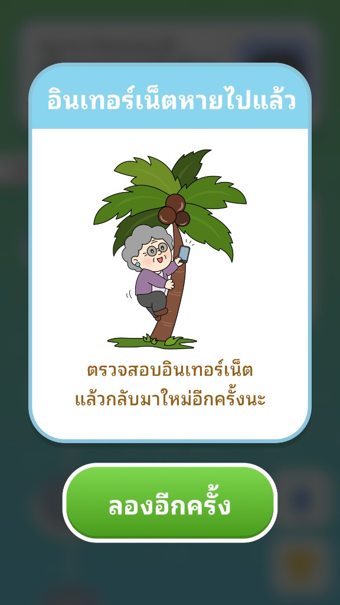

# User Story: US-E7-27 - Popup แจ้งเตือนเมื่ออินเทอร์เน็ตหลุด/ไม่มีอินเทอร์เน็ต

**Status:** ✅ Done (v0.29.0, 2026-07-06 — verified by owner) — popup + variant CSS + `InternetManager` (ตรวจ online/offline + probe) + art จริง (`*_internet_loss.png`) + อ่านเพศผู้เล่น + ผูก `onReconnect`→refresh route + buffer art เป็น data URL ให้รูปโชว์ตอนออฟไลน์ (+ SW precache safety net) + จัดตำแหน่งตัวละครชิดบนตามดีไซน์ *(ดัก fetch error ในชั้นข้อมูล = deferred, รอดีไซน์ popup error)*
**Epic:** [E7: Game Art Assets & UI/UX Polish](../01-product-backlog.md)
**Owner:** ก้องไผ่
**Source:** Owner Task Block — ก้องไผ่ (2026-07-06), [Sprint 07](../sprint-backlogs/sprint-07.md)

---

## 📖 Description
**ในฐานะ** ผู้เล่นสูงอายุที่ใช้แอปผ่านมือถือ/เน็ตบ้าน
**ฉันต้องการ** ให้มี Popup แจ้งเตือนอย่างชัดเจนเมื่อ **อินเทอร์เน็ตหลุด หรือไม่มีอินเทอร์เน็ต**
**เพื่อให้** เข้าใจว่าปัญหาเกิดจากเครือข่าย (ไม่ใช่แอปพัง) และรู้ว่าต้องทำอะไรต่อ (ตรวจเน็ต แล้วลองใหม่)

---

## 🖼 Reference (ดีไซน์ที่ต้องการ)

- **หัวข้อ:** "อินเทอร์เน็ตหายไปแล้ว"
- **ข้อความ:** "ตรวจสอบอินเทอร์เน็ต แล้วลองปิดเปิดเกมใหม่นะ"
- **ตัวละคร:** คุณตา/คุณยาย ปีนต้นมะพร้าวชูมือถือหาสัญญาณ (สื่อว่า "หาเน็ต")
- **ปุ่ม:** ปุ่มเขียว "ลองอีกครั้ง"

---

## ✅ Acceptance Criteria
1. [x] เมื่อ **ตรวจพบว่าออฟไลน์** (ไม่มีเน็ต หรือเน็ตหลุดกลางคัน) แอปแสดง Popup ตามดีไซน์: หัวข้อ "อินเทอร์เน็ตหายไปแล้ว" + ข้อความ "ตรวจสอบอินเทอร์เน็ต แล้วลองปิดเปิดเกมใหม่นะ" + ปุ่ม "ลองอีกครั้ง" — `InternetManager` ผูก event `online`/`offline` + start ที่ bootstrap แล้ว
2. [x] Popup ใช้กรอบ/สไตล์เดียวกับ popup อื่น (Frame_Form_Panel + Start-Game-Button) และแยกสไตล์ด้วย variant ของตัวเอง (`gh-popup--offline` — override เฉพาะ `--popup-*` ไม่กระทบ popup base ตามแนวทาง v0.26.1)
3. [x] ปุ่ม "ลองอีกครั้ง" → `retry()` re-probe เครือข่าย (HEAD `/favicon.png`); ยังออฟไลน์ = แสดงซ้ำ, กลับมาออนไลน์ = เรียก `onReconnect` → `renderCurrentRoute()` (refresh หน้าปัจจุบัน) ผูกจาก `main.js` แล้ว
4. [~] ครอบคลุม: (ก) **ไม่มีเน็ตตั้งแต่แรก** (เช็คตอน `start()`) และ (ข) **เน็ตหลุดระหว่างใช้งาน** (event `offline`) — *ยังไม่ดัก fetch error ในชั้นข้อมูล (`database.js`) โดยตรง (deferred: ยังไม่มีดีไซน์ popup error — จะทำทีหลัง)*
5. [x] ตัวละครแยกตามเพศ (คุณตา/คุณยาย) — art จริง `*_internet_loss.png` (+ fallback `*_profile.png`); เพศอ่านจาก session+DB แล้ว **cache ไว้** (`InternetManager.setGender()` เรียกจาก `main.js` ตอนโหลด patient) เพื่อให้ใช้ได้แม้ตอนออฟไลน์
6. [x] ไม่ขึ้น popup ซ้ำซ้อน (`isOfflinePopupOpen()` guard) + **ปิดอัตโนมัติเมื่อเน็ตกลับมา** (`dismissOfflinePopup()` ใน `handleOnline()`)
7. [x] แสดงผลถูกต้อง อ่านง่ายบนมือถือจริง — owner ยืนยันแล้ว (v0.29.0)

---

## 🛠 Technical Tasks
- [x] สร้าง popup ใหม่ `src/ui/offline-popup.js` (`showOfflinePopup()` + `dismissOfflinePopup()` + `isOfflinePopupOpen()`) ใช้ `renderFramePopupMarkup` ([frame-popup.js](../../../src/ui/components/frame-popup.js)) พร้อม `variant: "offline"` + เพิ่ม override สไตล์ `.gh-popup--offline` ใน `public/components.css` (override เฉพาะ `--popup-*` ตามแพทเทิร์น v0.26.1)
- [x] เขียน `src/core/internet-manager.js` (`InternetManager` singleton): ตรวจ `navigator.onLine` + event `online`/`offline`, active `probe()` (HEAD `/favicon.png`), แสดง/ปิด popup อัตโนมัติ, cache เพศผู้เล่น (`setGender`/`refreshGender` จาก session+DB)
- [x] Wire เข้า `src/main.js`: `internetManager.configure({ onReconnect })` + `.start()` ตอน bootstrap (onReconnect → `renderCurrentRoute()`) + `internetManager.setGender(patientGender)` ตอนโหลด patient ใน `showHub()`
- [x] ผูก `onReconnect` ให้ refresh หน้าปัจจุบัน (`renderCurrentRoute()`) เมื่อเน็ตกลับมา (ทั้ง event `online` และปุ่ม "ลองอีกครั้ง")
- [x] **buffer art เป็น data URL ในหน่วยความจำตอนออนไลน์** (`preloadOfflineArt()` ใน `offline-popup.js` — fetch→blob→FileReader→dataURL, cache ด้วย `Map`) แล้ว render จาก data URL ตอนออฟไลน์ (ไม่ต้องใช้เน็ตเลย) — `InternetManager.bufferArt()` เรียกตอน `setGender`/`refreshGender`/reconnect วิธีนี้แก้ปัญหารูปไม่ขึ้นได้จริง (SW HTTP cache ไม่น่าเชื่อถือ — คืน 503)
- [x] (safety net) precache art offline popup ใน service worker (`public/sw.js`, `CACHE_VERSION` — ปัจจุบัน **v3** หลัง US-E9-13): cache fallback เมื่อ network fail + precache `*_internet_loss.png`/`*_profile.png`
- [~] (deferred) ดักความล้มเหลวจากเครือข่ายในชั้นข้อมูล (`src/core/database.js` — Supabase/RPC fetch error) — รอดีไซน์ popup error ก่อน
- [x] art ตัวละคร (คุณตา/คุณยาย) มีแล้ว: `OldWoman_internet_loss.png` / `OldMan_internet_loss.png` (fallback: `*_profile.png`) — *ชุดใหม่ ship ใน [US-E9-13](US-E9-13.md) v1.1.7*
- [x] จัดตำแหน่งตัวละครให้ชิดด้านบนของ panel ตามดีไซน์ (`.gh-popup--offline .gh-frame-popup-panel__body { align-content: start; }`)
- [~] ตรวจว่า flow เดิม (toast/retry ของ US-E7-18) ไม่ตีกันกับ popup นี้ — popup นี้ singleton-guard + auto-dismiss แล้ว (toast = ชั่วคราวเล็ก, popup นี้ = บล็อกเมื่อออฟไลน์จริง)
- [x] ทดสอบ: ปิดเน็ต (DevTools offline) ระหว่างใช้งาน — popup ขึ้น + รูปคุณตา/คุณยายแสดงถูกต้อง — owner ยืนยันแล้ว

---

## 🔗 Related Files
- New: `src/ui/offline-popup.js`, `src/core/internet-manager.js`
- Wiring: `src/main.js` (`internetManager.configure({ onReconnect })`, `.start()`, `setGender(patientGender)`)
- Offline caching: `public/sw.js` (precache offline art + cache fallback on network failure)
- Art: `public/assets/common/character/{man/OldMan,female/OldWoman}_internet_loss.png`
- Follow-up art refresh: [US-E9-13](US-E9-13.md) ✅ Done (v1.1.7)
- Popup base: `src/ui/components/frame-popup.js`, `src/ui/transition/popup-transition.js`, `public/components.css` (`gh-popup--*`, `--popup-*`)
- Network/data: `src/core/database.js`, `src/main.js`
- Toast (เทียบเคียง): [US-E7-18](US-E7-18.md) (`src/ui/components/toast.js`)
- Related: [US-E7-04](US-E7-04.md) (ระบบภาพ popup), [US-E7-20](US-E7-20.md) (transition popup)
- Backlog: [01-product-backlog](../01-product-backlog.md)

---
Back to Product Backlog: [Product Backlog](../01-product-backlog.md) | Back to Index: [Index](../../index.md)
