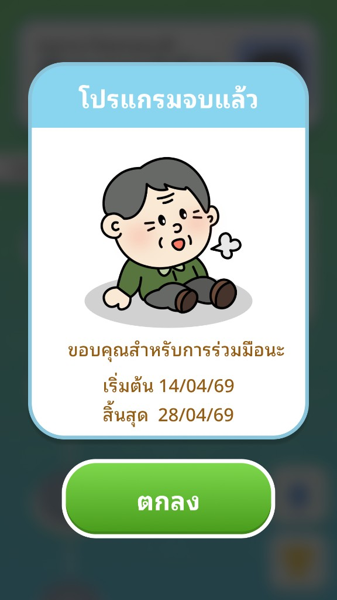

# User Story: US-E7-28 - Popup "โปรแกรมจบแล้ว" แสดงวันเริ่ม–วันสิ้นสุดโปรแกรม

**Status:** ✅ Done (v0.29.0, 2026-07-06 — verified by owner)
**Epic:** [E7: Game Art Assets & UI/UX Polish](../01-product-backlog.md)
**Owner:** ก้องไผ่
**Source:** Owner Task Block — ก้องไผ่ (2026-07-06), [Sprint 07](../sprint-backlogs/sprint-07.md)

---

## 📖 Description
**ในฐานะ** ผู้เล่นสูงอายุที่เล่นครบโปรแกรม 14 วัน
**ฉันต้องการ** ให้ Popup ตอนจบโปรแกรมบอก **วันที่เริ่ม** และ **วันที่สิ้นสุด** โปรแกรมอย่างชัดเจน
**เพื่อให้** เห็นสรุปช่วงเวลาที่เข้าร่วมโปรแกรม และรู้ว่าโปรแกรมสิ้นสุดวันไหน

---

## 🖼 Reference (ดีไซน์ที่ต้องการ)

- **หัวข้อ:** "โปรแกรมจบแล้ว"
- **ข้อความ:** "ขอบคุณสำหรับการร่วมมือนะ"
- **วันที่:** สองบรรทัด — "เริ่มต้น `14/04/69`" และ "สิ้นสุด `28/04/69`" (รูปแบบ `DD/MM/YY` ปี พ.ศ.)
- **ตัวละคร:** คุณตา/คุณยาย (ตามเพศ)

---

## ✅ Acceptance Criteria
1. [x] Popup ตอนจบโปรแกรม (program-complete) แสดง **วันเริ่มโปรแกรม** และ **วันสิ้นสุดโปรแกรม** เป็นสองบรรทัด ("เริ่มต้น …" / "สิ้นสุด …") ตามดีไซน์
2. [x] รูปแบบวันที่เป็น `DD/MM/YY` ปี **พ.ศ.** (เช่น `14/04/69`) ใช้ `formatThaiProgramDate()` ที่มีอยู่แล้ว
3. [x] วันสิ้นสุดคำนวณจากวันเริ่ม + จำนวนวันโปรแกรม (`getProgramEndDate(startedProgram, programDayCount)`) ไม่ hardcode
4. [x] ปรับหัวข้อ/ข้อความให้ตรงดีไซน์ตามที่เจ้าของงานเคาะ
5. [x] ตัวละครแยกตามเพศ (คุณตา/คุณยาย) เหมือนเดิม และเลย์เอาต์ไม่ล้น/ไม่เบียดเมื่อเพิ่มบรรทัดวันที่
6. [x] ถ้าไม่มีข้อมูลวันเริ่ม (edge case) ให้ซ่อนบรรทัดวันที่อย่างสุภาพ ไม่แสดง `NaN`/ค่าว่าง (guard `startedProgram ? … : ""`)
7. [x] แสดงผลถูกต้องบนมือถือจริง — owner ยืนยันแล้ว

> หมายเหตุ: ผู้ขอใช้คำว่า "เวลาและวันที่" — ดีไซน์อ้างอิงแสดงเฉพาะ **วันที่** (ไม่มีเวลา) จึงยึดวันที่เป็นหลัก ส่วน **เวลา** เป็น optional รอเจ้าของงานยืนยันว่าต้องการหรือไม่

---

## 🛠 Technical Tasks
- [x] ใน `showProgramCompletionPopup()` (`src/ui/day-completion-popup.js`) รับ `startedProgram` (วันเริ่มโปรแกรม) เพิ่มจาก options
- [x] คำนวณวันสิ้นสุดด้วย `getProgramEndDate(startedProgram, programDayCount)` และ format ทั้งวันเริ่ม/สิ้นสุดด้วย `formatThaiProgramDate()` จาก [`src/util/program-date-util.js`](../../../src/util/program-date-util.js)
- [x] เพิ่ม markup สองบรรทัดวันที่ ("เริ่มต้น …" / "สิ้นสุด …") ในบอดี้ popup + สไตล์ (`gh-popup__dates`/`gh-popup__date-line` ใต้ variant `program-complete`, ใช้ `--popup-*` ไม่กระทบ popup อื่น)
- [x] อัปเดตหัวข้อ/ข้อความให้ตรงดีไซน์ตามที่เจ้าของงานเคาะ
- [x] ส่งค่า `startedProgram` จากจุดที่เรียก popup (session/โปรแกรมผู้เล่น)
- [x] ตรวจ edge case ไม่มีวันเริ่ม + ทดสอบบนมือถือจริง — owner ยืนยันแล้ว

---

## 🔗 Related Files
- Popup: `src/ui/day-completion-popup.js` (`showProgramCompletionPopup`, variant `program-complete`)
- Date util (มีอยู่แล้ว): `src/util/program-date-util.js` (`getProgramEndDate`, `formatThaiProgramDate`)
- Popup base: `src/ui/components/frame-popup.js`, `public/components.css` (`gh-popup--program-complete`, `--popup-*`)
- Caller: `src/ui/game-hub-screen.js`, `src/main.js`
- Related: [US-E7-16](US-E7-16.md) AC#6 (ตัวละครคุณตา/ยายบน popup จบโปรแกรม), [US-E7-25](US-E7-25.md) (แยกสไตล์ popup)
- Backlog: [01-product-backlog](../01-product-backlog.md)

---
Back to Product Backlog: [Product Backlog](../01-product-backlog.md) | Back to Index: [Index](../../index.md)
