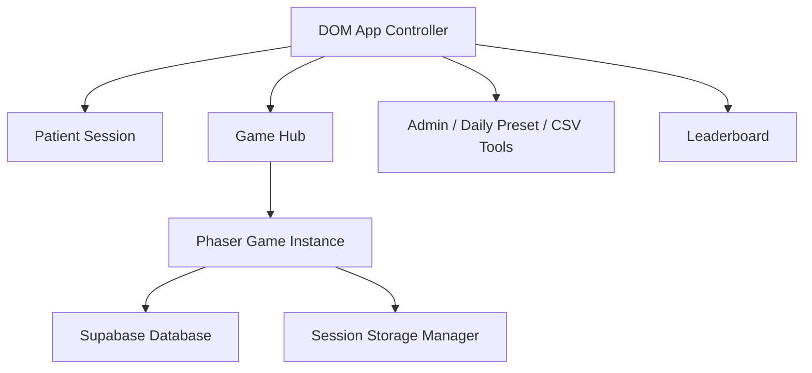
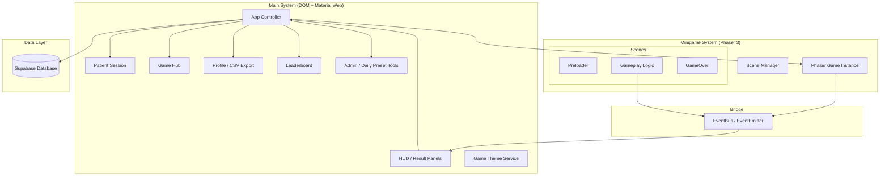

# MCI Cognitive Games — Game Concept & Architecture

**Version:** 1.2 | **Last Updated:** 2026-06-16 | **Owner:** NapLab Group

## 1. Introduction
### Elevator Pitch
MCI Cognitive Games เป็นแพลตฟอร์มเกมเว็บที่รวบรวมเกมฝึกสมองและกิจกรรมสนับสนุนสำหรับผู้ป่วย MCI (Mild Cognitive Impairment) และผู้สูงอายุ เพื่อช่วยพัฒนาความจำ การคิดวิเคราะห์ และทักษะทางปัญญา โดยใช้ธีมที่คุ้นเคยอย่าง "สวนสัตว์" และ "ชีวิตประจำวัน"

### Target Audience
- ผู้ป่วย MCI (Mild Cognitive Impairment)
- ผู้สูงอายุ
- นักกายภาพบำบัด/นักเวชศาสตร์ฟื้นฟู

---

## 2. Technical Stack
| Layer | Technology | Version / Notes |
|-------|-----------|-----------------|
| **Game Engine** | Phaser 3 | 3.90.0 (Core Logic & Rendering) |
| **Web UI** | Vanilla ES Modules + Material Web Components | Login, Signup, Game Hub, Profile, Leaderboard, Admin, Tooling |
| **Build Tool** | Vite | 6.3.1 (Fast Development & Bundling) |
| **Language** | JavaScript | ES Modules |
| **Backend/DB** | Supabase | Database, Edge Functions/RPC fallback, Storage |
| **Deployment** | Docker + nginx | Production image serves Vite `dist/` |

---

## 3. Game Collection
| # | Game Name | Thai Name | Genre | Core Skill |
|---|---|---|---|---|
| 1 | Zoo Detective | นักสืบสวนสัตว์ | Logic Puzzle | การคิดวิเคราะห์, การจำแนกสัตว์ |
| 2 | Zoo Feeder | คนเลี้ยงสัตว์ | Simulation | การจัดการทรัพยากร, การตัดสินใจ |
| 3 | Context Clues | คำใบ้บริบท | Word Puzzle | ความจำ, การเข้าใจภาษา |
| 4 | Symmetry Decor | ตกแต่งสมมาตร | Visual/Design | การรับรู้เชิงพื้นที่, Fine Motor |
| 5 | Postcard Reader | ผู้อ่านไปรษณีย์ | Reading | ความจำ, การอ่านเข้าใจ |
| 6 | Resting Point | พักยืดเส้นยืดสาย | Break Activity | การพักสายตาและการกลับเข้าสู่โปรแกรม |
| 7 | Fry Food | ทอดอาหาร | Sensor/Timing | การตอบสนองและการควบคุมด้วยการเคลื่อนไหว |

---

## 4. System Architecture
ระบบถูกออกแบบโดยใช้โครงสร้าง **Hybrid Architecture** ที่รวม DOM Web UI สำหรับ workflow หลักเข้ากับ Phaser 3 สำหรับเกมแต่ละเกม
ระบบแบ่งออกเป็น 2 ส่วนหลัก:
1. **Application UI (Vanilla JS + Material Web):** จัดการ login, signup, game hub, profile, leaderboard, admin และเครื่องมือจัดการข้อมูล
2. **Game Core (Phaser 3):** จัดการกลไกของเกมและกิจกรรมฝึกสมอง โดยใช้ระบบ Scene-based  
  

### 4.1 ภาพรวมส่วนประกอบหลัก (Core Components)
1. **DOM App Shell (Main System):** ทำหน้าที่เป็น container หลัก จัดการ hash routing, patient session, Supabase connection และหน้าจอ UI
2. **Phaser Engine (Game System):** จัดการ Rendering และ Logic ของมินิเกมแต่ละเกม
3. **EventBus (Communication Bridge):** ตัวกลางที่ช่วยให้ DOM UI และ Phaser คุยกันได้แบบ event-driven
4. **Supabase Data Layer:** อ่าน/เขียนข้อมูลผู้เล่น ประวัติการเล่น โปรแกรมรายวัน leaderboard และ export data

### 4.2 โครงสร้างการทำงาน (System Structure Diagram)

---

## 5. รายละเอียดส่วนประกอบสำคัญ (Key Components)

### 5.1 EventBus (The Bridge)
- **ตำแหน่ง:** `src/core/EventBus.js`
- **หน้าที่:** จัดการ Event-driven communication
- **ตัวอย่าง:** เมื่อเกมจบ Phaser จะส่ง event พร้อม `scoreData` และ DOM app/HUD จะรับค่าผ่าน `EventBus.on(...)` เพื่อบันทึกผลและนำทางกลับ flow หลัก

### 5.2 UI Overlay Strategy
- **Web screens:** ใช้ DOM templates และ Material Web Components ใน `src/ui/` สำหรับหน้าจอ app-level เช่น login, signup, hub, profile, leaderboard และ admin tools
- **HUD:** ใช้ DOM overlay ทับบน Phaser canvas สำหรับ score/timer/game-state ที่ต้องอยู่นอก canvas
- **Syncing:** ข้อมูลเช่น score, timer, game completion และ navigation จะถูกส่งผ่าน EventBus และ session storage keys

### 5.3 Data Flow
1. **Startup:** App โหลด session/HN, ตรวจข้อมูลผู้เล่นจาก Supabase และเลือก route ที่เหมาะสม
2. **Game Hub:** ระบบโหลดโปรแกรมรายวัน, ประวัติการเล่น, node progression, rest/check-in node และสถานะวันปัจจุบัน
3. **Launch Game:** App ส่ง game config ผ่าน session storage และเริ่ม Phaser game ตาม `gid`, stage, level และ preset data
4. **In-game:** Phaser คำนวณคะแนนและ logic ต่างๆ
5. **Completion:** เมื่อเกมจบ Phaser ส่งข้อมูลสรุปกลับมาที่ Main System เพื่อบันทึก `user_game_data` และ `user_game_history`
6. **Analytics/Export:** Profile/Admin tools อ่านข้อมูลผู้เล่น เกม และประวัติออกเป็น CSV

### 5.4 Shared Services
- **DatabaseManager:** Singleton สำหรับการ Query และ Update ข้อมูลไปยัง Supabase
- **GameTheme:** บริการจัดการ Design Tokens (สี, ฟอนต์) เพื่อให้ทั้ง DOM UI และ Phaser มี Visual Identity เดียวกัน
- **SessionStorageManager:** เก็บ launch context, login ID และ route handoff ระหว่าง DOM app กับ Phaser
- **CurrentNodeScrollController:** จัดการการ scroll ไปยัง node ปัจจุบันใน game hub และ leaderboard โดยไม่ผูก state กับ DOM เก่า
- **ProgramDateUtil:** คำนวณวันที่เริ่ม/จบโปรแกรม สถานะวัน และ format วันที่ไทย

---

## 6. มาตรฐานการพัฒนา (Integration Standards)
- **Separation of Concerns:** อย่าเขียน Logic การบันทึก DB ไว้ใน Phaser Scene ให้ส่งข้อมูลออกมาให้ app controller/database layer เป็นผู้จัดการ
- **Asset Management:** Assets ทั้งหมดต้องอยู่ใน `public/assets/` และถูกเรียกผ่าน `Preloader` ของแต่ละเกม
- **Responsiveness:** ใช้ `LayoutManager` ใน Phaser ควบคู่กับ CSS Grid/Flexbox และ viewport-safe DOM layout
- **Deployment Hygiene:** ก่อน deploy production build ให้ตรวจว่า branch ไม่มี stale leaderboard code (`grep -R "topObserver" src dist`) และ build จาก branch เดียวกับที่ test ผ่านแล้ว

---

## 7. Project Management
- **Scope:** 6+ Sprints with post-Sprint hardening
- **Team Size:** 2-5 People
- **Current Milestone:** Stabilization, deployment verification, and documentation sync

---

## Related Documents
- Mechanics: [Mechanics](01-mechanics.md)
- System Design: [System Design](../software/01-system-design.md)
- Product Backlog: [Product Backlog](../agile/01-product-backlog.md)
- UX/UI Modernization: [UX/UI Modernization](../wiki/guidelines/ux-ui-modernization-guidelines.md)

---
[Back to Index](../index.md)
