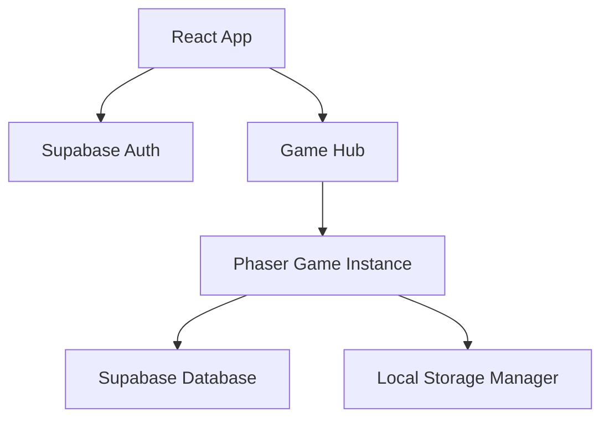
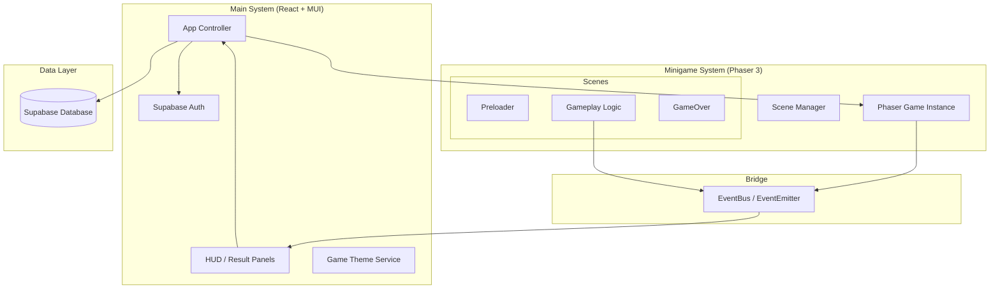

# MCI Cognitive Games — Game Concept & Architecture

**Version:** 1.1 | **Last Updated:** 2026-05-02 | **Owner:** NapLab Group

## 1. Introduction
### Elevator Pitch
MCI Cognitive Games เป็นแพลตฟอร์มเกมเว็บที่รวบรวมเกมฝึกสมอง 5 เกมย่อยสำหรับผู้ป่วย MCI (Mild Cognitive Impairment) และผู้สูงอายุ เพื่อช่วยพัฒนาความจำ การคิดวิเคราะห์ และทักษะทางปัญญา โดยใช้ธีมที่คุ้นเคยอย่าง "สวนสัตว์" และ "ชีวิตประจำวัน"

### Target Audience
- ผู้ป่วย MCI (Mild Cognitive Impairment)
- ผู้สูงอายุ
- นักกายภาพบำบัด/นักเวชศาสตร์ฟื้นฟู

---

## 2. Technical Stack
| Layer | Technology | Version / Notes |
|-------|-----------|-----------------|
| **Game Engine** | Phaser 3 | 3.90.0 (Core Logic & Rendering) |
| **Web Framework** | React / Material UI | HUD, Login, Signup, GameHub |
| **Build Tool** | Vite | 6.3.1 (Fast Development & Bundling) |
| **Language** | JavaScript | ES Modules |
| **Backend/DB** | Supabase | Database, Authentication & Storage |

---

## 3. Game Collection (5 Mini-Games)
| # | Game Name | Thai Name | Genre | Core Skill |
|---|---|---|---|---|
| 1 | Zoo Detective | นักสืบสวนสัตว์ | Logic Puzzle | การคิดวิเคราะห์, การจำแนกสัตว์ |
| 2 | Zoo Feeder | คนเลี้ยงสัตว์ | Simulation | การจัดการทรัพยากร, การตัดสินใจ |
| 3 | Context Clues | คำใบ้บริบท | Word Puzzle | ความจำ, การเข้าใจภาษา |
| 4 | Symmetry Decor | ตกแต่งสมมาตร | Visual/Design | การรับรู้เชิงพื้นที่, Fine Motor |
| 5 | Postcard Reader | ผู้อ่านไปรษณีย์ | Reading | ความจำ, การอ่านเข้าใจ |

---

## 4. System Architecture
ระบบถูกออกแบบโดยใช้โครงสร้าง **Hybrid Architecture** ที่รวมความสามารถในการจัดการ UI และ Data ของ React เข้ากับความสามารถในการประมวลผลกราฟิกและ Game Logic ของ Phaser 3
ระบบแบ่งออกเป็น 2 ส่วนหลัก:  
1. **Application UI (React/MUI):** จัดการส่วนของการเข้าสู่ระบบ และการเลือกเกม  
2. **Game Core (Phaser 3):** จัดการกลไกของเกมทั้ง 5 เกม โดยใช้ระบบ Scene-based  
  

### 4.1 ภาพรวมส่วนประกอบหลัก (Core Components)
1. **React Shell (Main System):** ทำหน้าที่เป็น Container หลัก จัดการเรื่อง Authentication, Routing, และ Database Connection (Supabase)
2. **Phaser Engine (Game System):** จัดการ Rendering และ Logic ของมินิเกมแต่ละเกม
3. **EventBus (Communication Bridge):** ตัวกลางที่ช่วยให้ React และ Phaser คุยกันได้แบบ Bi-directional

### 4.2 โครงสร้างการทำงาน (System Structure Diagram)

---

## 5. รายละเอียดส่วนประกอบสำคัญ (Key Components)

### 5.1 EventBus (The Bridge)
- **ตำแหน่ง:** `src/core/EventBus.js`
- **หน้าที่:** จัดการ Event-driven communication
- **ตัวอย่าง:** เมื่อเกมจบ Phaser จะส่ง `Gameplay.emit('game-over', scoreData)` และ React จะรับค่าผ่าน `EventBus.on('game-over', ...)` เพื่อแสดงผลหน้าสรุปคะแนน

### 5.2 UI Overlay Strategy
- **HUD:** ใช้ React/MUI ในการวาด Overlay ทับบน Canvas เพื่อให้ได้ UI ที่คมชัดและจัดการ Responsive ได้ง่าย
- **Syncing:** ข้อมูลเช่น HP หรือ Score จะถูกส่งจาก Phaser มาที่ React HUD แบบ Real-time ผ่าน EventBus

### 5.3 Data Flow
1. **Startup:** App โหลดข้อมูลผู้เล่นจาก Supabase และส่งค่า Config เข้าไปใน Phaser ผ่าน `Scene.init(data)`
2. **In-game:** Phaser คำนวณคะแนนและ Logic ต่างๆ
3. **Completion:** เมื่อเกมจบ Phaser ส่งข้อมูลสรุปกลับมาที่ Main System เพื่อทำการบันทึกลง Supabase Table

### 5.4 Shared Services
- **DatabaseManager:** Singleton สำหรับการ Query และ Update ข้อมูลไปยัง Supabase
- **GameTheme:** บริการจัดการ Design Tokens (สี, ฟอนต์) เพื่อให้ทั้ง React และ Phaser มี Visual Identity เดียวกัน

---

## 6. มาตรฐานการพัฒนา (Integration Standards)
- **Separation of Concerns:** อย่าเขียน Logic การบันทึก DB ไว้ใน Phaser Scene ให้ส่งข้อมูลออกมาให้ React เป็นผู้จัดการ
- **Asset Management:** Assets ทั้งหมดต้องอยู่ใน `public/assets/` และถูกเรียกผ่าน `Preloader` ของแต่ละเกม
- **Responsiveness:** ใช้ `LayoutManager` ใน Phaser ควบคู่กับ CSS Flexbox/Grid ใน React

---

## 7. Project Management
- **Scope:** 8 Weeks (4 Sprints)
- **Team Size:** 2-5 People
- **Current Milestone:** ✅ Completed - Full Game Suite & Accessibility Polish

---

## Related Documents
- Mechanics: [[./01-mechanics.md]]
- System Design: [[../software/01-system-design.md]]
- Product Backlog: [[01-product-backlog]]
- UX/UI Modernization: [[../wiki/guidelines/ux-ui-modernization-guidelines.md]]
