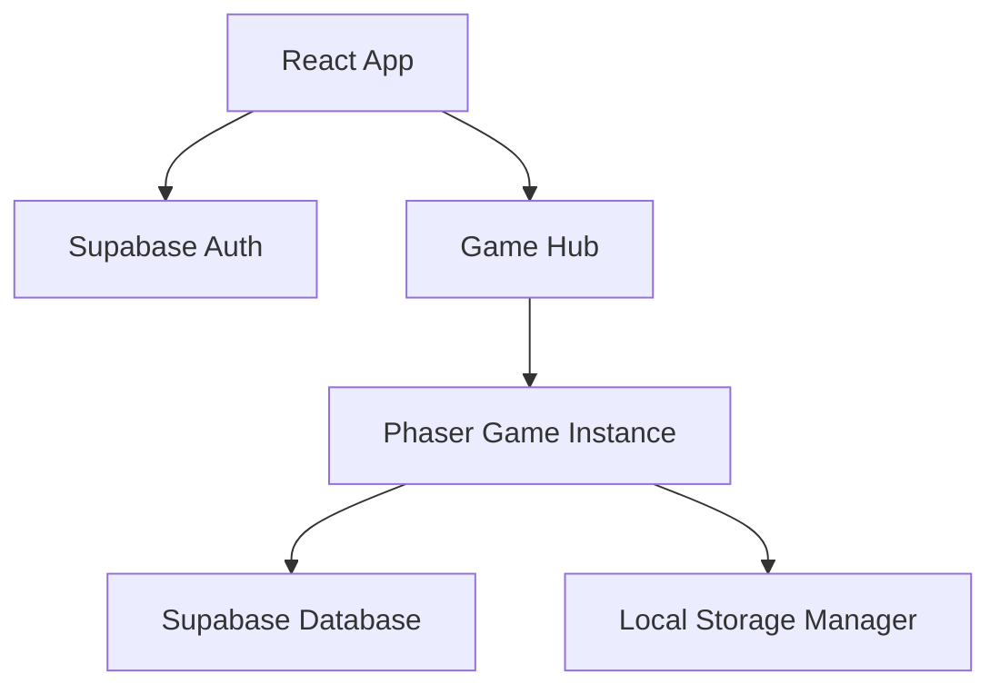

# MCI Cognitive Games — Software Architecture

**Version:** 1.0 | **Last Updated:** 2026-05-02

## Tech Stack
| Layer | Technology | Notes |
|-------|-----------|-------|
| Game Engine | Phaser 3.90.0 | Core logic for mini-games |
| Web Framework | React / Material UI | Login, Signup, GameHub screens |
| Build Tool | Vite 6.3.1 | Fast development & bundling |
| Database | Supabase | Patient data, Score logging |
| Authentication | Supabase Auth | User management |
| i18n | phaser3-i18n | Multi-language support (Thai/English) |

## High-Level Architecture
ระบบแบ่งออกเป็น 2 ส่วนหลัก:
1. **Application UI (React/MUI):** จัดการส่วนของการเข้าสู่ระบบ และการเลือกเกม
2. **Game Core (Phaser 3):** จัดการกลไกของเกมทั้ง 5 เกม โดยใช้ระบบ Scene-based

## Core Systems
- **Database Manager:** จัดการการเชื่อมต่อและยิง API ไปยัง Supabase
- **Drag-Drop Manager:** ระบบจัดการการลากวางสัตว์และองค์ประกอบ
- **Layout Manager:** จัดการการจัดวางตำแหน่งวัตถุใน Phaser ให้รองรับ Responsive

## Related Documents
- System Design: [[./01-system-design.md]]
- GDD Mechanics: [[../gdd/01-mechanics.md]]
