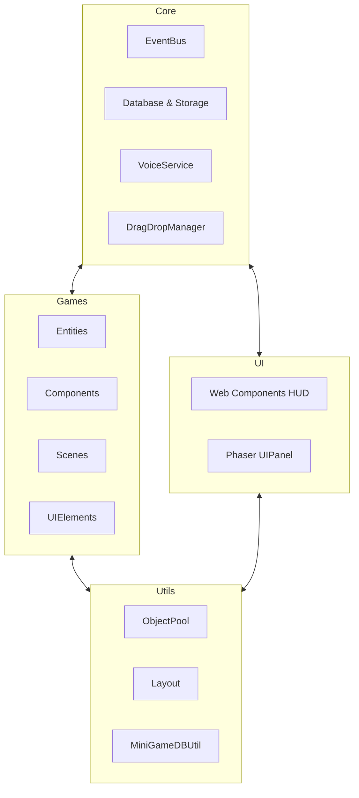

# MCI Cognitive Games — System Design

**Version:** 1.2 | **Last Updated:** 2026-05-08

เอกสารนี้อธิบายรายละเอียดการออกแบบระบบเชิงโครงสร้าง (Subsystems) และรูปแบบการเขียนโปรแกรม (Design Patterns) ที่ใช้ในโครงการ

## 1. โครงสร้างมินิเกมมาตรฐาน (Standardized Minigame Structure)
ทุกมินิเกมจะถูกจัดเก็บภายใต้ `src/game/[game-name]/` โดยมีโครงสร้างโฟลเดอร์ที่เหมือนกันเพื่อความง่ายในการบำรุงรักษา:

- `main.js`: จุดเริ่มต้นของมินิเกม (Entry Point) ทำหน้าที่ตั้งค่า Phaser Game Config และโหลด Scenes
- `components/`: สคริปต์ตรรกะย่อยที่นำไปประกอบร่างเป็น Entity (เช่น `Clickable.js`, `Draggable.js`)
- `entity/`: วัตถุหลักในเกม (เช่น ผู้เล่น, สัตว์, ตาราง) ที่ขยายจาก Phaser Sprite และรองรับระบบ Component
- `scenes/`: ฉากต่างๆ ของ Phaser (Boot, Preloader, MainMenu, Gameplay)
- `ui-elements/`: หน้าจอ Overlay และ UI Panels ภายใน Phaser (เช่น `ResultPanel.js`)
- `constants.js`: ค่าคงที่, การตั้งค่าความยาก, และ Asset Keys (รวมถึงข้อมูลด่านในบางเกม)

---

## 2. ระบบหลัก (Core Systems)

### 2.1 Entity-Component System (ECS Lite)
ในมินิเกมรุ่นใหม่ (เช่น Context Clues, Postcard Reader) มีการนำรูปแบบ ECS มาใช้เพื่อแยกตรรกะออกจากตัววัตถุ:
- **Entity**: คลาสที่ขยายจาก `Phaser.Physics.Arcade.Sprite` ทำหน้าที่เป็น Container สำหรับ Components
- **Component**: คลาสฐานสำหรับสร้าง Logic ย่อย (เช่น `Clickable`, `EmojiRenderer`, `Draggable`)
- **การใช้งาน**: `entity.addComponent(ComponentClass)`

### 2.2 UI System (Dual-Layer Architecture)
ระบบ UI ถูกแบ่งออกเป็น 2 ชั้นเพื่อให้เหมาะสมกับหน้าที่:
1. **Web Components HUD**: ใช้ Vanilla JS ร่วมกับ Material Web Components (`@material/web`) สำหรับ UI หลักภายนอกเกม เช่น หน้า Hub, Login, และหน้าสรุปผลรวม (จัดการผ่าน `src/ui/`)
2. **Phaser UIPanel**: ใช้สำหรับ UI ภายใน Canvas ของเกม เช่น หน้าต่าง Pause หรือ Tutorial (จัดการผ่าน `src/game/common/ui/core/ui-panel-base.js`) โดยใช้ระบบ Tween และ Phaser Graphics

### 2.3 EventBus (The Bridge)
ใช้ `src/core/EventBus.js` เป็นตัวกลางในการสื่อสารระหว่างส่วนที่เป็น Web UI และ Phaser:
- **Phaser -> Web UI**: ส่งเหตุการณ์ `game-over`, `score-update`, `timer-tick`
- **Web UI -> Phaser**: ส่งเหตุการณ์ `start-game`, `pause-game`, `change-level`

### 2.4 Drag-Drop Manager
ระบบจัดการการลากวางส่วนกลาง (`src/core/drag-drop-manager.js`) ที่ช่วยให้การตรวจจับการลากวัตถุและการตรวจสอบจุดวาง (Drop Zone) เป็นไปอย่างเป็นระบบ

---

## 3. ระบบสนับสนุนทั่วไป (Common Utilities)

### 3.1 Object Pooling
ใช้เพื่อเพิ่มประสิทธิภาพโดยการนำวัตถุกลับมาใช้ใหม่ ลดภาระของ Garbage Collector:
- **BaseObjectPool**: คลาสแม่สำหรับจัดการกลุ่มวัตถุ
- **ArcadeObjectPool**: ปรับแต่งมาเพื่อใช้งานร่วมกับฟิสิกส์ของ Phaser Arcade

### 3.2 Layout Management
จัดการการจัดวางตำแหน่งที่รองรับความละเอียดหน้าจอที่หลากหลาย:
- **SquareGridLayout**: จัดวางวัตถุในรูปแบบตาราง (ใช้ใน Zoo Detective)
- **AnimalIconTray**: จัดวางไอคอนสัตว์แบบ Grid ที่ปรับขนาดอัตโนมัติ

### 3.3 MiniGameDBUtil
ตัวช่วยในการเชื่อมต่อข้อมูลเกมจาก Phaser กลับไปยัง Database ผ่าน `sessionStorage` และ `src/core/database.js` เพื่อบันทึกคะแนนและสถานะการเล่น

---

## 4. รายละเอียด Subsystems รายเกม

### 4.1 Zoo Detective (นักสืบสวนสัตว์)
- `RandomPuzzle`: ระบบ Generate ปริศนาและคำใบ้ตามระดับความยาก
- `HintLineViewer`: แสดงคำใบ้ทีละขั้นตอนพร้อมสถานะการตรวจสอบ
- `SquareGridLayout`: จัดการการโต้ตอบกับช่องตารางและการวางสัตว์

### 4.2 Zoo Feeder (คนเลี้ยงสัตว์)
- `ConveyorManager`: จัดการความเร็วและทิศทางของสายพานลำเลียง
- `Spawner`: สุ่มการเกิดของสัตว์และอาหารโดยใช้ Object Pooling
- `Clickable Component`: จัดการการคลิกให้อาหาร

### 4.3 Context Clues (คำใบ้บริบท)
- `RandomQuiz`: ดึงข้อมูลโจทย์จาก `QuizGameData` และสุ่มลำดับ
- `EmojiRenderer`: จัดการการแสดงผลอิโมจิขนาดใหญ่ในตัวเลือก
- `TriggerListener`: ตรวจสอบเงื่อนไขการเลือกคำตอบ

### 4.4 Symmetry Decor (ตกแต่งสมมาตร)
- `EntityGrid`: ระบบตารางที่รองรับการสะท้อน (Mirroring) ของแกนสมมาตร
- `Draggable/Socket`: ระบบลากวางวัตถุและตรวจสอบจุดติดตั้งที่ถูกต้อง

### 4.5 Postcard Reader (ผู้อ่านไปรษณีย์)
- `PostcardPanel`: จัดการการแสดงผลข้อความและรูปภาพในไปรษณีย์
- `ProgressBar`: แสดงเวลาที่เหลือในการจดจำเนื้อหา
- `VoiceService`: ระบบอ่านออกเสียงภาษาไทยอัตโนมัติเพื่อเพิ่มประสิทธิภาพการจดจำ

---

## 5. มาตรฐานการพัฒนา (Design Patterns)
- **Singleton Pattern**: ใช้ใน `DatabaseManager`, `StorageManager`, และ `EventBus`
- **Observer Pattern**: ใช้ในระบบ EventBus
- **State Pattern**: จัดการ Game State ภายใน Gameplay Scene (IDLE, PLAYING, EVALUATING, GAMEOVER)
- **Factory Pattern**: ใช้ใน Object Pool สำหรับการสร้างสมาชิกใหม่

---

## Related Documents
- Architecture: [Concept](../gdd/00-concept.md)
- GDD Mechanics: [Mechanics](../gdd/01-mechanics.md)

---
[Back to Index](../index.md)

