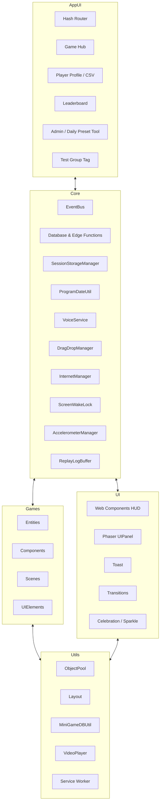

# MCI Cognitive Games — System Design

**Version:** 1.6 | **Last Updated:** 2026-07-24 | **App Release:** v1.3.0

```mermaid
graph TD
    subgraph Core
        EventBus
        DB[Database & Edge Functions]
        Session[SessionStorageManager]
        ProgramDate[ProgramDateUtil]
        Voice[VoiceService]
        DDM[DragDropManager]
        Net[InternetManager]
        Wake[ScreenWakeLock]
        Accel[AccelerometerManager]
        Replay[ReplayLogBuffer]
    end

    subgraph AppUI
        Routes[Hash Router]
        Hub[Game Hub]
        Profile[Player Profile / CSV]
        Leaderboard
        Admin[Admin / Daily Preset Tool]
        Groups[Test Group Tag]
    end

    subgraph Games
        Entities
        Components
        Scenes
        UIElements
    end

    subgraph UI
        WebHUD[Web Components HUD]
        PhaserUI[Phaser UIPanel]
        Toast
        Transitions
        Effects[Celebration / Sparkle]
    end

    subgraph Utils
        ObjectPool
        Layout
        DBUtil[MiniGameDBUtil]
        Video[VideoPlayer]
        PWA[Service Worker]
    end

    AppUI <--> Core
    Core <--> Games
    Core <--> UI
    Games <--> Utils
    UI <--> Utils
```

เอกสารนี้อธิบายรายละเอียดการออกแบบระบบเชิงโครงสร้าง (Subsystems) และรูปแบบการเขียนโปรแกรม (Design Patterns) ที่ใช้ในโครงการ ณ เวอร์ชัน **v1.3.0** (Sprint 10)

## 1. โครงสร้างมินิเกมมาตรฐาน (Standardized Minigame Structure)
ทุกมินิเกมจะถูกจัดเก็บภายใต้ `src/game/[game-name]/` โดยมีโครงสร้างโฟลเดอร์ที่เหมือนกันเพื่อความง่ายในการบำรุงรักษา:

- `main.js`: จุดเริ่มต้นของมินิเกม (Entry Point) ทำหน้าที่ตั้งค่า Phaser Game Config และโหลด Scenes
- `components/`: สคริปต์ตรรกะย่อยที่นำไปประกอบร่างเป็น Entity (เช่น `Clickable.js`, `Draggable.js`)
- `entity/`: วัตถุหลักในเกมที่ขยายจาก Phaser Sprite และรองรับระบบ Component
- `scenes/`: ฉากต่างๆ ของ Phaser (Boot, Preloader, MainMenu, Gameplay)
- `ui-elements/`: หน้าจอ Overlay และ UI Panels ภายใน Phaser (เช่น `ResultPanel.js`)
- `constants.js`: ค่าคงที่, การตั้งค่าความยาก, และ Asset Keys

---

## 2. ระบบหลัก (Core Systems)

### 2.0 App Controller & Hash Routing
`src/main.js` ทำหน้าที่เป็น application controller หลัก โดยใช้ hash route เช่น `#/login`, `#/signup`, `#/hub`, `#/leaderboard`, `#/player-info`, `#/admin-login`, `#/tools/daily-presets` และ `#/game/:gid` เพื่อสลับระหว่าง DOM screens และ Phaser game instance

หน้าที่หลัก:
- จัดการ body/app mode (`hub-mode`, `landing-mode`, `game-mode`)
- โหลดข้อมูลผู้เล่นและ session
- เตรียม game launch context ผ่าน `SessionStorageManager`
- เชื่อมต่อ Supabase ผ่าน `src/core/database.js` และ Edge Functions ผ่าน `src/core/edge-function.js`
- ซ่อน/แสดง game canvas และ DOM UI ตาม route
- ผูก Screen Wake Lock ตอนเข้า/ออกมินิเกม

### 2.1 Entity-Component System (ECS Lite)
ในมินิเกมรุ่นใหม่มีการนำรูปแบบ ECS มาใช้เพื่อแยกตรรกะออกจากตัววัตถุ:
- **Entity**: คลาสที่ขยายจาก `Phaser.Physics.Arcade.Sprite` ทำหน้าที่เป็น Container สำหรับ Components
- **Component**: คลาสฐานสำหรับสร้าง Logic ย่อย (เช่น `Clickable`, `EmojiRenderer`, `Draggable`)
- **การใช้งาน**: `entity.addComponent(ComponentClass)`

### 2.2 UI System (Dual-Layer Architecture)
ระบบ UI ถูกแบ่งออกเป็น 2 ชั้นเพื่อให้เหมาะสมกับหน้าที่:
1. **DOM + Material Web UI**: ใช้ Vanilla JS template ร่วมกับ Material Web Components (`@material/web`) สำหรับ UI หลักภายนอกเกม เช่น Login, Signup, Game Hub, Profile, Leaderboard, Admin และ Daily Preset Tool (จัดการผ่าน `src/ui/`)
2. **Phaser UIPanel**: ใช้สำหรับ UI ภายใน Canvas ของเกม เช่น หน้าต่าง Pause หรือ Tutorial (จัดการผ่าน `src/game/common/ui/core/ui-panel-base.js`) โดยใช้ระบบ Tween และ Phaser Graphics

ส่วนประกอบร่วมชั้น DOM (Sprint 7+):
- Toast (`src/ui/components/toast.js`) — ข้อความสถานะ/ข้อผิดพลาดแบบ Android
- Screen / Popup transitions (`src/ui/transition/`)
- Celebration และ Sparkle effects ตอนเช็คชื่อ/ฉลอง
- Loading overlay แบบ reusable
- ชุด art frames (panel, popup, ปุ่ม) ตามแนว Figma

### 2.3 EventBus (The Bridge)
ใช้ `src/core/EventBus.js` เป็นตัวกลางในการสื่อสารระหว่างส่วนที่เป็น Web UI และ Phaser:
- **Phaser -> Web UI**: ส่งเหตุการณ์ `game-over`, `score-update`, `timer-tick`
- **Web UI -> Phaser**: ส่งเหตุการณ์ `start-game`, `pause-game`, `change-level`

### 2.4 Drag-Drop Manager
ระบบจัดการการลากวางส่วนกลาง (`src/core/drag-drop-manager.js`) ที่ช่วยให้การตรวจจับการลากวัตถุและการตรวจสอบจุดวาง (Drop Zone) เป็นไปอย่างเป็นระบบ

### 2.5 Game Hub Progression System
Game Hub (`src/ui/game-hub-screen.js`) สร้าง daily progression จากข้อมูล preset และ history:
- `buildProgramDays()` แปลงข้อมูล Supabase เป็น day sections
- `buildDayNodes()` แทรก game/rest/check-in nodes
- `getSequentialCompletedCount()` ตรวจ completion แบบลำดับ
- `bindCurrentNodeScrollController()` scroll ไปยัง node ปัจจุบันโดยแยก logic เป็น utility
- ปิดปุ่มเริ่มเกมก่อนวันเริ่มโปรแกรม
- แสดงชื่อเกมภาษาไทยด้านบน / หมวดหมู่ด้านล่าง
- แสดงเลขเวอร์ชันบน Hub (ซ่อนเมื่อเข้ามินิเกม)

### 2.6 Leaderboard System
Leaderboard (`src/ui/leaderboard-screen.js`) แสดง top players และ rank ของผู้เล่นปัจจุบัน:
- ใช้ `db.getLeaderboard({ currentHn, offset, limit })`
- ใช้ `db.getUserRank(hn)` สำหรับ bottom bar/current rank
- Database layer พยายามเรียก Edge Function ก่อน แล้ว fallback เป็น RPC/client query
- **กรองตามกลุ่มทดสอบ (`GRPID`)**: ผู้เล่นเห็นเฉพาะสมาชิกกลุ่มเดียวกัน; ค่า `UNTAGGED` เห็นทุกกลุ่ม (มุมมอง admin)

### 2.7 Data Export System
Profile screen ใช้ `src/util/player-csv-export.js` ร่วมกับ Edge Function เพื่อสร้างและดาวน์โหลด CSV:
- Player CSV / Game score CSV / Game history CSV
- Full export ผ่าน pagination บน Edge Function (กันข้อมูลหายเมื่อชุดข้อมูลใหญ่)
- Popup เลือกประเภทไฟล์ + กรองตามกลุ่มทดสอบ (`export-options-popup.js`) — filter-only ไม่ใส่คอลัมน์กลุ่มในไฟล์
- Toast แจ้งสถานะระหว่างเตรียม/ส่งออก

### 2.8 Test Group Segmentation
ระบบแบ่งกลุ่มผู้เล่นสำหรับการวิจัย/ทดสอบภาคสนาม:
- Lookup table `user_group_tag` (`GRPID`, `tag_name`)
- คอลัมน์ FK `GRPID` บน `user_game_profile_data` (default `UNTAGGED`)
- อ่านผ่าน `db.getUserGroup()` / `db.getUserGroupTags()`
- กำหนดกลุ่มผ่าน SQL โดยตรง (ยังไม่มี UI / CLI ตั้ง tag)

### 2.9 Check-in Tree Personalization
- ชนิดต้นคิดดี `tree_type` (`a`–`d`) จาก `game_tree_list`
- สุ่มตอนสร้าง profile และ lazy backfill เมื่อค่าเป็น `NULL`
- Asset path: `public/assets/checkin-popup/{tree_type}/…`

### 2.10 Connectivity, Wake Lock & PWA
- `InternetManager` — ตรวจ online/offline และแสดง offline popup (art ตามเพศ)
- `ScreenWakeLockManager` — กันหน้าจอดับระหว่างมินิเกมและวิดีโอ (Wake Lock API + silent video fallback)
- Progressive Web App: `public/manifest.webmanifest` + `public/sw.js`

### 2.11 Device Input & Media
- `AccelerometerManager` — ควบคุม Fry Food; มีปุ่มข้ามเมื่อไม่มี gyroscope
- `VoiceService` — TTS ภาษาไทย (Web Speech API); รายละเอียดใน [05-voice-service.md](./05-voice-service.md)
- `AudioManager` (Howler) — BGM ของ Hub/มินิเกม, SFX ปุ่ม/ป๊อปอัป, จำ volume/mute, duck เสียงเมื่อ TTS พูด
- `VideoManager` — ซิงก์ volume/mute ระหว่างส่วนต่าง ๆ
- `VideoPlayer` — เล่นคลิป rest/check-in พร้อมปุ่มปิดระหว่างเล่น
- TTS asset pipeline: `tools/generate-tts.mjs` สำหรับสร้างไฟล์เสียงล่วงหน้า

### 2.12 Analytics & Replay
- `user-event.js` / `user-log.js` — บันทึกเหตุการณ์การใช้งาน
- `replay-event.js` / `replay-log-buffer.js` — buffer บันทึกการเล่นซ้ำพฤติกรรม ลงตาราง replay log

### 2.13 Daily Preset Admin Tool
ชุดเครื่องมือใน `src/tools/` (ไม่ได้อยู่ใต้ `src/ui/`):
- `daily-preset-tool.js` / `daily-preset-editor.js` — แก้ไขแผนรายวันและด่าน
- CSV import / เพิ่มวัน / แก้ stage / เพิ่มฟิลด์
- `daily-preset-database.js` — ชั้นเข้าถึงข้อมูล preset
- เข้าถึงผ่าน route `#/tools/daily-presets` หลัง Admin login

### 2.14 Test Game Hub
- `src/ui/test-game-hub.js` — เปิดมินิเกมแบบสแตนด์อโลนเพื่อทดสอบ โดยไม่ต้องเดินตามโปรแกรม 14 วัน

### 2.15 App Shell Presentation
- Welcome screen + partner logos (`welcome-screen.js`)
- App version badge บน Hub (ซ่อนในมินิเกม)
- Gender-based avatars / ตัวละครคุณตา–คุณยาย ใน Hub, rest, check-in, offline
- แสดงหมวด cognitive (`mci_group`) บนโหนดเกม
- Loading overlay / boot loading (`loading-overlay.js`)
- Popups: day completion, program completion, game exit, confirm, export, offline, resting

---

## 3. ระบบสนับสนุนทั่วไป (Common Utilities)

### 3.1 Object Pooling
ใช้เพื่อเพิ่มประสิทธิภาพโดยการนำวัตถุกลับมาใช้ใหม่ ลดภาระของ Garbage Collector:
- **BaseObjectPool**: คลาสแม่สำหรับจัดการกลุ่มวัตถุ
- **ArcadeObjectPool**: ปรับแต่งมาเพื่อใช้งานร่วมกับฟิสิกส์ของ Phaser Arcade

### 3.2 Layout Management
จัดการการจัดวางตำแหน่งที่รองรับความละเอียดหน้าจอที่หลากหลาย:
- **SquareGridLayout**: จัดวางวัตถุในรูปแบบตาราง (ใช้ใน Zoo Detective)
- **AnimalIconTray**: จัดวางไอคอนสัตว์แบบ Grid ที่ปรับขนาดอัตโนมัติ
- อื่น ๆ ใน `src/util/layout/`: progress bar, scroll container, shadow rounded panel, inline content layout

### 3.3 MiniGameDBUtil
ตัวช่วยในการเชื่อมต่อข้อมูลเกมจาก Phaser กลับไปยัง Database ผ่าน `sessionStorage` และ `src/core/database.js` เพื่อบันทึกคะแนนและสถานะการเล่น

### 3.4 ProgramDateUtil & Patient helpers
- `program-date-util.js` — local day start, date key, program day/end/status, Thai display date
- `thai-era-date.js` / `thai-date-select.js` — พ.ศ. ในฟอร์ม
- `patient-date-util.js`, `phone-number-util.js`, `patient-session.js`
- `datetime-timer.js`, `Odometer/odometer.js` — จับเวลา / นับถอยหลังบน HUD
- `game-theme.js` — สีธีมเมนูเริ่มต้นของมินิเกม
- `current-node-scroll-controller.js` — scroll Hub ไป node ปัจจุบัน
- `player-csv-export.js` — สร้างไฟล์ CSV
- CLI: `delete-user.js`, `update-user-hn.js`

### 3.5 DOM UI Component Libraries
รายการเต็มอยู่ใน [04-ui-components.md](./04-ui-components.md) (ควร sync กับโค้ด) — สรุปกลุ่มหลัก:
- Art frames / buttons: `frame-panel`, `frame-popup`, `frame-form-panel`, `button-ok*`, `button-close*`, `start-game-button`, `check-circle`
- Hub path: `level-path`, `day-section`, `lesson-card`, nodes (`current-number`, `pass`, `fryfood`, …), path lines
- Leaderboard: `leaderboard-row`, `leaderboard-top-bar`, `leaderboard-bottom-status`, `bg-rounded-leaderboard`
- Feedback: Toast, celebration/sparkle effects, transitions (`screen-transition`, `popup-transition`)
- Minigame overlays: `minigame-hud.js`, `minigame-result-panel.js`, `start-menu-panel.js`, `tutorial-panel.js`
- Phaser shared: `src/game/common/ui/` + `level-complete-effect.js`

### 3.6 Deployment
- Vite production build → `dist/`
- Docker image + nginx static serve
- ตรวจไม่ให้ stale leaderboard (`topObserver`) กลับเข้า production bundle

---

## 4. รายละเอียด Subsystems รายเกม

### 4.1 Zoo Detective (นักสืบสวนสัตว์)
- `RandomPuzzle`: ระบบ Generate ปริศนาและคำใบ้ตามระดับความยาก
- `HintLineViewer`: แสดงคำใบ้ทีละขั้นตอนพร้อมสถานะการตรวจสอบ
- `SquareGridLayout`: จัดการการโต้ตอบกับช่องตาราง
- Input แบบลากเพื่อวาง

### 4.2 Zoo Feeder (คนเลี้ยงสัตว์)
- `ConveyorManager`: จัดการความเร็วและทิศทางของสายพานลำเลียง
- `Spawner`: สุ่มการเกิดของสัตว์และอาหารโดยใช้ Object Pooling
- `Clickable Component`: จัดการการคลิกให้อาหาร

### 4.3 Medicine Feeder (สายพานยา/อาหาร)
- มินิเกมแนวสายพานคล้าย feeder ใน `src/game/medicine-feeder/`
- ใช้ theme JSON แยกสำหรับ sprite / ข้อความ / สีแผงเมนู

### 4.4 Context Clues (คำใบ้บริบท)
- `RandomQuiz`: ดึงข้อมูลโจทย์จาก `QuizGameData` และสุ่มลำดับ
- `EmojiRenderer`: จัดการการแสดงผลอิโมจิขนาดใหญ่ในตัวเลือก
- `TriggerListener`: ตรวจสอบเงื่อนไขการเลือกคำตอบ
- ขยาย collision กล่องวางคำตอบ

### 4.5 Symmetry Decor (ตกแต่งสมมาตร)
- `EntityGrid`: ระบบตารางที่รองรับการสะท้อน (Mirroring) ของแกนสมมาตร
- `Draggable/Socket`: ระบบลากวางวัตถุและตรวจสอบจุดติดตั้งที่ถูกต้อง
- Field UX: บล็อกฝั่งโจทย์, ลดโหมดสะท้อน, ปรับขนาดกริด, จบเมื่อหมดเวลา

### 4.6 Symmetry Decor Household
- ตัวแปรธีมบ้านใน `src/game/symmetry-decor-household/`
- โครงสร้าง scenes / entity / components คล้าย Symmetry Decor หลัก

### 4.7 Postcard Reader (จดหมายจากหลานรัก)
- `PostcardPanel`: จัดการการแสดงผลข้อความและรูปภาพในไปรษณีย์
- `ProgressBar`: แสดงเวลาที่เหลือในการจดจำเนื้อหา
- `VoiceService`: ระบบอ่านออกเสียงภาษาไทยอัตโนมัติ
- ฟอนต์โจทย์ขยายเพื่อผู้สูงอายุ

### 4.8 Fry Food (ทอดอาหาร)
- Minigame แยก entry point ใน `src/game/fry-food/main.js`
- ควบคุมด้วย Accelerometer / Gyroscope
- ปุ่มข้ามเมื่ออุปกรณ์ไม่มีเซนเซอร์ (ไม่ให้คะแนน)

### 4.9 Resting Point (พักยืดเส้นยืดสาย)
- ฝัง `VideoPlayer` ใน popup flow สำหรับ rest node และ check-in short-video step
- วิดีโอสุ่มผ่าน `Database.getRandomGameVideoUrl()` (กรอง `hidden = false`)
- บันทึก history ด้วย `REST001`
- ปุ่มปิด popup วิดีโอระหว่างคลิปกำลังเล่น

---

## 5. มาตรฐานการพัฒนา (Design Patterns)
- **Singleton Pattern**: ใช้ใน `DatabaseManager`, `StorageManager`, `EventBus`, `VoiceService`, `InternetManager`, `ScreenWakeLockManager`
- **Observer Pattern**: ใช้ในระบบ EventBus
- **State Pattern**: จัดการ Game State ภายใน Gameplay Scene (IDLE, PLAYING, EVALUATING, GAMEOVER)
- **Factory Pattern**: ใช้ใน Object Pool สำหรับการสร้างสมาชิกใหม่
- **Fallback Pattern**: Database methods ใช้ Edge Function -> RPC -> client query; Wake Lock ใช้ API -> silent video
- **Owner-based Lock**: Wake Lock ถือโดยหลาย owner (`minigame`, `video`) พร้อมกันได้

---

## Related Documents
- รายงานสรุประบบ (ข้อความ): [system-design.md](../../system-design.md) ที่ root project
- Architecture: [Concept](../gdd/00-concept.md)
- GDD Mechanics: [Mechanics](../gdd/01-mechanics.md)
- Data Schema: [03-data-schema.md](./03-data-schema.md)
- Data Reference: [03-data-reference.md](./03-data-reference.md)
- UI Components: [04-ui-components.md](./04-ui-components.md) *(ยังค้าง sync กับชุด art / popup / Hub components)*
- Voice Service: [05-voice-service.md](./05-voice-service.md)
- UI Wireframes: [06-ui-design-wireframes.md](./06-ui-design-wireframes.md) *(ล้าสมัย — ยังอ้าง React HUD)*
- Product Backlog: [01-product-backlog.md](../agile/01-product-backlog.md)

---
[Back to Index](../index.md)
