# Database Schema Diagram - MCI Cognitive Games

---

## *Document Version: 1.1*  
*Project: MCI Cognitive Games*  
*Last Updated: 2026-05-03*

## 1. Database Overview

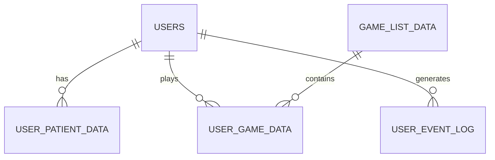

---

## 2. Database Tables

### 2.1 USERS (Supabase Auth)

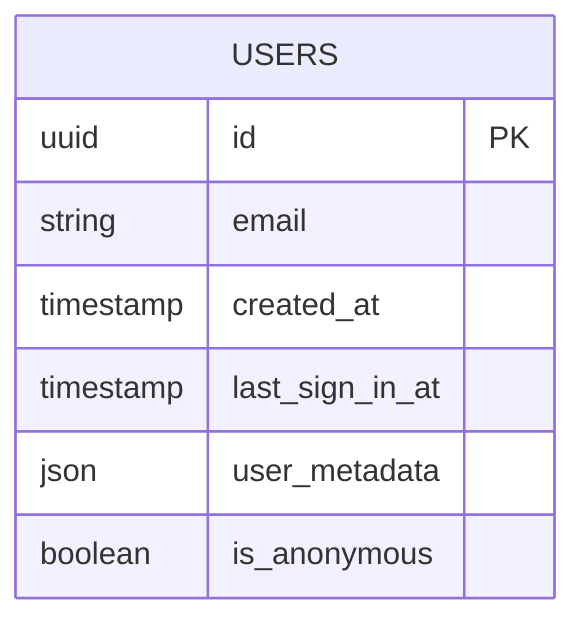

**Description:** Supabase built-in authentication table

---

### 2.2 user_patient_data

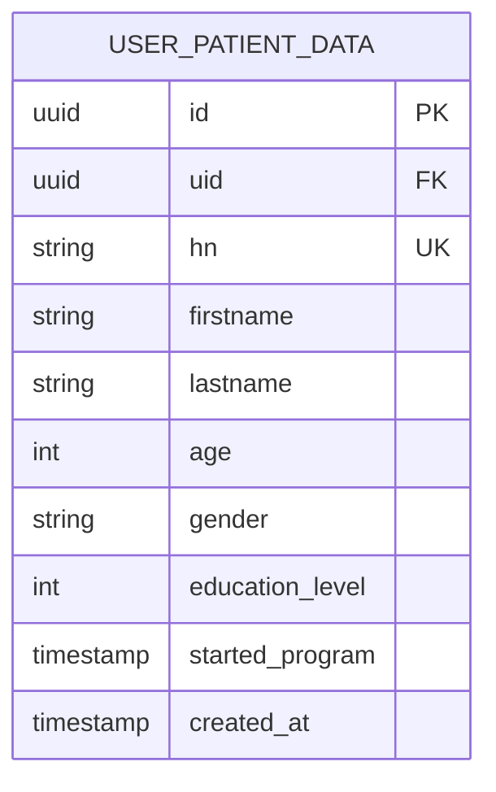

**Description:** ข้อมูลผู้ป่วย/ผู้ใช้งาน


| Column          | Type      | Constraints | Description             |
| --------------- | --------- | ----------- | ----------------------- |
| id              | uuid      | PK          | Primary Key             |
| uid             | uuid      | FK          | Reference to auth.users |
| hn              | string    | UK          | หมายเลข HN ของผู้ป่วย   |
| firstname       | string    | NOT NULL    | ชื่อ                    |
| lastname        | string    | NOT NULL    | นามสกุล                 |
| age             | int       | NOT NULL    | อายุ                    |
| gender          | string    | NOT NULL    | เพศ                     |
| education_level | int       | NULLABLE    | ระดับการศึกษา           |
| started_program | timestamp | NOT NULL    | วันที่เริ่มโปรแกรม      |
| created_at      | timestamp | DEFAULT     | วันที่สร้างข้อมูล       |


---

### 2.3 game_list_data

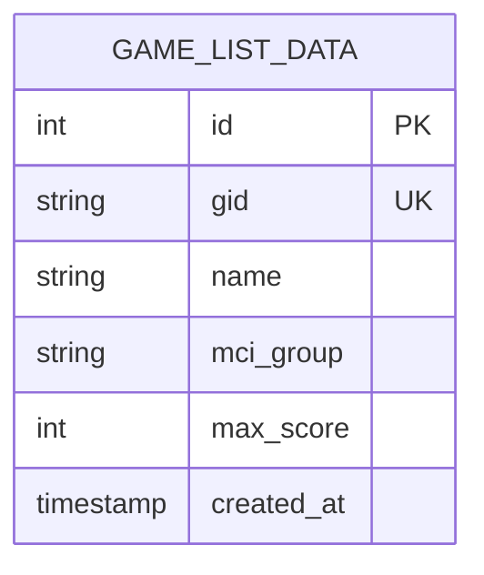

**Description:** รายการเกมในระบบ


| Column     | Type      | Constraints | Description                   |
| ---------- | --------- | ----------- | ----------------------------- |
| id         | int       | PK          | Primary Key                   |
| gid        | string    | UK          | Game ID (เช่น ZOO001, CTX001) |
| name       | string    | NOT NULL    | ชื่อเกม                       |
| mci_group  | string    | NOT NULL    | กลุ่ม MCI                     |
| max_score  | int       | NULLABLE    | คะแนนสูงสุด                   |
| created_at | timestamp | DEFAULT     | วันที่สร้าง                   |


**Sample Data:**


| gid    | name            | mci_group |
| ------ | --------------- | --------- |
| ZOO001 | Zoo Detective   | ATTENTION |
| ZOO002 | Zoo Feeder      | ATTENTION |
| CTX001 | Context Clues   | MEMORY    |
| SYM001 | Symmetry Decor  | EXECUTIVE |
| POS001 | Postcard Reader | MEMORY    |


---

### 2.4 user_game_data

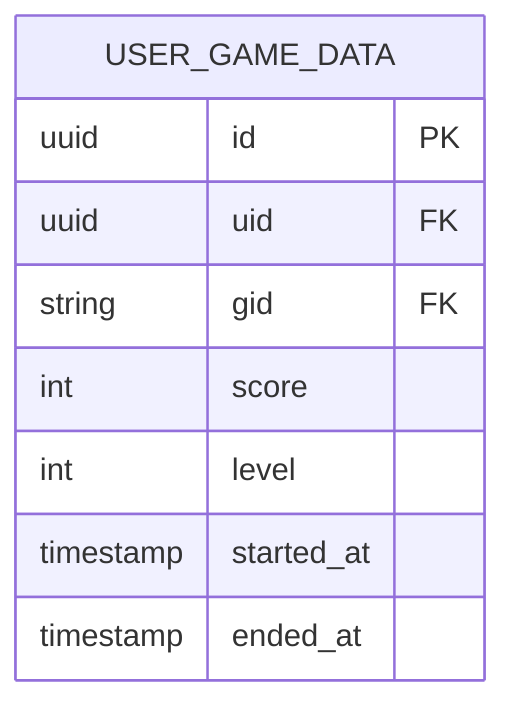

**Description:** ข้อมูลการเล่นเกมของผู้ใช้


| Column     | Type      | Constraints | Description                 |
| ---------- | --------- | ----------- | --------------------------- |
| id         | uuid      | PK          | Primary Key                 |
| uid        | uuid      | FK          | Reference to auth.users     |
| gid        | string    | FK          | Reference to game_list_data |
| score      | int       | NULLABLE    | คะแนนที่ได้                 |
| level      | int       | NULLABLE    | ระดับความยาก                |
| started_at | timestamp | NOT NULL    | เวลาเริ่มเล่น               |
| ended_at   | timestamp | NOT NULL    | เวลาสิ้นสุด                 |


---

### 2.5 user_event_log

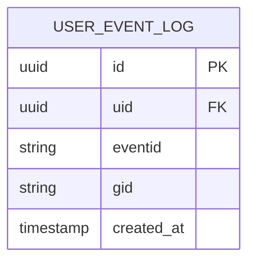

**Description:** บันทึกเหตุการณ์ต่างๆ


| Column     | Type      | Constraints | Description             |
| ---------- | --------- | ----------- | ----------------------- |
| id         | uuid      | PK          | Primary Key             |
| uid        | uuid      | FK          | Reference to auth.users |
| eventid    | string    | NOT NULL    | รหัสเหตุการณ์           |
| gid        | string    | NULLABLE    | Game ID (ถ้ามี)         |
| created_at | timestamp | DEFAULT     | วันที่บันทึก            |


**Event IDs:**


| eventid | Description  |
| ------- | ------------ |
| OPAPP   | เปิดแอป      |
| SPG     | เริ่มเล่นเกม |


---

## 3. Entity Relationship Diagram

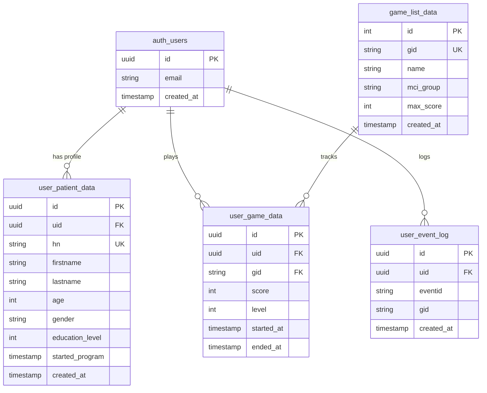

---

## 4. MCI Group Classification

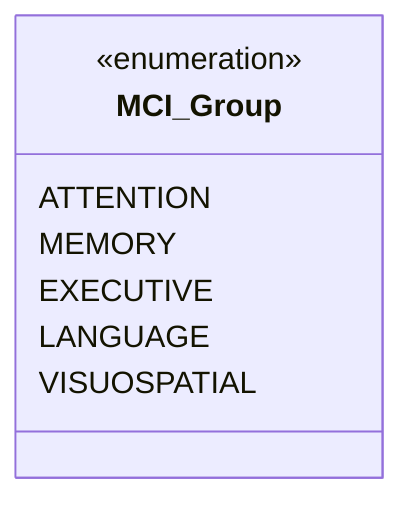

**Mapping:**


| Game            | MCI Group | Skill Trained               |
| --------------- | --------- | --------------------------- |
| Zoo Detective   | ATTENTION | Logical thinking, Deduction |
| Zoo Feeder      | ATTENTION | Decision making, Timing     |
| Context Clues   | MEMORY    | Language comprehension      |
| Symmetry Decor  | EXECUTIVE | Spatial reasoning           |
| Postcard Reader | MEMORY    | Reading comprehension       |


---

## 5. API Flow Diagrams

### 5.1 Authentication Flow

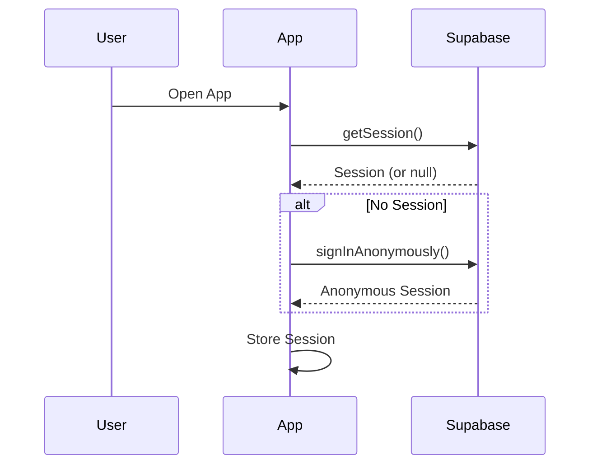

### 5.2 Submit Score Flow

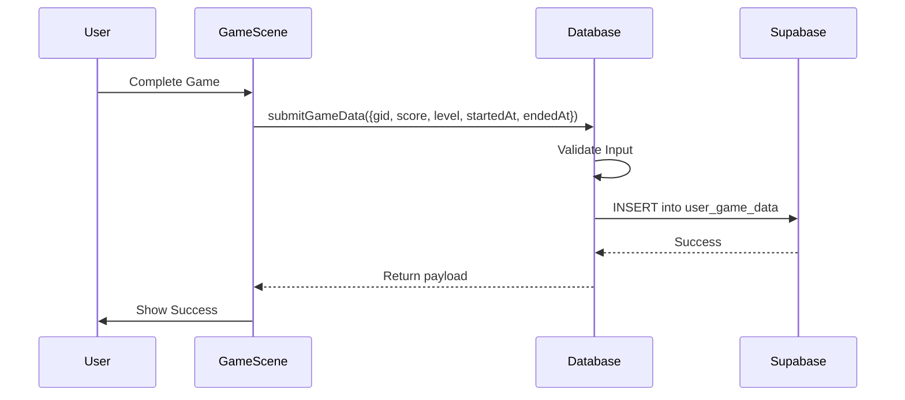

### 5.3 Load Patient Data Flow

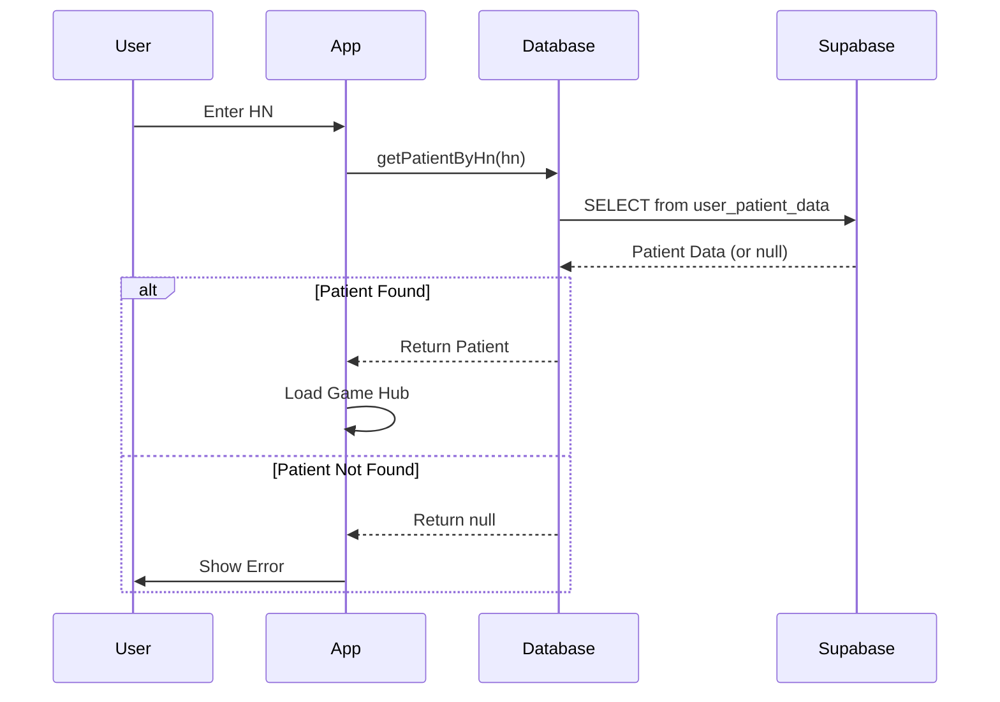

---

## 6. Indexes & Constraints

```sql
-- Primary Keys
ALTER TABLE user_patient_data ADD PRIMARY KEY (id);
ALTER TABLE game_list_data ADD PRIMARY KEY (id);
ALTER TABLE user_game_data ADD PRIMARY KEY (id);
ALTER TABLE user_event_log ADD PRIMARY KEY (id);

-- Unique Constraints
ALTER TABLE user_patient_data ADD CONSTRAINT unique_hn UNIQUE (hn);
ALTER TABLE game_list_data ADD CONSTRAINT unique_gid UNIQUE (gid);

-- Foreign Keys
ALTER TABLE user_patient_data ADD CONSTRAINT fk_patient_user
    FOREIGN KEY (uid) REFERENCES auth.users(id);

ALTER TABLE user_game_data ADD CONSTRAINT fk_game_user
    FOREIGN KEY (uid) REFERENCES auth.users(id);

ALTER TABLE user_game_data ADD CONSTRAINT fk_game_list
    FOREIGN KEY (gid) REFERENCES game_list_data(gid);

ALTER TABLE user_event_log ADD CONSTRAINT fk_event_user
    FOREIGN KEY (uid) REFERENCES auth.users(id);

-- Indexes
CREATE INDEX idx_patient_hn ON user_patient_data(hn);
CREATE INDEX idx_game_user ON user_game_data(uid);
CREATE INDEX idx_game_gid ON user_game_data(gid);
CREATE INDEX idx_event_user ON user_event_log(uid);
CREATE INDEX idx_event_created ON user_event_log(created_at);
```

---

## 7. Security Rules (RLS)

```sql
-- Enable RLS
ALTER TABLE user_patient_data ENABLE ROW LEVEL SECURITY;
ALTER TABLE user_game_data ENABLE ROW LEVEL SECURITY;
ALTER TABLE user_event_log ENABLE ROW LEVEL SECURITY;
ALTER TABLE game_list_data ENABLE ROW LEVEL SECURITY;

-- Patients: Users can only see their own data
CREATE POLICY "Patients can view own data"
    ON user_patient_data FOR SELECT
    USING (auth.uid() = uid);

CREATE POLICY "Users can insert own data"
    ON user_patient_data FOR INSERT
    WITH CHECK (auth.uid() = uid);

-- Game Data: Users can only see their own
CREATE POLICY "Users can view own game data"
    ON user_game_data FOR SELECT
    USING (auth.uid() = uid);

CREATE POLICY "Users can insert own game data"
    ON user_game_data FOR INSERT
    WITH CHECK (auth.uid() = uid);

-- Game List: Public read access
CREATE POLICY "Public can view game list"
    ON game_list_data FOR SELECT
    USING (true);

-- Event Log: Users can only insert their own
CREATE POLICY "Users can insert own events"
    ON user_event_log FOR INSERT
    WITH CHECK (auth.uid() = uid);
```

---

## 8. Environment Variables

```bash
# Supabase Configuration
VITE_SUPABASE_URL=https://xxxxx.supabase.co
VITE_SUPABASE_ANON_KEY=your-anon-key-here
```

---

## 9. Implementation Reference
- **Schema Setup:** [US-E2-01](US-E2-01.md) (Supabase Table Setup)
- **Authentication:** [US-E2-02](US-E2-02.md) (Patient Auth Integration)
- **Data Flow:** [US-E2-03](US-E2-03.md) (Score & Time API)

---

## Notes

- ใช้ Supabase เป็น Backend-as-a-Service
- รองรับ Anonymous Login สำหรับผู้ที่ไม่ต้องการสร้างบัญชี
- Row Level Security (RLS) สำหรับความปลอดภัยของข้อมูล
- ทุกตารางมีการสร้าง Index สำหรับ Query ที่ใช้บ่อย
\

---
[? Back to Index](../index.md)\

