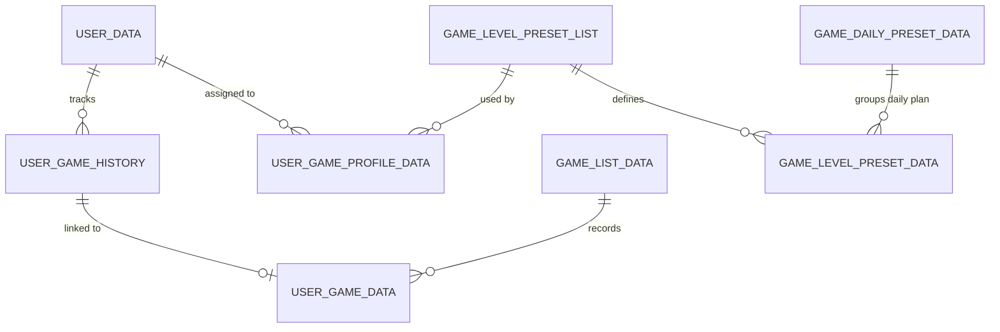
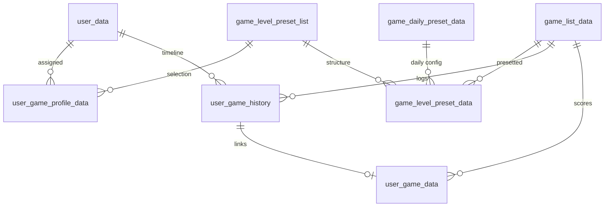

# Database Schema Diagram - MCI Cognitive Games

---

## *Document Version: 1.5*
*Project: MCI Cognitive Games*
*Last Updated: 2026-06-17*

## 1. Database Overview



---

## 2. Core Tables

### 2.1 USERS (Supabase Auth)
Supabase built-in authentication table (`auth.users`).

### 2.2 user_data
ข้อมูลผู้ป่วย/ผู้ใช้งานหลัก

| Column          | Type      | Constraints | Description                         |
| --------------- | --------- | ----------- | ----------------------------------- |
| id              | bigint    | PK, identity | Primary Key                       |
| hn              | string    | UK, NULLABLE | หมายเลข HN ของผู้ป่วย (Patient ID) |
| firstname       | string    | NOT NULL    | ชื่อ                                |
| lastname        | string    | NOT NULL    | นามสกุล                             |
| phone           | string    | UK          | เบอร์โทรศัพท์                       |
| birth_date      | date      | NOT NULL    | วันเกิด (Birth Date)                |
| gender          | string    | NOT NULL    | เพศ                                 |
| education_level | string    | NULLABLE    | ระดับการศึกษา (ID)                  |
| started_program | timestamp | NOT NULL    | วันที่เริ่มโปรแกรม                  |
| created_at      | timestamp | DEFAULT     | วันที่สร้างข้อมูล                   |

**Runtime notes**
- `hn` เป็น identifier หลักของ patient flow ใน UI และใช้ผูก session cookie/sessionStorage
- `started_program` ใช้ร่วมกับ `ProgramDateUtil` เพื่อคำนวณวันเล่น วันสิ้นสุด และสถานะโปรแกรม
- `education_level` ถูก resolve เป็นชื่อแสดงผลผ่าน `user_education_level` เมื่อโหลด profile/export

---

### 2.3 game_list_data
รายการมินิเกมทั้งหมดในระบบ

| Column     | Type      | Constraints | Description                   |
| ---------- | --------- | ----------- | ----------------------------- |
| id         | int       | PK          | Primary Key                   |
| gid        | string    | UK          | Game ID (เช่น ZOO001, CTX001) |
| name       | string    | NOT NULL    | ชื่อภาษาอังกฤษ                |
| th_name    | string    | NULLABLE    | ชื่อภาษาไทย                   |
| mci_group  | string    | NOT NULL    | กลุ่ม MCI (Attention, Memory) |
| max_score  | int       | NULLABLE    | คะแนนสูงสุดพื้นฐาน            |
| created_at | timestamp | DEFAULT     | วันที่สร้าง                   |

**Known runtime game IDs**
- Core minigames: Zoo Detective, Zoo Feeder, Context Clues, Symmetry Decor, Postcard Reader
- Rest activity uses `REST001`
- Additional/test minigame: Fry Food

---

### 2.4 user_game_data
ข้อมูลการเล่นเกมเชิงลึก (คะแนนและเวลา)

| Column     | Type      | Constraints | Description                 |
| ---------- | --------- | ----------- | --------------------------- |
| id         | bigint    | PK, identity | Primary Key                |
| gid        | string    | FK          | Reference to game_list_data |
| score      | int       | NULLABLE    | คะแนนที่ได้                 |
| level      | int       | NULLABLE    | ระดับความยาก (ถ้ามี)        |
| started_at | timestamp | NOT NULL    | เวลาเริ่มเล่น               |
| ended_at   | timestamp | NOT NULL    | เวลาสิ้นสุด                 |

---

### 2.5 user_game_history
บันทึกประวัติการเข้าเล่นเกมและกิจกรรมใน Hub (Timeline)

| Column            | Type      | Constraints | Description                             |
| ----------------- | --------- | ----------- | --------------------------------------- |
| id                | int       | PK          | Primary Key                             |
| hn                | string    | FK          | Reference to user_data(hn)              |
| gid               | string    | FK          | Reference to game_list_data(gid)        |
| stage             | int       | NULLABLE    | ลำดับด่านในโปรแกรม                      |
| start_at          | timestamp | NOT NULL    | เวลาที่กดเริ่ม                          |
| end_at            | timestamp | NULLABLE    | เวลาที่เล่นเสร็จ                        |
| user_game_data_id | bigint    | FK          | Linked to user_game_data                |
| check-in          | boolean   | DEFAULT F   | สถานะการเช็คชื่อ                        |

**Runtime notes**
- ใช้เป็น timeline หลักของ Game Hub และ daily program completion
- Game node ที่จบแล้วต้องมี `end_at`
- Rest node ใช้ `gid = REST001`
- Check-in compatibility layer รองรับทั้ง `checkIn`, `check_in`, และ `check-in` ในฝั่ง client

---

## 3. Game Program & Preset System

### 3.1 game_level_preset_list
รายชื่อโปรแกรมการฝึก (เช่น โปรแกรมพื้นฐาน, โปรแกรมเข้มข้น)

| Column      | Type      | Description        |
| ----------- | --------- | ------------------ |
| id          | int       | PK                 |
| name        | string    | ชื่อโปรแกรม        |
| description | string    | รายละเอียดโปรแกรม  |

### 3.2 game_level_preset_data
รายละเอียดการจับคู่ เกม-ด่าน-วัน ในแต่ละโปรแกรม

| Column | Type   | Description                            |
| ------ | ------ | -------------------------------------- |
| id     | int    | PK                                     |
| gpid   | int    | FK (game_level_preset_list)            |
| gdid   | int    | FK (game_daily_preset_data)            |
| gid    | string | FK (game_list_data)                    |
| day    | int    | วันที่กำหนดให้เล่น                     |
| stage  | int    | ลำดับภายในวัน                          |
| level  | int    | ระดับความยากของ Phaser Game ในด่านนั้น |

### 3.3 user_game_profile_data
ตารางเชื่อมโยงผู้ป่วยกับโปรแกรมที่กำลังเล่น

| Column  | Type   | Description                         |
| ------- | ------ | ----------------------------------- |
| id      | int    | PK                                  |
| hn      | string | FK (user_data)                      |
| program | int    | FK (game_level_preset_list)         |

### 3.4 game_daily_preset_data
ข้อมูลเป้าหมายและ loop ของชุดเกมรายวัน ใช้เป็น daily config ที่ `game_level_preset_data.gdid` อ้างถึง

| Column | Type | Description |
| ------ | ---- | ----------- |
| id | int | PK |
| goal | string | เป้าหมายประจำวัน |
| loop | int | จำนวนรอบ/ชุดที่กำหนด |

### 3.5 Leaderboard / Rank Read Model
Leaderboard ปัจจุบันถูกอ่านผ่าน service layer ไม่จำเป็นต้องเป็น table เดี่ยว:

1. Edge Function: `read-database/getLeaderboard`, `read-database/getUserRank`
2. RPC fallback: `get_leaderboard_page`
3. Client query fallback จาก score/history data

ผลลัพธ์ที่ UI ใช้:

| Field | Description |
| ----- | ----------- |
| rank | อันดับรวม |
| name | ชื่อแสดงผล |
| hn | HN ของผู้เล่น |
| score | คะแนนรวม |
| current | ผู้เล่นปัจจุบันหรือไม่ |

### 3.6 game_video_list
รายการวิดีโอที่ใช้สุ่มแสดงในขั้นตอน short-video ของ check-in flow และ resting point ดึงผ่าน `Database.getRandomGameVideoUrl()`

| Column | Type | Description |
| ------ | ---- | ----------- |
| id | int | PK |
| url | string | URL ของไฟล์วิดีโอ |
| hidden | boolean | ถ้า `true` จะถูกกรองออกจากการสุ่ม (ใช้ซ่อนวิดีโอโดยไม่ต้องลบ) |

> หมายเหตุ: `getRandomGameVideoUrl()` query เฉพาะแถวที่ `hidden = false` เท่านั้น

---

## 4. Full ER Diagram



---

## 5. Environment Variables
```bash
VITE_SUPABASE_URL=https://xxxxx.supabase.co
VITE_SUPABASE_ANON_KEY=your-anon-key-here
```

## 6. Deployment/Data Compatibility Notes
- Production Docker image builds Vite `dist/` and serves it with nginx
- Test VM must build from the same branch/commit that passed UI smoke tests
- Before production build, verify stale leaderboard code is absent:

```bash
grep -R "topObserver" src dist
```

If this command finds `topObserver` in `src/ui/leaderboard-screen.js`, the branch likely contains an older leaderboard implementation.

---
[Back to Index](../index.md)
