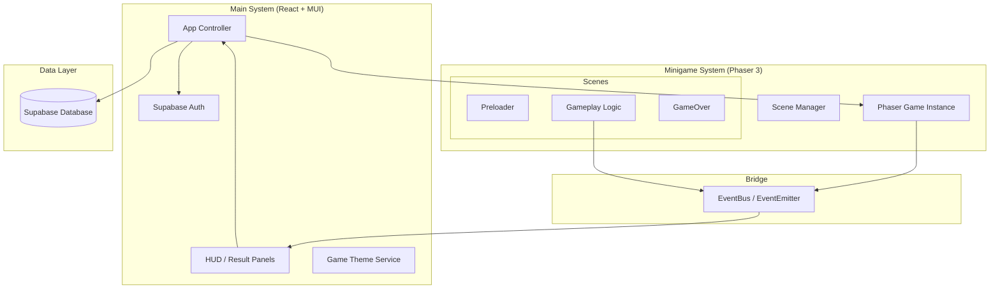

# MCI Cognitive Games — System Architecture

**Version:** 1.1 | **Last Updated:** 2026-05-02

เอกสารนี้อธิบายสถาปัตยกรรมระบบโดยละเอียด โดยเน้นการทำงานร่วมกันระหว่างระบบหลัก (Main System/React) และระบบย่อยในเกม (Minigame System/Phaser)

## 1. ภาพรวมสถาปัตยกรรม (Architecture Overview)

ระบบถูกออกแบบโดยใช้โครงสร้าง **Hybrid Architecture** ที่รวมความสามารถในการจัดการ UI และ Data ของ React เข้ากับความสามารถในการประมวลผลกราฟิกและ Game Logic ของ Phaser 3

### ส่วนประกอบหลัก (Core Components)
1. **React Shell (Main System):** ทำหน้าที่เป็น Container หลัก จัดการเรื่อง Authentication, Routing, และ Database Connection (Supabase)
2. **Phaser Engine (Game System):** จัดการ Rendering และ Logic ของมินิเกมแต่ละเกม
3. **EventBus (Communication Bridge):** ตัวกลางที่ช่วยให้ React และ Phaser คุยกันได้แบบ Bi-directional

---

## 2. โครงสร้างการทำงาน (System Structure Diagram)

---

## 3. รายละเอียดส่วนประกอบสำคัญ (Key Components)

### 3.1 EventBus (The Bridge)
- **ตำแหน่ง:** `src/core/EventBus.js`
- **หน้าที่:** จัดการ Event-driven communication
- **ตัวอย่างการใช้งาน:** 
  - เมื่อเกมจบ Phaser จะส่ง `Gameplay.emit('game-over', scoreData)`
  - React จะรับค่าผ่าน `EventBus.on('game-over', ...)` เพื่อแสดงผลหน้าสรุปคะแนน (MUI Panel)

### 3.2 UI Overlay Strategy
- **HUD:** ใช้ React/MUI ในการวาด Overlay ทับบน Canvas เพื่อให้ได้ UI ที่คมชัดและจัดการ Responsive ได้ง่าย
- **Syncing:** ข้อมูลเช่น HP หรือ Score จะถูกส่งจาก Phaser มาที่ React HUD แบบ Real-time ผ่าน EventBus

### 3.3 Data Flow
1. **Startup:** App โหลดข้อมูลผู้เล่นจาก Supabase และส่งค่า Config เข้าไปใน Phaser ผ่าน `Scene.init(data)`
2. **In-game:** Phaser คำนวณคะแนนและ Logic ต่างๆ
3. **Completion:** เมื่อเกมจบ Phaser ส่งข้อมูลสรุปกลับมาที่ Main System เพื่อทำการบันทึกลง Supabase Table

### 3.4 Shared Services
- **DatabaseManager:** Singleton สำหรับการ Query และ Update ข้อมูลไปยัง Supabase
- **GameTheme:** บริการจัดการ Design Tokens (สี, ฟอนต์) เพื่อให้ทั้ง React และ Phaser มี Visual Identity เดียวกัน

---

## 4. มาตรฐานการพัฒนา (Integration Standards)
- **Separation of Concerns:** อย่าเขียน Logic การบันทึก DB ไว้ใน Phaser Scene ให้ส่งข้อมูลออกมาให้ React เป็นผู้จัดการ
- **Asset Management:** Assets ทั้งหมดต้องอยู่ใน `public/assets/` และถูกเรียกผ่าน `Preloader` ของแต่ละเกม
- **Responsiveness:** ใช้ `LayoutManager` ใน Phaser ควบคู่กับ CSS Flexbox/Grid ใน React

---
## Related Documents
- [System Design](./01-system-design.md)
- [UX/UI Modernization Guidelines](../wiki/guidelines/ux-ui-modernization-guidelines.md)
