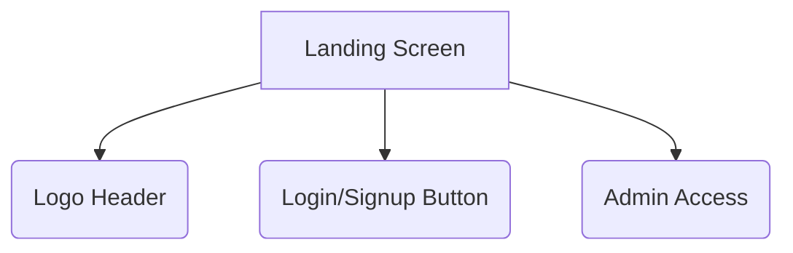
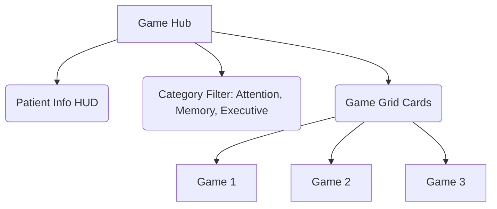
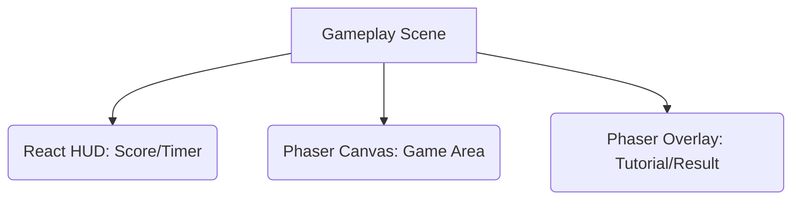

# UI Design & Wireframes - MCI Cognitive Games

---

## *Document Version: 1.0*  
*Project: MCI Cognitive Games*  
*Last Updated: 2026-05-03*

## 1. Design Philosophy
- **Accessibility**: เน้นตัวอักษรขนาดใหญ่, Contrast สูง, และปุ่มกดที่มีขนาดเหมาะสมสำหรับผู้สูงอายุ
- **Consistency**: ใช้ Layout Pattern เดียวกันในทุกมินิเกม เพื่อลดภาระการเรียนรู้ (Cognitive Load)
- **Responsive**: ออกแบบให้รองรับการแสดงผลบน Tablet และ Desktop

---

## 2. Wireframe Concepts

### 2.1 Landing Screen (หน้าแรก)

### 2.2 Game Hub Screen (หน้ารวมเกม)

### 2.3 Gameplay Screen (หน้าระหว่างเล่น)

---

## 3. Component Layout Details

### 3.1 Game HUD (React)
- **Header Section**: แสดงชื่อผู้ป่วย, HN, และปุ่มย้อนกลับ (Game Hub)
- **Status Section**: แถบคะแนน (Score) และตัวจับเวลา (Timer)

### 3.2 Game Area (Phaser Canvas)
- **Grid System**: สำหรับวางวัตถุเกม (Zoo Detective, Symmetry Decor)
- **Tray Area**: สำหรับเลือกไอเทมหรือตัวละคร (AnimalIconTray)

### 3.3 Overlay Panels (Phaser UI)
- **Tutorial Overlay**: กล่องข้อความกึ่งโปร่งใส พร้อมปุ่ม "ถัดไป" และ "ข้าม"
- **Result Panel**: แสดงคะแนนรวม, ดาว (Star Rating), และปุ่มควบคุม (Restart/Home)

---

## 4. Design Guidelines
- **Typography**: เน้นใช้ฟอนต์ที่อ่านง่าย สบายตา
- **Colors**: สีที่สดใสแต่ไม่แยงตา (High Contrast) เพื่อการมองเห็นที่ชัดเจน
- **Feedback**: ทุกการกดปุ่มควรมี Visual Feedback (เช่น การเปลี่ยนสีปุ่ม, เสียง)

---
[Back to Index](../index.md)
