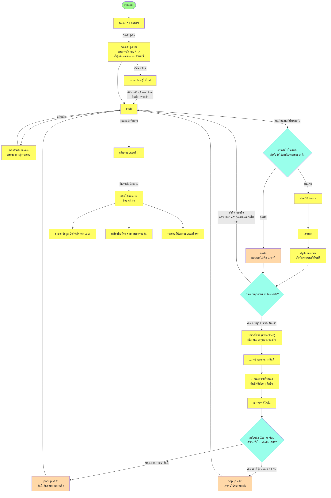
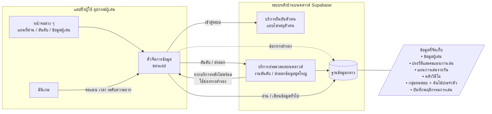

# แผนผังการทำงานของระบบ — MCI Cognitive Games

**เวอร์ชันแอป:** v1.3.0
**วันที่จัดทำ:** 24 กรกฎาคม 2026
**เอกสารคู่กัน:** [system-design.md](./system-design.md) (รายงานสรุประบบ)

เอกสารฉบับนี้แสดงแผนผังการทำงานหลัก 2 ชุด ได้แก่
1. **เส้นทางการใช้งานของผู้เล่น** — เข้ามาที่หน้าแรกแล้วไปที่ไหนได้บ้าง
2. **การเชื่อมต่อระบบหลังบ้าน** — แอปเชื่อมกับบริการบนคลาวด์อย่างไร

> แผนภาพด้านล่างเขียนด้วย Mermaid ซึ่งแสดงผลเป็นแผนผังอัตโนมัติเมื่อเปิดบน GitHub หรือโปรแกรมที่รองรับ

---

## 1. เส้นทางการใช้งานของผู้เล่น (Game Flow)

แผนผังนี้แสดงว่าเมื่อเปิดแอปที่หน้าแรก ผู้เล่นเดินทางไปยังหน้าใดได้บ้าง และลำดับการเล่นในแต่ละวันเป็นอย่างไร

**จุดสำคัญของเส้นทางนี้**

- จากหน้าแรก เมื่อกดเข้าสู่เกมจะเข้าสู่ **หน้าเข้าสู่ระบบ** ที่ต้องกรอกรหัส HN หรือ ID ก่อนเสมอ — **ทั้งผู้เล่นและทีมงานเข้าทางเดียวกันนี้** ส่วนผู้ใช้ใหม่จะแยกไปลงทะเบียนก่อน และ **เมื่อสมัครเสร็จจะเข้าเกมได้ทันที ไม่ต้องวนกลับมากรอกซ้ำ**
- หลังเข้าสู่ระบบ ทุกคนจะมาอยู่ที่ **แผนที่ด่าน** ซึ่งเป็นศูนย์กลาง เดินทางไปดูอันดับ หรือเปิดเล่นด่านของวันได้
- **ลำดับด่านถูกจัดไว้ตามโปรแกรมของวัน** ผู้เล่นไม่ได้เลือกด่านเองอย่างอิสระ แต่จะกดเปิดด่านถัดไปตามลำดับจากแผนที่ด่าน
- **ด่านมินิเกม** มี 3 ขั้น คือ สอนวิธีเล่นเกม → เล่นเกม → สรุปผลคะแนน (บันทึกคะแนนอัตโนมัติ) แล้ว **กลับมาที่แผนที่ด่าน** — ไม่มีการเล่นเกมถัดไปอัตโนมัติ ผู้เล่นต้องกดเปิดเกมถัดไปเอง
- **ด่านจุดพัก** เป็นเพียงหน้าต่าง (popup) ที่เด้งขึ้นมาให้พัก 1 นาที ไม่ใช่วิดีโอ เมื่อเสร็จก็กลับมาที่แผนที่ด่าน
- เมื่อเล่น **ครบทุกด่านของวัน** ระบบจะแสดง **หน้าเช็คชื่อ (Check-in)** เป็นลำดับ 3 หน้า คือ หน้าแสดงความยินดี → หน้าความคืบหน้าที่มี "ต้นคิดดี" ค่อย ๆ โตขึ้น → หน้าวิดีโอสั้น จากนั้นกลับสู่แผนที่ด่าน
- เมื่อกลับถึงแผนที่ด่าน จะมี **popup แจ้งเตือน** ขึ้นมา — ถ้าจบเฉพาะเกมของวันนั้นจะแจ้งว่า "วันนี้เล่นครบทุกเกมแล้ว" แต่ถ้าเล่นครบทั้งโปรแกรม 14 วันจะแจ้งว่า "เล่นจบโปรแกรมแล้ว"
- **ส่วนของทีมงานเข้าได้จากแผนที่ด่านเท่านั้น** โดยกดปุ่มสำหรับทีมงานเพื่อเข้าสู่ระบบแอดมินอีกชั้น เมื่อยืนยันสิทธิ์แล้วจึงเข้าถึงคอนโซลข้อมูลผู้เล่น การส่งออกข้อมูล เครื่องมือจัดตาราง และการทดสอบมินิเกม
- ก่อนถึงวันเริ่มโปรแกรม ปุ่มเริ่มเกมจะยังไม่เปิดใช้งาน

---

## 2. การเชื่อมต่อระบบหลังบ้าน (Backend Connectivity)

แผนผังนี้แสดงว่าแอปฝั่งผู้ใช้เชื่อมต่อกับบริการบนคลาวด์อย่างไร และข้อมูลไหลไปเก็บที่ใด

**จุดสำคัญของการเชื่อมต่อนี้**

- แอปฝั่งผู้ใช้ทุกหน้าจอส่งงานผ่าน **ตัวจัดการข้อมูลของแอป** ซึ่งเป็นตัวกลางเดียวที่คุยกับระบบหลังบ้าน
- ระบบหลังบ้านทั้งหมดอยู่บนคลาวด์ (Supabase) ประกอบด้วย บริการยืนยันตัวตน บริการประมวลผล และฐานข้อมูลกลาง
- งานหนัก เช่น การจัดอันดับและการส่งออกข้อมูลจำนวนมาก จะทำผ่าน **บริการประมวลผลบนคลาวด์** ก่อน หากบริการหลักไม่พร้อม ระบบจะสลับไปใช้ **ช่องทางสำรอง** เพื่อให้แอปยังทำงานต่อได้
- เมื่อเล่นมินิเกมจบ คะแนนและเวลาจะถูกส่งเข้าฐานข้อมูลกลางโดยอัตโนมัติ
- ฐานข้อมูลกลางจัดเก็บข้อมูลทุกส่วนที่เชื่อมโยงกัน ทำให้ติดตามผล จัดอันดับ และส่งออกเพื่อการวิจัยได้ครบถ้วน

---

[กลับไปที่รายงานสรุประบบ](./system-design.md)
